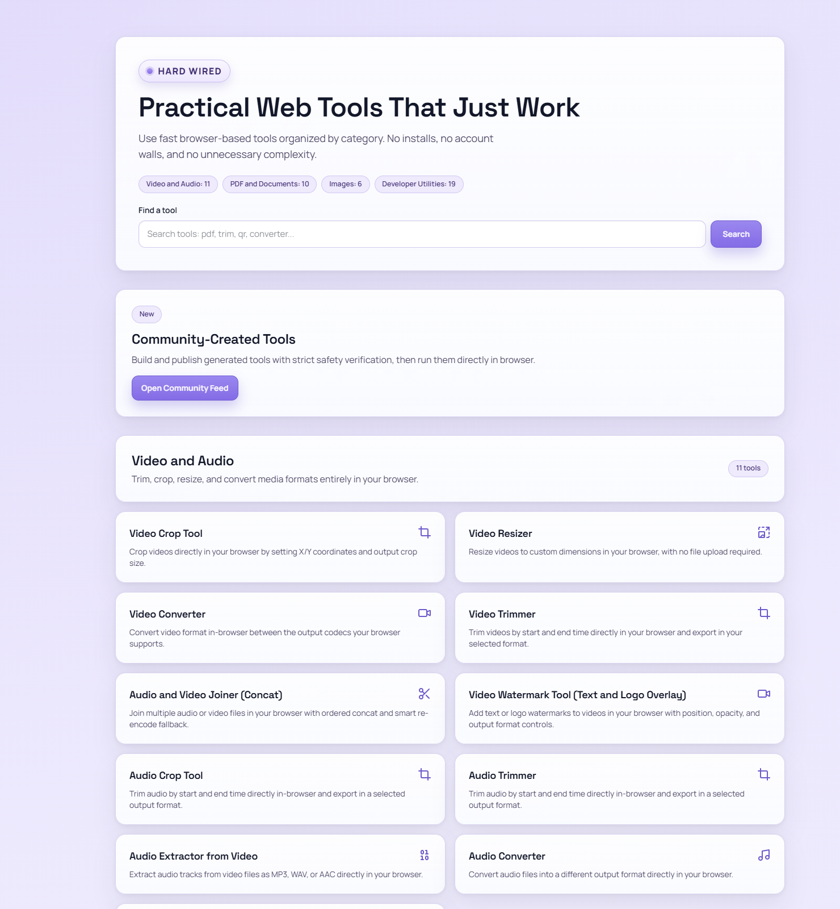
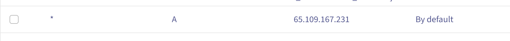
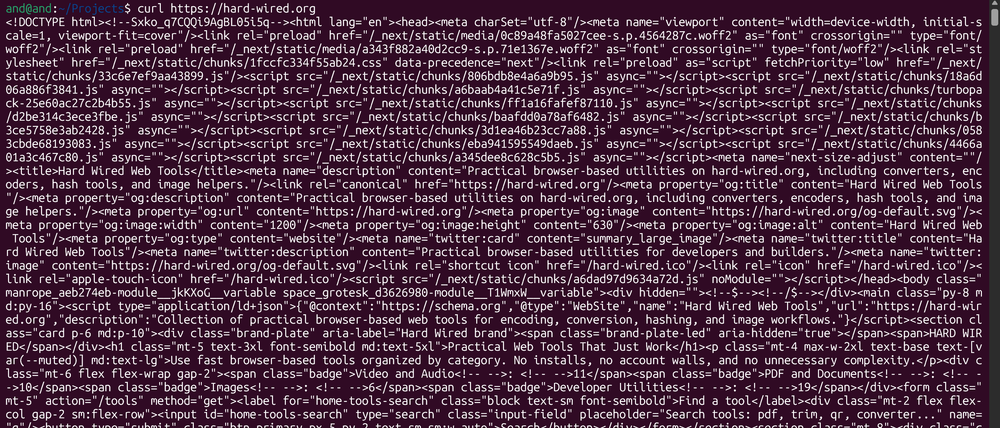
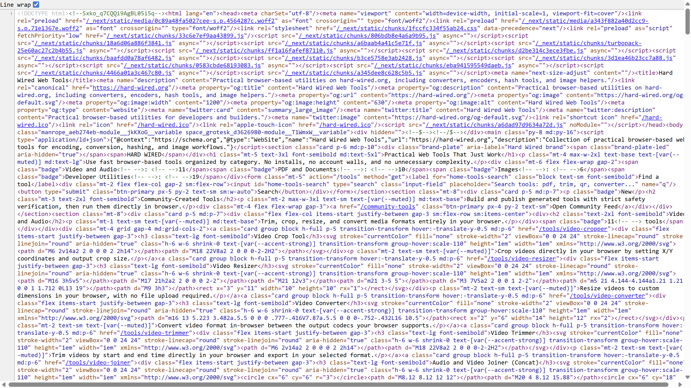
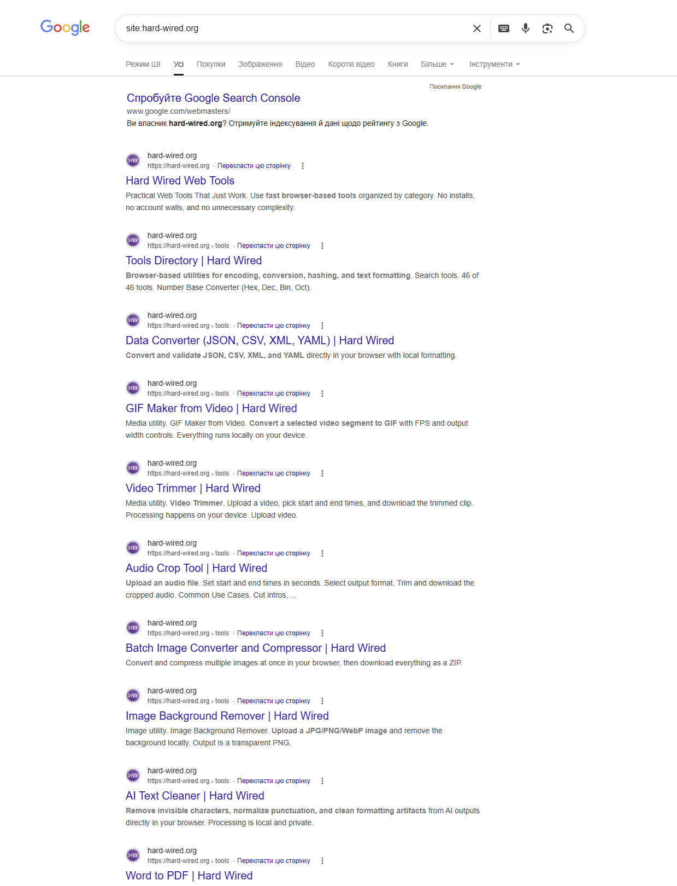
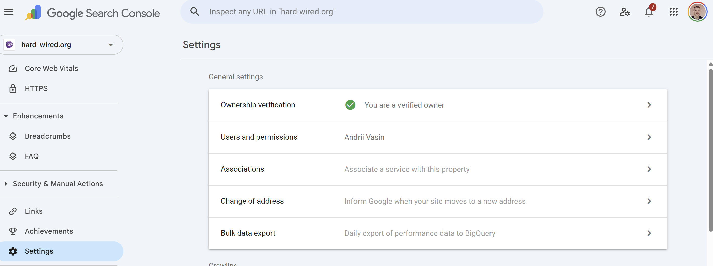
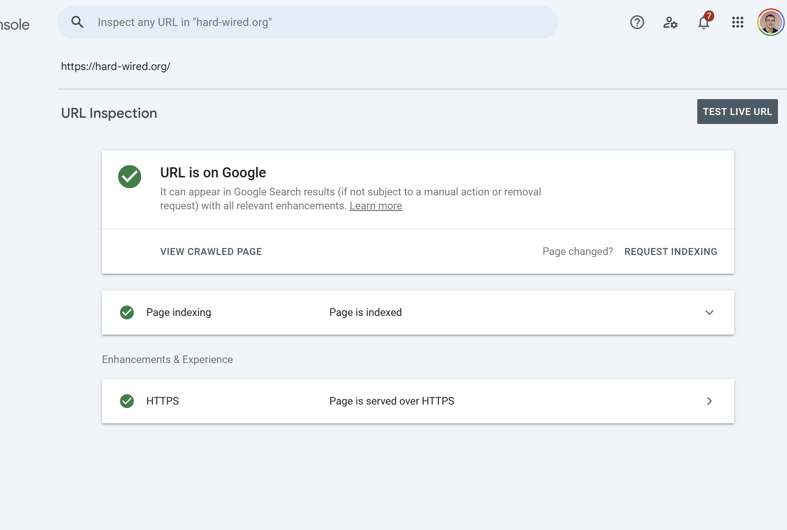

# Звіт до лабораторної роботи №1
## Вступ до SEO та пошукових систем

**Сайт:** [hard-wired.org](https://hard-wired.org)

---

## 1. Підготовка проєкту

### Опис проєкту

**Hard Wired** — платформа браузерних веб-інструментів для розробників: конвертери, енкодери, хеш-генератори, інструменти для роботи з зображеннями та PDF.

- **Репозиторій (фронтенд):** https://github.com/tappress/hard-wired
- **Репозиторій (бекенд):** https://github.com/tappress/hard-wired-backend

### Технологічний стек

| Частина    | Технологія                                              |
|------------|---------------------------------------------------------|
| Frontend   | Next.js 16 + App Router + TypeScript, `output: "export"` |
| Backend    | FastAPI (Python), SQLAlchemy async + asyncpg            |
| Деплой     | Docker (nginx:alpine), Traefik як reverse proxy         |
| База даних | PostgreSQL                                              |

### Локальний запуск

```bash
git clone git@github.com:tappress/hard-wired.git
cd hard-wired
npm install
npm run dev
# → http://localhost:3000
```

---

## 2. Розгортання

Сайт розгорнуто **не на Railway**, а на власному VPS з Docker + Traefik. Next.js будується у статичний HTML export (`output: "export"`), результат обслуговується через `nginx:alpine`.

```dockerfile
# Стадія 1: збірка статичного експорту
FROM node:22-alpine AS builder
WORKDIR /app
COPY package*.json ./
RUN npm install
COPY . .
RUN npm run build

# Стадія 2: роздача через nginx (без Node.js в prod)
FROM nginx:alpine
COPY --from=builder /app/out /usr/share/nginx/html
COPY nginx.conf /etc/nginx/conf.d/default.conf
EXPOSE 80
```

**Публічний URL:** https://hard-wired.org



---

## 3. Домени

### 3.1 Основний домен — `hard-wired.org`

**Реєстратор:** Namecheap
**DNS:** вказує на IP VPS через A-запис

| Тип   | Ім'я | Значення     |
|-------|------|--------------|
| A     | @    | `65.109.167.231` |
| A     | www  | `65.109.167.231` |
| TXT   | @    | `google-site-verification=...` |

### 3.2 Sandbox-домен для Community Tools

Community Tools — це інструменти, що генеруються користувачами. Їх відображення виконується в `<iframe>`, тому вони потребують **окремого домену** з міркувань безпеки: щоб ізолювати виконання довільного JS/HTML від основного домену і уникнути атак типу XSS або cookie theft.

Для цього використовується окремий домен з **wildcard A-записом**:

| Тип | Ім'я | Значення          |
|-----|------|-------------------|
| A   | `*`  | `65.109.167.231`  |

Wildcard (`*`) дозволяє динамічно генерувати субдомени вигляду `tool-<id>.example.com` — кожен комп'юніті інструмент отримує ізольований origin, що унеможливлює міжсайтові атаки.



---

## 4. Підключення до хостингу

Замість Railway використовується власний сервер з Traefik як reverse proxy:

- Traefik приймає HTTPS-запити на `hard-wired.org`
- Автоматично отримує TLS-сертифікат через Let's Encrypt
- Проксіює трафік на Docker-контейнер з nginx

---

## 5. Дослідження — "Що бачить Google"

### 5.1 curl запит

```bash
curl https://hard-wired.org
```

Оскільки проєкт використовує `output: "export"` в Next.js, **сервер повертає повністю згенерований статичний HTML** — на відміну від CSR-додатків (Create React App, Vite SPA), де повертається лише порожній `<div id="root"></div>`.

Реальний фрагмент отриманого HTML (збережено у [`curl-result.txt`](./curl-result.txt)):

```html
<!DOCTYPE html>
<html lang="en">
<head>
  <meta charSet="utf-8"/>
  <meta name="viewport" content="width=device-width, initial-scale=1, viewport-fit=cover"/>
  <title>Hard Wired Web Tools</title>
  <meta name="description" content="Practical browser-based utilities on hard-wired.org,
    including converters, encoders, hash tools, and image helpers."/>
  <link rel="canonical" href="https://hard-wired.org"/>
  <meta property="og:title" content="Hard Wired Web Tools"/>
  <meta property="og:description" content="Practical browser-based utilities..."/>
  <script type="application/ld+json">...</script>
</head>
<body>
  <h1 class="mt-5 text-3xl font-semibold md:text-5xl">
    Practical Web Tools That Just Work
  </h1>
  <h2 class="text-2xl font-semibold">Video and Audio</h2>
  <a href="/tools/video-cropper">...</a>
  <a href="/tools/video-resizer">...</a>
  <h2 class="text-2xl font-semibold">PDF &amp; Documents</h2>
  <a href="/tools/pdf-compress">...</a>
  <!-- ... десятки посилань на інструменти ... -->
</body>
</html>
```



### 5.2 Аналіз результату

| Елемент                     | Присутній | Що містить                                                                           |
|-----------------------------|-----------|--------------------------------------------------------------------------------------|
| Текст статей / контент      | Так       | Назви та посилання на всі інструменти платформи, заголовки секцій                   |
| `<title>`                   | Так       | `Hard Wired Web Tools`                                                               |
| `<meta name="description">` | Так       | `Practical browser-based utilities on hard-wired.org, including converters, ...`    |
| Вміст `<body>`              | Повний    | Повна розмітка сторінки: header, main з переліком інструментів, footer              |
| JSON-LD                     | Так       | Структуровані дані: `WebSite`, `SoftwareApplication`, `FAQPage`, breadcrumbs        |
| `<link rel="canonical">`    | Так       | `https://hard-wired.org/`                                                            |
| `robots.txt`                | Так       | `Allow: /`, `Disallow: /community-tools`, посилання на sitemap                      |
| `sitemap.xml`               | Так       | Усі сторінки інструментів, конверсій та статичних сторінок                          |

### 5.3 View Source vs curl vs DevTools

| Критерій                    | curl                        | View Page Source            | DevTools (Elements)              |
|-----------------------------|-----------------------------|-----------------------------|----------------------------------|
| Що показує                  | HTTP-відповідь сервера      | Те саме що curl (initial HTML) | DOM після виконання JS          |
| JS виконано                 | Ні                          | Ні                          | Так                              |
| Видно серверний HTML        | Так                         | Так                         | Так (+ динамічні зміни)         |
| Корисно для SEO-аудиту      | Так                         | Так                         | Тільки частково                  |

**Висновок:** у даному проєкті `curl` та `View Page Source` показують **ідентичний** HTML — повноцінну розмітку без порожніх `<div>`. DevTools показує той самий вміст плюс зміни, внесені JavaScript після завантаження (інтерактивні компоненти).



### 5.4 Google Cache / site: перевірка

Запит у Google:
```
site:hard-wired.org
```



Google знайшов сторінки: Hard Wired Web Tools, Tools Directory, Data Converter, GIF Maker, Video Trimmer, Audio Crop Tool, AI Text Cleaner, Batch Image Converter, Image Background Remover, Word to PDF та інші.

---

## 6. Google Search Console

- Ресурс додано як **Domain property**: `hard-wired.org`
- Верифікація через **DNS TXT запис**:

```
Тип:      TXT
Ім'я:     @
Значення: google-site-verification=<токен>
```

TXT-запис додано в налаштуваннях DNS у Namecheap, після чого натиснуто "Verify" в GSC.



---

## 7. Перший запит на індексацію

В GSC → `URL Inspection` → введено `https://hard-wired.org`.

Сайт вже був **проіндексований** на момент перевірки — статус **"URL is on Google"**, "Page is indexed". Кнопка `Request Indexing` доступна для повторного запиту при змінах на сторінці.



---

## 8. Висновок: що побачить Google Crawler

Завдяки архітектурі **Next.js static export** (`output: "export"`) + nginx, Googlebot отримує повноцінний HTML при першому HTTP-запиті:

- `<title>` та `<meta name="description">` — присутні на кожній сторінці
- Текстовий контент сторінки — доступний без виконання JS
- JSON-LD структуровані дані — `FAQPage`, `SoftwareApplication`, breadcrumbs
- `robots.txt` з явним `Allow: /` та посиланням на sitemap
- `sitemap.xml` з усіма URL та пріоритетами

**Проблем з індексацією, характерних для CSR-додатків, немає.** Якби проєкт був реалізований як чистий Vite/CRA SPA без SSR/SSG, Google отримував би лише `<div id="root"></div>` і мав би покладатись виключно на JavaScript-рендеринг, що повільніше і ненадійніше.

---

## Контрольні питання

### Рівень 1 — Розуміння термінів

**1. Що таке SEO і чим відрізняється від платної реклами (SEA)?**

SEO (Search Engine Optimization) — комплекс дій для покращення органічного (безкоштовного) ранжування сайту в пошукових системах. SEA (Search Engine Advertising) — платне розміщення реклами в результатах пошуку (Google Ads). Основна різниця: SEO дає стабільний довгостроковий трафік без прямої плати за кліки, але вимагає часу; SEA дає миттєвий трафік, але припиняється з зупинкою бюджету.

**2. Різниця між crawling, indexing та ranking:**

- **Crawling** — Googlebot обходить сторінки, переходячи по посиланнях і завантажуючи їх HTML. *Аналогія:* бібліотекар обходить полиці і збирає книги.
- **Indexing** — аналіз та збереження вмісту сторінки в базу даних Google. *Аналогія:* бібліотекар читає книгу і записує короткий зміст у картотеку.
- **Ranking** — визначення порядку сторінок у результатах за конкретним запитом. *Аналогія:* бібліотекар рекомендує найрелевантнішу книгу читачу.

**3. Що таке DNS і яку роль він відіграє при відкритті сайту?**

DNS (Domain Name System) — розподілена система, яка перетворює доменні імена (наприклад, `hard-wired.org`) на IP-адреси серверів. Коли браузер відкриває сайт, він спочатку робить DNS-запит, отримує IP, і лише потім встановлює TCP-з'єднання з сервером.

**4. Що таке CNAME запис і чим він відрізняється від A запису?**

- **A запис** — вказує домен безпосередньо на IPv4-адресу (`hard-wired.org → 1.2.3.4`).
- **CNAME запис** — вказує домен на інший домен (`www.hard-wired.org → hard-wired.org`), тобто є аліасом. IP вирішується у другому кроці. CNAME не можна використовувати для кореневого домену (`@`).

**5. Навіщо потрібен TXT запис у DNS?**

TXT-запис зберігає довільний текст у DNS. Використовується для:
- Верифікації власника домену (Google Search Console, Facebook Business)
- SPF (дозволені SMTP-сервери для поштового домену)
- DKIM (підпис email-повідомлень)
- DMARC (політика обробки підозрілих листів)

---

### Рівень 2 — Аналіз

**6. curl повертає лише `<div id="root"></div>`. Чому і що це означає для SEO?**

Це ознака **Client-Side Rendering (CSR)** — SPA-додатку на React/Vue/Angular без SSR. Сервер повертає порожній HTML-шаблон, а весь вміст генерується JavaScript у браузері після його виконання. Для Googlebot це означає: при crawling він бачить порожню сторінку. Хоча Google може виконувати JS, це відбувається з затримкою і в черзі "second wave indexing". Результат: гірше або повільніше індексування, відсутність тексту в сніпеті, погані позиції.

**7. Чим відрізняється View Page Source від DevTools?**

`View Page Source` (Ctrl+U) показує **оригінальний HTML**, отриманий від сервера до виконання будь-якого JavaScript — тобто те саме, що бачить Googlebot при crawling. `DevTools → Elements` показує **живий DOM** після виконання JS, маніпуляцій React/Vue тощо. Для SEO-аудиту критично перевіряти саме View Source: якщо `<title>`, `<h1>`, контент відсутні там — Google їх не побачить при першому crawl.

**8. Що таке DNS propagation і чому зміни не застосовуються миттєво?**

DNS — розподілена ієрархічна система. Після зміни запису він поширюється від авторитативного NS-сервера реєстратора через кешуючі резолвери провайдерів та CDN по всьому світу. Кожен вузол кешує записи на час TTL (Time To Live), тому нові значення бачать лише ті, у кого кеш застарів. Propagation може тривати від 5 хвилин до 48 годин залежно від TTL і географії.

**9. White, Grey та Black SEO:**

- **White SEO** — методи в рамках гайдлайнів Google: якісний контент, технічна оптимізація, природні зворотні посилання. *Приклад:* написання детальних статей, прискорення Core Web Vitals, структуровані дані.
- **Grey SEO** — методи не заборонені явно, але на межі: агресивна закупівля посилань, масове генерування схожого контенту. *Приклад:* PBN (приватні мережі сайтів).
- **Black SEO** — прямі маніпуляції: клоакінг (різний контент для боту і людини), прихований текст, спамні посилання, keyword stuffing. Веде до бану.

**10. Навіщо GSC вимагає верифікацію власника сайту?**

Щоб запобігти несанкціонованому доступу до даних про трафік, помилки індексації та управління сайтом. Шляхи верифікації: DNS TXT запис, HTML-файл у корені, HTML meta-тег, Google Analytics, Google Tag Manager.

---

### Рівень 3 — Синтез та висновки

**11. Чи готовий сайт до індексації?**

Так. Аргументи:
- Static export повертає повний HTML без JS-рендерингу — контент доступний crawlерам одразу
- `<title>`, `<meta description>`, `<link rel="canonical">` присутні на кожній сторінці
- `robots.txt` коректно налаштований, не блокує важливі розділи
- `sitemap.xml` включає всі сторінки з пріоритетами та `changeFrequency`
- JSON-LD структуровані дані допомагають Google розуміти тип контенту
- HTTPS з валідним TLS сертифікатом

**12. Googlebot вміє JS, але CSR досі проблема. Чому?**

Google використовує дворівневий підхід: **перша хвиля** (First Wave) — миттєвий crawl HTML без JS, **друга хвиля** (Second Wave) — рендеринг JS у черзі WRS (Web Rendering Service). Проблеми CSR:
- Рендеринг JS відбувається з затримкою від годин до тижнів після crawl
- WRS має обмежений бюджет: Google не рендерить нескінченно для кожного сайту
- Залежності між компонентами, lazy loading, динамічні роути можуть не відпрацювати коректно
- Помилки JS (мережеві, CORS, API timeout) призводять до порожньої сторінки при рендерингу

**13. Три зміни для покращення індексації CSR-сайту без переходу на SSR:**

1. **Пре-рендеринг (static pre-rendering)** — використати Vite plugin `vite-plugin-prerender` або `react-snap` для генерації статичних HTML-знімків маршрутів під час збірки. Результат: сервер повертає готовий HTML для відомих URL.

2. **Dynamic meta-теги через `react-helmet` + окремий SSR-сервер лише для ботів** — налаштувати `nginx` або Cloudflare Workers для виявлення User-Agent Googlebot і проксіювання до headless Chrome сервісу (наприклад Prerender.io або власний Puppeteer).

3. **Мінімальний SSR-шаблон у `index.html`** — винести критичний контент (назва сторінки, H1, перший абзац, canonical) у статичний `index.html` через шаблонізацію на рівні сервера (nginx + SSI), не чекаючи JS.

**14. Порівняння верифікації GSC через DNS TXT vs HTML-файл:**

| Критерій             | DNS TXT запис                              | HTML файл (`google<hash>.html`)          |
|----------------------|--------------------------------------------|------------------------------------------|
| Складність           | Потрібен доступ до DNS (реєстратор)        | Потрібен доступ до файлів сайту          |
| Стійкість            | Не залежить від деплою сайту               | Видаляється при перегенерації /out       |
| Час propagation      | До 24 год для DNS                          | Миттєво після деплою                     |
| Підходить для        | Domain property (весь домен + субдомени)   | URL prefix property (конкретний URL)     |
| Ризики               | Помилка в DNS може зламати пошту           | Файл може зникнути при CI/CD             |
| **Рекомендація**     | Кращий варіант для production              | Зручний для швидкої перевірки            |

---