# Звіт до лабораторної роботи №2

## Індексація та алгоритми Google

**Сайт:** [hard-wired.org](https://hard-wired.org)


---

## 1. Перевірка поточного стану індексації

### 1.1 URL Inspection у GSC

Інструмент **URL Inspection** запущено на головній сторінці `https://hard-wired.org/`. Результат: **URL is on Google → Page is indexed**.

| Параметр                           | Значення                                                                        |
|------------------------------------|---------------------------------------------------------------------------------|
| Статус індексації                  | URL is on Google · Page is indexed                                              |
| Дата останнього crawl              | 29 березня 2026, 04:18:24                                                       |
| Метод виявлення URL                | Discovery: Sitemaps (Temporary processing error) · Referring page (`/tools/ai-text-cleaner`, `/tools/video-trimmer`) |
| Чи дозволено індексацію robots.txt | Так (Crawl allowed: Yes · Indexing allowed: Yes)                                |
| Чи є canonical                     | Так. User-declared: `https://hard-wired.org/` · Google-selected: Inspected URL  |
| Статус рендерингу                  | Page fetch: Successful · Crawled as: Googlebot smartphone                       |

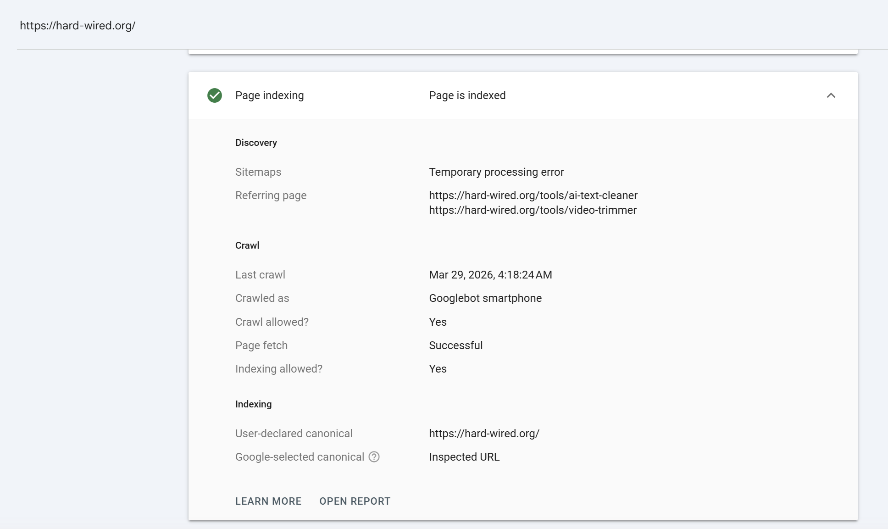

**Coverage tab (Page indexing).** На рівні всього домену:

- **Indexed: 11** сторінок
- **Not indexed: 8** сторінок (2 reasons)

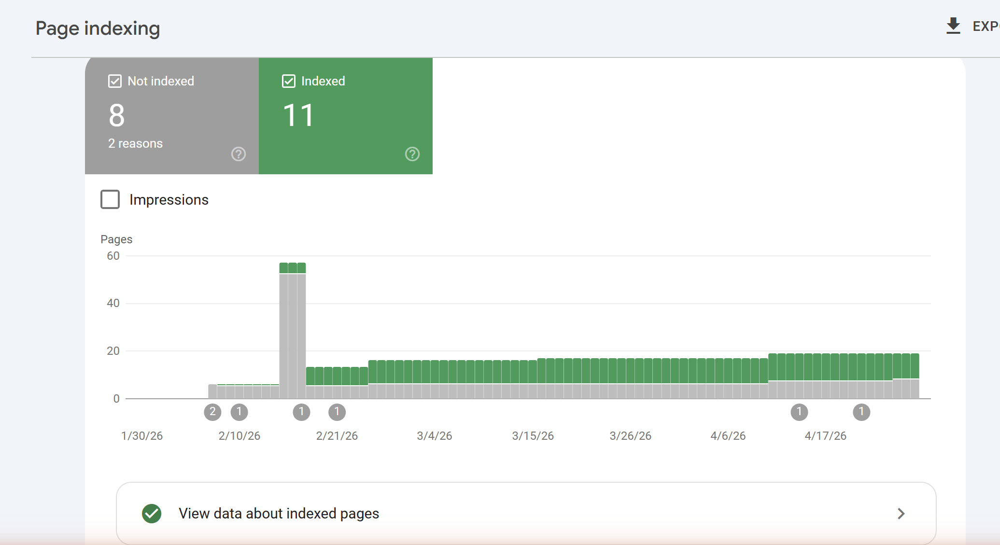

Розгорнутий звіт причин:

| Причина (Reason)                  | Source         | Validation | Pages |
|-----------------------------------|----------------|------------|-------|
| Crawled - currently not indexed   | Google systems | Failed     | 3     |
| Server error (5xx)                | Website        | Started    | 5     |
| Not found (404)                   | Website        | N/A        | 0     |
| Page with redirect                | Website        | N/A        | 0     |
| Discovered - currently not indexed| Google systems | Passed     | 0     |

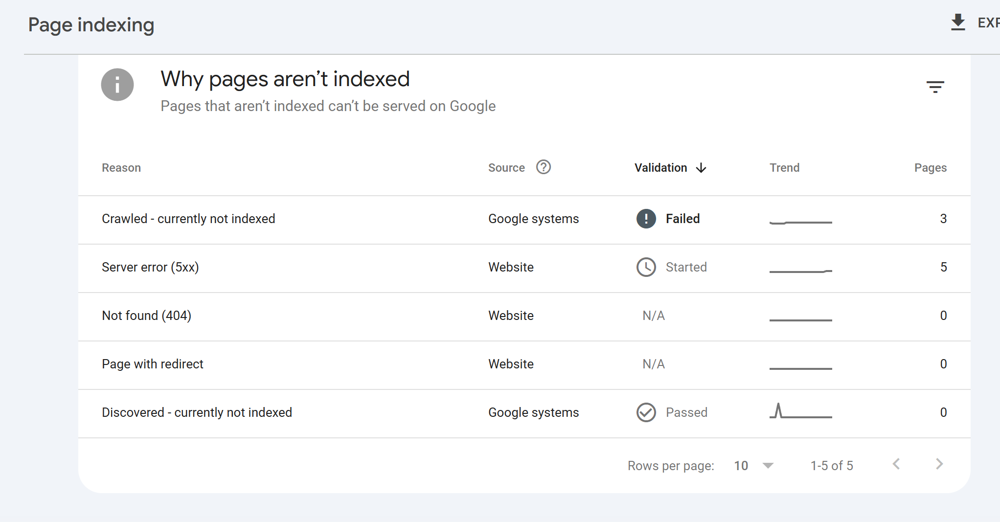

> **Висновок з Coverage Report:** із 19 відомих сторінок 11 у індексі, 5 не потрапили через тимчасові 5xx помилки сервера (валідація стартувала після фіксу), 3 — Google відсканував, але не визнав достатньо корисними для індексації. Жодного 404 та жодного редіректа — структура URL чиста.

**Enhancements tab.** Структуровані дані Breadcrumbs валідні:

- **Valid: 7** елементів
- **Invalid: 0** (No critical issues)

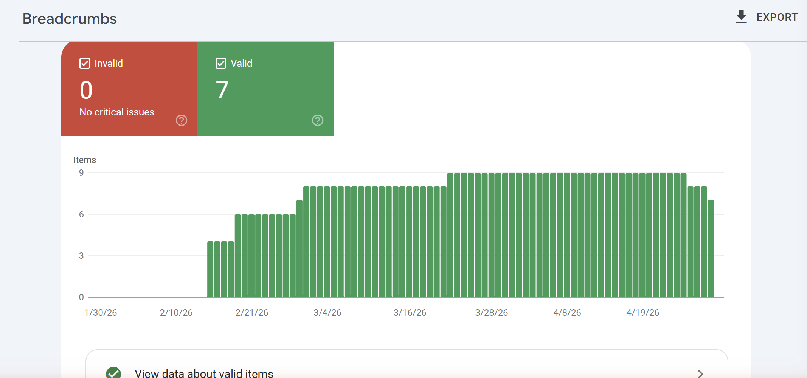

### 1.2 Перевірка через пошукові оператори

| Оператор                  | Результат                                                                               | Що це означає                                                                                                                                                                                                                                  |
|---------------------------|-----------------------------------------------------------------------------------------|------------------------------------------------------------------------------------------------------------------------------------------------------------------------------------------------------------------------------------------------|
| `site:hard-wired.org`     | Знайдено сторінки: Hard Wired Web Tools (homepage), Data Converter, GIF Maker, …       | Найбільш надійний оператор — показує сторінки конкретного домену в індексі Google. Працює нормально.                                                                                                                                            |
| `cache:hard-wired.org`    | "Your search - cache:hard-wired.org - did not match any documents."                    | Оператор `cache:` офіційно **відключено Google у січні 2024** (підтверджено у пості Дені Саллівана). Більше не показує копію сторінки з кешу.                                                                                                  |
| `info:hard-wired.org`     | Google **ігнорує** оператор: показує невідповідні результати про "hardwired" як бренд (Hardwired with Jeff Wickwire, Hardwired Global). У сніпеті — позначка "Missing: info:". | Оператор `info:` теж **deprecated** (відключено Google ще 2017 року, фінально прибрано до 2019). Тому пошуковик трактує `info:` як звичайне ключове слово, шукаючи дослівно.                                                                   |

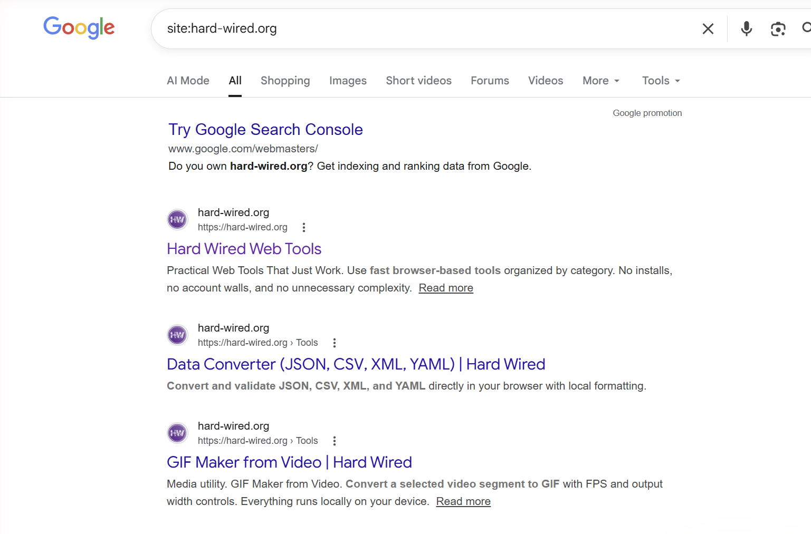
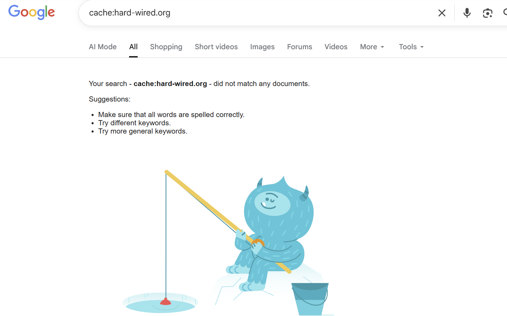
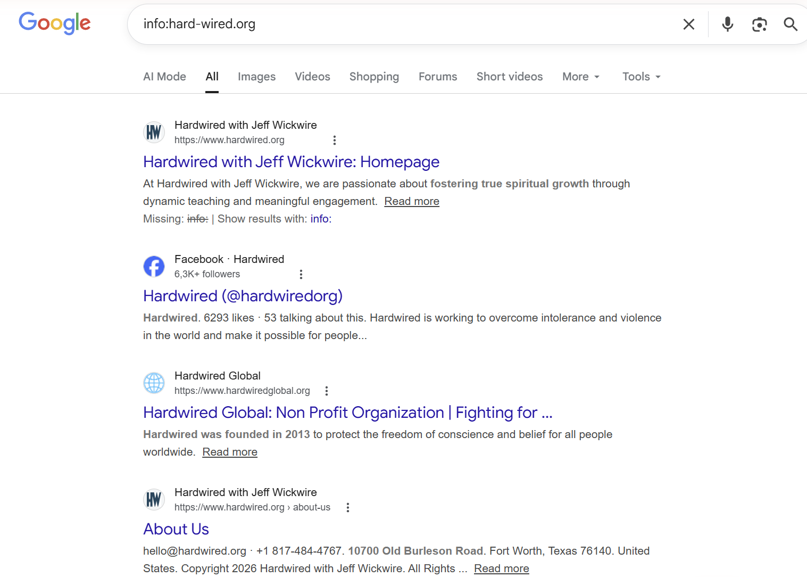

> Для аудиту кешованої версії сторінки сьогодні слід використовувати **GSC URL Inspection → View crawled page** або **archive.org / web.archive.org**. Замість `info:` — комбінацію `site:` + `intitle:` / `inurl:`.

### 1.3 Аналіз статусів Coverage Report

| Статус                                 | Пояснення                                                                                                                                                                       | Можлива причина                                                                                                                                                                                              |
|----------------------------------------|---------------------------------------------------------------------------------------------------------------------------------------------------------------------------------|--------------------------------------------------------------------------------------------------------------------------------------------------------------------------------------------------------------|
| **Submitted and indexed**              | Сторінка була явно подана через sitemap (або вручну через Request Indexing) і Google її проіндексував. Відображається у пошуку.                                                  | Найкращий нормальний стан. Sitemap відомий боту, ним користується Googlebot як seed-листом для crawl-черги.                                                                                                  |
| **Crawled - currently not indexed**    | Googlebot побачив сторінку, прочитав HTML, але **вирішив не вносити її в індекс**. Сторінка фізично доступна, але Google не вважає її достатньо цінною прямо зараз.              | Тонкий або дубльований контент, низький Quality Score, мало внутрішніх посилань на сторінку, мало унікальної інформації проти конкурентів. У моєму звіті: **3 сторінки**.                                  |
| **Discovered - currently not indexed** | Google **знає про URL** (наприклад, з sitemap або як ціль внутрішнього посилання), але **ще не виходив на сторінку**. Crawl запланований, але не виконаний.                       | Crawl budget вичерпаний для цього домену цього циклу, або Google свідомо відкладає, оскільки оцінює "imminent quality" низько. Часта проблема молодих доменів.                                              |
| **Excluded by noindex tag**            | На сторінці явно стоїть `<meta name="robots" content="noindex">` або HTTP-заголовок `X-Robots-Tag: noindex`. Бот побачив директиву й не індексує.                                  | Розробник навмисно виключив (наприклад, адмінка, чернетки, дубльовані landing). Іноді — забутий `noindex` зі staging.                                                                                       |
| **Blocked by robots.txt**              | Шлях URL заборонено в `robots.txt` через `Disallow:`. Бот **не відвідує** сторінку взагалі (важливо: це ≠ `noindex`, такий URL все одно може потрапити в індекс без сніпета).     | `Disallow: /admin`, `Disallow: /api`, `Disallow: /community-tools` (наш випадок), приватні розділи, динамічні endpointи.                                                                                    |
| **Redirect error**                     | Googlebot спробував відкрити URL і зустрів проблемний ланцюжок редіректів: занадто довгий (>5 хопів), цикл, redirect на 4xx/5xx, або redirect на сторінку з відсутнім контентом. | Помилки в конфігурації nginx/Cloudflare, циклічні CMS-правила, редіректи на видалені сторінки.                                                                                                              |
| **404 Not Found**                      | Сервер відповів HTTP 404 на запит URL, який Google знав з sitemap або з посилань.                                                                                                | Видалена сторінка, переїзд без 301-редіректа, друкарська помилка в URL у sitemap, посилання з backlink на неіснуючу сторінку.                                                                              |
| **Soft 404**                           | Сервер повернув **HTTP 200**, але контент сторінки **виглядає як "не знайдено"** (порожній, "page not found", редірект на головну без зміни статусу). Гірший за 404.              | Помилка фронтенду: SPA повертає 200 для будь-якого URL без перевірки, framework-генератори без error-page налаштованого, вміст порожній через зламаний API. Витрачає crawl budget.                          |

📚 Документація: [Page Indexing report — Search Console Help](https://support.google.com/webmasters/answer/7440203)

---

## 2. Аналіз алгоритмів Google на реальних прикладах

| Алгоритм    | Рік запуску    | На що впливає                                                                                                          | Реальний кейс (посилання)                                                                                                                                                                                                                | Що треба робити                                                                                                                                            |
|-------------|----------------|------------------------------------------------------------------------------------------------------------------------|------------------------------------------------------------------------------------------------------------------------------------------------------------------------------------------------------------------------------------------|------------------------------------------------------------------------------------------------------------------------------------------------------------|
| **Panda**   | 2011           | Якість контенту: thin / scraped / duplicate, content farms, агресивна реклама, дубльовані описи товарів.                 | **Demand Media (eHow.com)** — в 2011 після першого Panda втратили ~50% органічного трафіку через тисячі тонких how-to статей з низькою глибиною. Кейс описано в [Search Engine Land — Panda Update](https://searchengineland.com/library/google/google-panda-update). | Прибрати thin content (короткі сторінки без додаткової цінності), консолідувати дублі через canonical/noindex, переписати "scraped" контент додаючи унікальні дані. |
| **Penguin** | 2012           | Якість зворотних посилань: куплені посилання, link schemes, спамні анкори з точною відповідністю ключу, footer-посилання. | **Interflora (UK)** — в 2013 отримав manual action + Penguin penalty за PR-кампанії з купленими anchor-text посиланнями в новинних блогах. Видалився з Google на 11 днів. Розбір: [Search Engine Land — Interflora](https://searchengineland.com/google-confirms-penalizing-interflora-uk-152578). | Disavow токсичних посилань через GSC Disavow Tool, зняти неприродні backlinks (outreach), диверсифікувати анкори, фокус на natural editorial links.       |
| **BERT**    | 2019 (англ.) / 2020 (70+ мов) | Розуміння natural language: контекстуальне значення слів, прийменників, conversational queries, long-tail запитів. | Запит "**2019 brazil traveler to usa need a visa**". До BERT Google розумів як "USA citizen → Brazil". Після BERT правильно інтерпретував напрямок (Brazil → USA). Описано в офіційному пості [Google: Understanding searches better than ever before](https://blog.google/products/search/search-language-understanding-bert/). | Писати природно (як говорить користувач), фокус на intent а не на keyword density, відповідати на конкретне питання у першому абзаці, структурувати FAQ. |

**Який з цих алгоритмів найбільш релевантний для вашого сайту? Чому?**

Найбільш релевантний — **Panda**. Hard Wired має багато тулових сторінок (`/tools/<slug>`), кожна — досить тонка за обсягом тексту (інтерфейс інструменту + короткий опис). Якщо ці описи будуть однотипні, шаблонні або дослівно дубльовані ("Convert X to Y in your browser"), Panda оцінить їх як thin content. Penguin не загрожує — у мене практично немає зовнішніх backlinks, тому штрафувати нема за що. BERT — релевантний у середній мірі: впливає на те, як Google розуміє кожен tool-page, але я не оптимізую під специфічні запити, тому ефект пасивний.

**Як BERT змінив підхід до написання контенту порівняно з Panda?**

- **Panda карає за форму:** мало тексту → погано, дубльовано → погано, реклама зверху → погано. Реакція автора: писати **довше**, **унікальніше**, з більшою кількістю даних.
- **BERT змінює акцент на контекст і намір:** поодинокий ключ більше нічого не вирішує, важливо щоб зміст відповідав на конкретний `query intent`. Реакція автора: писати **природньо**, **під питання**, починати з прямої відповіді (answer-first), додавати FAQ-блок, структурувати під featured snippets, не боятися прийменників та стилістичних слів.

Грубо: Panda → "достатня товщина та унікальність контенту"; BERT → "семантична відповідність наміру користувача".

---

## 3. Впровадження E-E-A-T у проєкт

> Content-сторінками tools-сайту є самі інструменти `/tools/[slug]` — саме вони ранжуються в Google за utility-запитами і саме на них користувач приймає рішення довіряти чи ні. Тому головне впровадження E-E-A-T зроблено в шаблоні `/tools/[slug]`. Сторінки `/about` і `/privacy` додані як **підтримуючі trust-pages**.

### 3.1 E-E-A-T у шаблоні `/tools/[slug]` (головний showcase)

Оновлено shared-template, який рендерить кожну сторінку інструменту. Тепер усі сторінки `/tools/*` (≈19 сторінок) одночасно отримали комплект сигналів E-E-A-T. Як демонстрацію використано `/tools/image-to-pdf`.

**Що додано на кожну tool-сторінку:**

| Блок                        | Розташування         | E-E-A-T сигнал                           | Що бачить Google / користувач                              |
|-----------------------------|----------------------|------------------------------------------|------------------------------------------------------------|
| **Maintainer credit**       | Видимий футер картки | Authoritativeness, Trustworthiness       | "Maintained by Hard Wired" з посиланням на `/about`        |
| **Last updated date**       | Поряд з Maintainer    | Trustworthiness (живий, підтримуваний контент) | "Last updated Apr 30, 2026" з `<time datetime="2026-04-30">` |
| **Enhanced JSON-LD `SoftwareApplication`** | `<script type="application/ld+json">` | Усі чотири E-E-A-T               | Поля `creator`, `author`, `dateModified`, `publisher` (детально нижче) |
| **FAQ-блок з privacy-питаннями** | Тіло сторінки      | Trustworthiness (privacy-first proactive) | "Is conversion backend-free? — Yes. Image to PDF runs locally in your browser." |

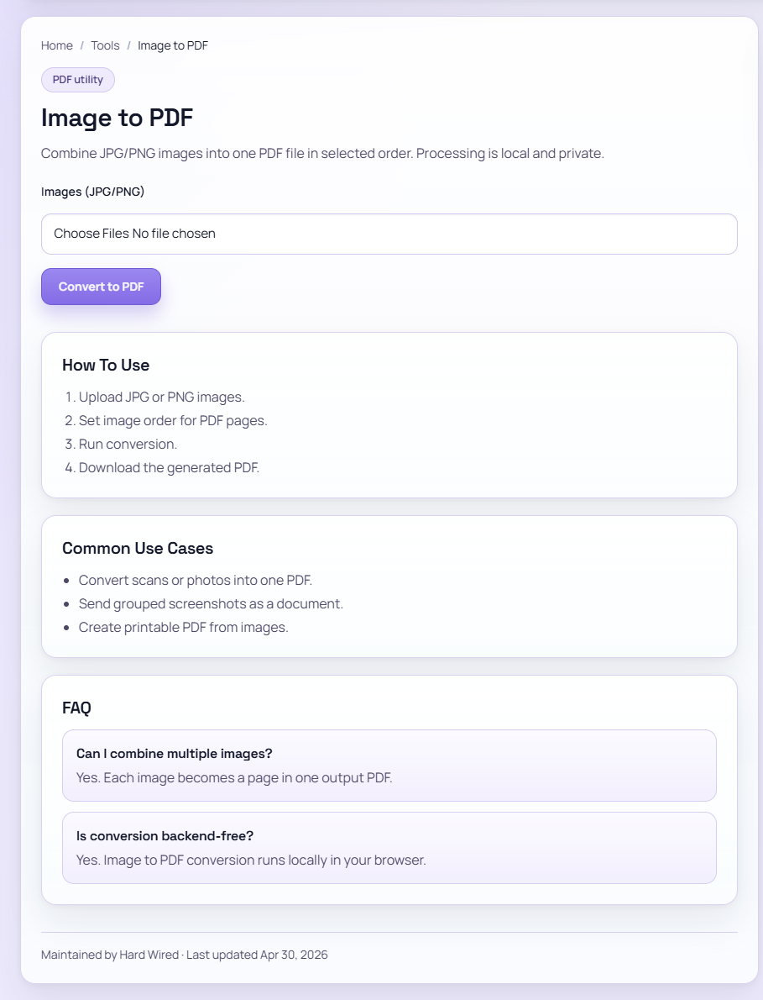

#### Розширений `SoftwareApplication` JSON-LD

До існуючої схеми (з лабораторної 1) додано чотири поля:

```jsonc
{
  "@context": "https://schema.org",
  "@type": "SoftwareApplication",
  "name": "Image to PDF",
  // ...існуючі поля...
  "creator":   { "@type": "Person",       "name": "Andrii Vinogradov", "url": "https://hard-wired.org/about" },
  "author":    { "@type": "Person",       "name": "Andrii Vinogradov", "url": "https://hard-wired.org/about" },
  "publisher": { "@type": "Organization", "name": "Hard Wired",        "url": "https://hard-wired.org" },
  "dateModified": "2026-04-30"
}
```

Перевірено через `curl`:

```bash
$ curl -sS https://hard-wired.org/tools/image-to-pdf | grep -oE "creator|author|dateModified|publisher" | sort -u
author
creator
dateModified
publisher

$ curl -sS https://hard-wired.org/tools/image-to-pdf | grep -oE 'dateModified[^,]*' | head
dateModified":"2026-04-30"
```

#### Що це дає для SEO

- **Experience** — `dateModified` у JSON-LD + видима "Last updated" сигналізують Google, що **за сторінкою стоїть жива людина, яка тримає її у тонусі**, а не content-farm з опублікованим один раз і закинутим контентом.
- **Expertise** — `creator`/`author` як `Person` дозволяють Google однозначно атрибутувати застосунок до ідентифікованого автора. Парсер structured data ставить це в knowledge graph замість анонімного "page".
- **Authoritativeness** — однаковий `publisher` ("Hard Wired") на **всіх** ≈19 tool-сторінках створює entity-consistency: Google бачить, що домен не набір випадкових інструментів від різних людей, а уніфікований проєкт. Внутрішні посилання `/about` зміцнюють цей кластер.
- **Trustworthiness** — на **кожній** tool-сторінці FAQ-блок **проактивно** відповідає на головні privacy-питання (запитує користувач про backend, про відправку даних). Це сильніший сигнал, ніж єдиний `/privacy` — privacy подається як first-class частина продукту, а не legal-boilerplate приклеєний пост-фактум. Quality Raters Google під час ручної оцінки (PRG-process) фіксують такі патерни.

### 3.2 Сторінка `/about` (supporting trust-page)

Створено `app/about/page.tsx`. URL: **https://hard-wired.org/about** (HTTP 200).

Структура: H1, "What is Hard Wired" (опис), "Mission & Editorial Policy" (4 пункти), "Maintainer" (з посиланням на GitHub), "Contact" (`support@hard-wired.org`). Метадані: `<title>`, `<meta description>`, `<link rel="canonical">`, Open Graph.

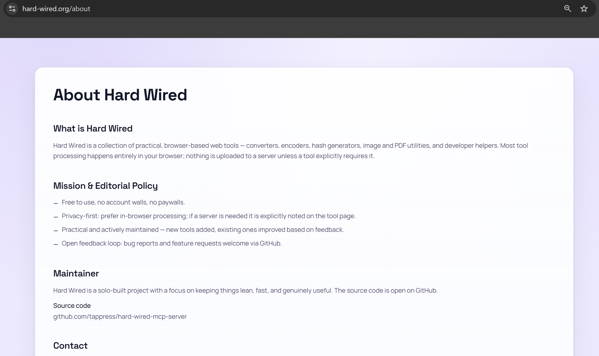

> Роль `/about` тут — бути **canonical джерелом правди** про проєкт, до якого посилаються `creator`/`author` поля з усіх tool-сторінок та посилання "Maintained by Hard Wired" у футері. Це і є entity coherence, описана вище.

### 3.3 Сторінка `/privacy` (supporting trust-page)

Створено `app/privacy/page.tsx`. URL: **https://hard-wired.org/privacy** (HTTP 200).

Зміст: відсутність трекерів/реклами/аналітики, in-browser processing для більшості інструментів, server-side tools мають окреме labelling, server logs ≤ 30 днів, no tracking cookies. Дата "Last updated".

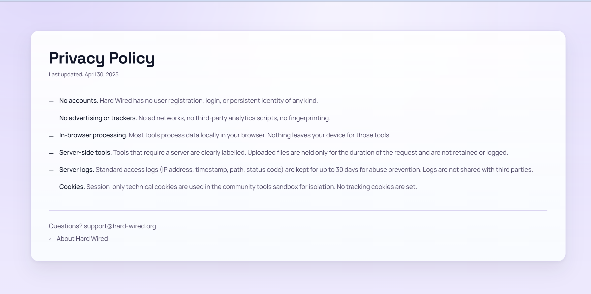

> Роль `/privacy` — закрити formal compliance-вимогу окремої сторінки. Реальну "робочу" privacy-комунікацію виконує **per-tool FAQ** на кожній tool-сторінці (див. 3.1).

### 3.4 E-E-A-T чек-ліст

**Experience (Досвід)**

- [x] **`dateModified` у JSON-LD + видима "Last updated"** на кожній tool-сторінці — Google бачить активне підтримання.
- [x] Кожен інструмент — реальна робоча функція в браузері (UI + код працює), не просто landing.
- [x] Опис місії на `/about` від першої особи мейнтейнера ("solo-built", "tools the maintainer kept rebuilding").
- [ ] На tool-сторінках поки немає блоку "Maintainer's note" з персональним кейсом використання — план для наступних лабораторних.

**Expertise (Експертиза)**

- [x] **`creator`/`author` у `SoftwareApplication` JSON-LD** атрибутують кожен інструмент до ідентифікованої особи (`Person` schema).
- [x] Сторінка `/about` посилається на GitHub-репозиторії з відкритим кодом — фактичне підтвердження, що автор пише код, а не PR-теч.
- [x] Tools технічно коректні (наприклад, sandbox-домен з wildcard A-record для безпечної ізоляції iframe community-tools).
- [ ] Немає окремих long-form guides, що системно розкривають expertise. Існує тільки `/guides/ai-agents-mcp`.

**Authoritativeness (Авторитетність)**

- [x] **Однаковий `publisher: "Hard Wired"` на всіх ≈19 tool-сторінках** + однаковий "Maintained by Hard Wired" footer = entity coherence, яку шукає Google Knowledge Graph.
- [x] Сторінка `/about` як canonical-сторінка про проєкт; усі author/creator-посилання сходяться сюди.
- [x] Maintainer має публічний GitHub-профіль і репозиторії з реальною історією комітів.
- [ ] External backlinks мінімальні (домен запущено кінець 2025 / початок 2026). Внутрішні referring pages у GSC: `/tools/ai-text-cleaner`, `/tools/video-trimmer`.

**Trustworthiness (Надійність)**

- [x] **Per-tool FAQ proactively addresses privacy** на кожній сторінці інструмента — сильніший сигнал, ніж окрема `/privacy` (privacy як first-class частина продукту, а не приклеєний legal-text).
- [x] Сайт працює через HTTPS (Let's Encrypt через Traefik, HSTS у заголовках).
- [x] Privacy Policy на `/privacy` фіксує: no tracking, no accounts, in-browser processing, server logs ≤ 30 днів.
- [x] Контактна інформація на `/about` (email `support@hard-wired.org`).
- [x] Дати публікації/модифікації коректні: structured data Breadcrumbs валідні (7 valid / 0 invalid у GSC), `dateModified` у JSON-LD.
- [x] Немає битих посилань: GSC показує 0 у "Not found (404)" та 0 у "Page with redirect".

---

## 4. Базовий Lighthouse звіт (PageSpeed Insights)

Запуск: **30 квіт. 2026 р., 22:28 GMT+3**, Lighthouse 13.0.1, headless Chromium 146.0.7680.177.
URL: `https://hard-wired.org/`. Real-user data (CrUX): "**Немає даних**" — для домену ще не зібрано достатньо реальних відвідувань. Тому всі цифри — з синтетичного Lighthouse-замірювання.

### 4.1 Зведена таблиця показників

| Метрика                                | Mobile (Moto G Power, 4G slow) | Desktop                |
|----------------------------------------|--------------------------------|------------------------|
| **Performance Score**                  | **76** (orange)                | **84** (orange)        |
| **SEO Score**                          | 100 (green)                    | 100 (green)            |
| **Accessibility Score**                | 100 (green)                    | 100 (green)            |
| **Best Practices Score**               | 100 (green)                    | 100 (green)            |
| **LCP** (Largest Contentful Paint)     | **5,0 с** ❌ red                | **2,2 с** ⚠️ orange    |
| **CLS** (Cumulative Layout Shift)      | 0 ✅ green                      | 0 ✅ green              |
| **INP** (Interaction to Next Paint)    | n/a (CrUX немає даних)         | n/a (CrUX немає даних) |
| **FCP** (First Contentful Paint)       | 1,7 с ✅ green                  | 0,4 с ✅ green          |
| **TBT** (Total Blocking Time)          | 280 мс ⚠️ orange                | 180 мс ⚠️ orange       |
| **TTFB** (Time to First Byte)          | n/a (не в метричній шапці звіту) | n/a                  |
| **Speed Index**                        | 1,9 с ✅ green                  | 0,7 с ✅ green          |

> INP замірюється тільки у CrUX (на справжніх користувачах) — синтетичний Lighthouse повертає TBT як його синтетичний проксі. Для сайту з кінця 2025 / початку 2026 трафіку ще недостатньо, тому INP буде доступним приблизно через 28 днів стабільної відвідуваності > 1000 унікальних/міс.

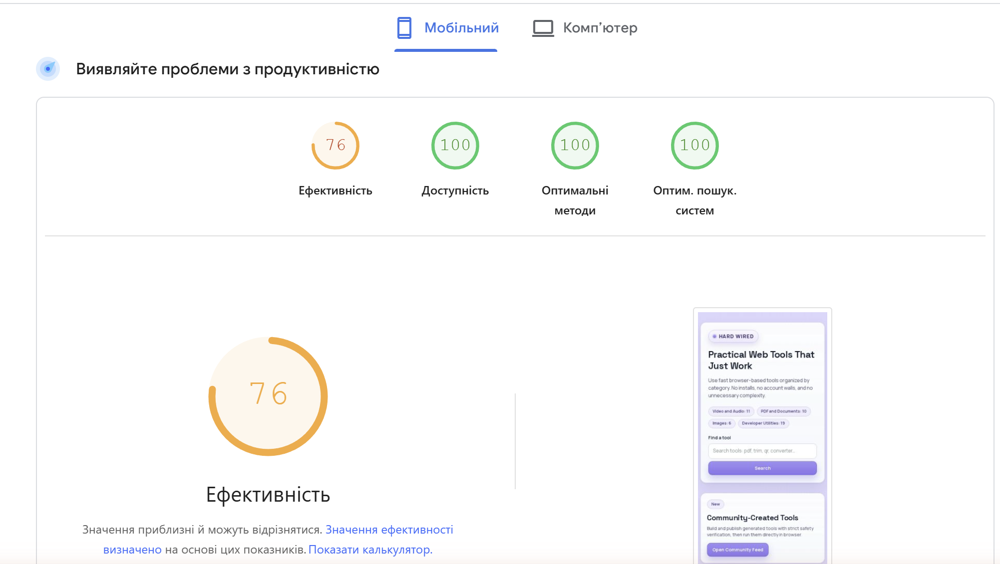
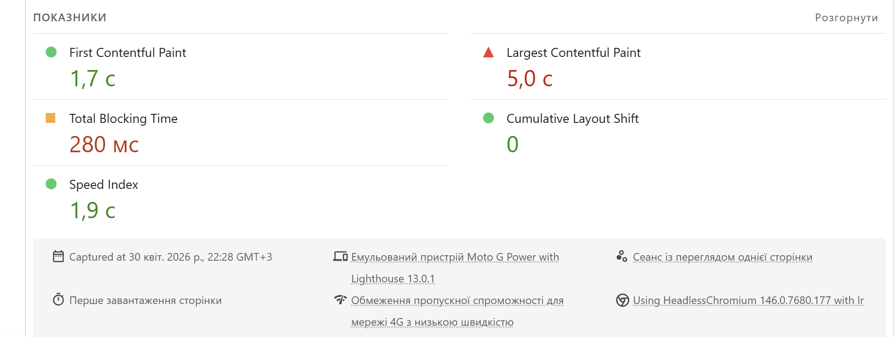
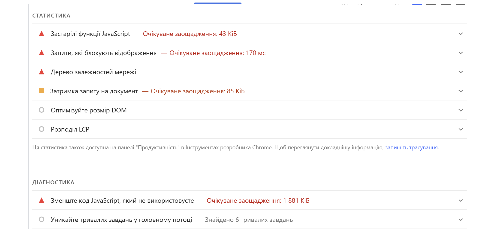
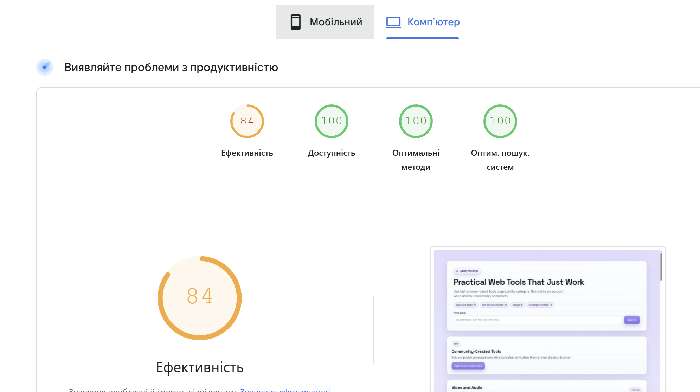
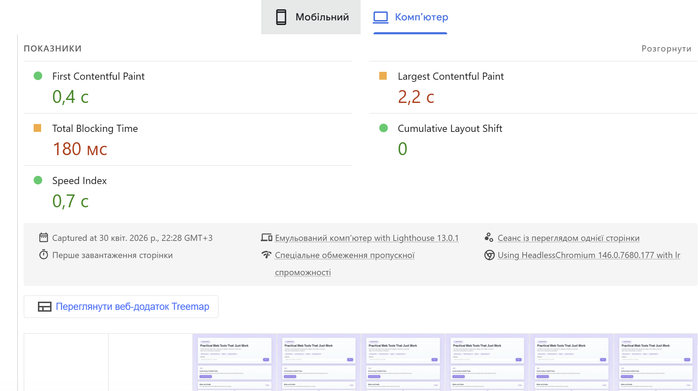
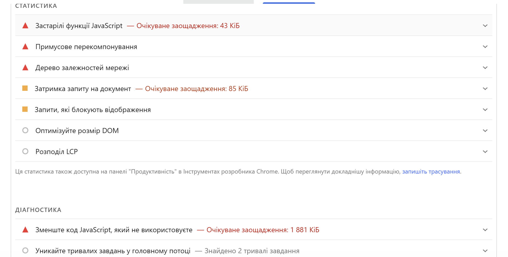

### 4.2 Аналіз результатів

**1. Які метрики у червоній зоні? Що це означає для користувача?**

У червоному (failed/critical) — лише **LCP на Mobile (5,0 с)**. Поріг "Good" від Google — ≤ 2,5 с; "Needs improvement" — 2,5 – 4,0 с; "Poor" — > 4,0 с. Для користувача це означає: на мобільному 4G з повільним каналом найбільший видимий блок головної сторінки (вірогідно — заголовок+картки інструментів) з'являється тільки через 5 секунд після початку завантаження. Це сильно вище психологічного порогу терпіння (≈ 3 с), тому реальні користувачі почнуть втрачатися. На Desktop LCP 2,2 с — у "Good" зоні з невеликим запасом.

В жовтій (warning) зоні: **TBT** на обох пристроях (280 мс mobile / 180 мс desktop) — поріг Good < 200 мс, Poor > 600 мс. Це означає що між FCP і TTI були блокуючі main-thread задачі (синхронний JS, large parsing).

**2. Які три проблеми PageSpeed вважає найкритичнішими?**

З панелі "Діагностика" (mobile, з найбільшим estimated saving):

1. **Reduce unused JavaScript — 1 881 KiB.** Lighthouse виявив, що з усіх вантажуваних JS-чанків Next.js близько 1.8 MB не використовуються на головній. Найбільша частина — це код tool-сторінок, який підгружається разом з shared-bundle. Виправлення: динамічний імпорт (`next/dynamic`), маршрут-специфічні chunks, прибрати вендорний код, який не потрібен на homepage.
2. **Render-blocking requests — saving ~170 ms.** CSS/JS у `<head>` без `defer`/`async` блокують перший рендер. Виправлення: `display=swap` для шрифтів, `<link rel="preload">` для критичного CSS, async-завантаження third-party скриптів (якщо будуть).
3. **Document request latency — saving 85 KiB.** Розмір самого HTML-документа можна зменшити, очевидно через прибирання inline-CSS / inline-JSON-LD з зайвими полями + gzip/brotli оптимізація.

Інші відмічені, з менш-критичним пріоритетом: legacy JavaScript (43 KiB economic), forced reflows ("примусове перекомпонування"), DOM-розмір, LCP breakdown.

**3. Порівняй результати Mobile vs Desktop — чому вони відрізняються?**

| Метрика | Mobile | Desktop | Δ                            |
|---------|--------|---------|------------------------------|
| FCP     | 1,7 с  | 0,4 с  | mobile +325 %                |
| LCP     | 5,0 с  | 2,2 с  | mobile +127 %                |
| TBT     | 280 мс | 180 мс | mobile +56 %                 |
| Long tasks | 6   | 2      | mobile +200 %                |

Причини розриву:

- **Емуляція слабшого CPU.** Lighthouse на Mobile емулює `Moto G Power` з 4× CPU throttling — це впливає на парсинг JS, виконання React-rehydration, layout-обчислення.
- **Емуляція мережі.** Mobile тестується на "**Slow 4G**" (~1.6 Mbps download, 150 ms RTT) проти Desktop "Cable" (~10 Mbps, 28 ms). 1.8 MB unused JS на slow 4G = додаткові ~9 секунд завантаження chunk'ів, з яких більшість не використовуються.
- **Розмір viewport.** На mobile емуляторі видно більше вмісту "below the fold" одразу, тому LCP-кандидатом стає більший елемент.
- **Long tasks.** На слабшому CPU кожна синхронна функція тривніше блокує потік — звідси x3 long tasks (6 vs 2).

> **Важливо:** не намагаємось виправляти зараз. Цей звіт — точка відліку. У наступних лабораторних оптимізації по `Reduce unused JS`, `Defer offscreen images`, `Preconnect critical origins` повинні підняти Mobile Performance з 76 → 90+.

---

## Контрольні питання

### Рівень 1 — Розуміння термінів

**1. Що означає статус "Discovered - currently not indexed" і чому Google може не індексувати сторінку навіть якщо знайшов її?**

Статус означає: Google **знає про існування URL** (з sitemap, як ціль внутрішнього посилання, або з referring page з іншого сайту), але **ще не відвідав** саму сторінку та, відповідно, не проіндексував. На відміну від "Crawled - currently not indexed", тут навіть HTML ніхто не читав. Причини:

- **Crawl budget.** Для домену виділяється обмежена кількість Googlebot-запитів на день. Молоді домени мають низький бюджет; великі сайти переповнюють чергу.
- **Низький pre-crawl Quality Score.** Google прогнозує цінність сторінки за метаданими у sitemap, патернами URL, авторитетністю джерела посилання. Якщо прогноз низький — crawl відкладається.
- **Server overload.** Google помітив 5xx або довгі час відповіді на сусідніх crawl'ах і навмисно throttle'ить, щоб не перевантажувати.
- **Дублікати.** Якщо URL канонікалізований до іншого, Google може ігнорувати оригінал.

**2. Яка різниця між `crawling` та `indexing`? Чи може сторінка бути crawled, але не indexed?**

- **Crawling** = Googlebot завантажує HTML сторінки за певним URL. Це фізична HTTP-операція.
- **Indexing** = Google аналізує завантажений HTML, витягає сигнали (слова, заголовки, лінки, schema.org), і **записує сторінку в search index**, де її можна знайти за запитами.

Так, дуже частий стан: **crawled but not indexed** ("Crawled - currently not indexed" у GSC). Бот прочитав HTML, але алгоритм відмовив у внесенні: thin content, дубль існуючої сторінки, низький авторитет, або просто "почекаємо ще". У моєму звіті — 3 такі сторінки з 19.

**3. Що таке "crawl budget" і чому він важливий для великих сайтів?**

Crawl budget — це **сукупна кількість URL'ів, які Googlebot готовий обійти на конкретному домені за одиницю часу** (зазвичай — день). Складається з двох компонентів:

- **Crawl rate limit.** Скільки запитів за секунду Googlebot робить, не перевантажуючи сервер. Залежить від швидкості відповідей сайту й налаштованого ліміту в GSC.
- **Crawl demand.** Скільки сторінок Google **хоче** обійти, виходячи з популярності та частоти оновлення.

Для маленьких сайтів (десятки сторінок) — нерелевантно: бюджет завжди надлишковий. Для великих (e-commerce з мільйонами SKU, новинні портали з постійним продовженням архіву) бюджет стає критичним: якщо забрати його marshrootами на нерелевантні URL (фасетна навігація, фільтри, пагінація без `noindex`), Google не встигне обходити цінні landing-сторінки. Звідси оптимізації: `robots.txt` блокує параметризовані URL, canonical-теги об'єднують дублікати, sitemap пріоритезує важливі сторінки.

**4. Поясніть що означає кожна літера в абревіатурі E-E-A-T.**

- **E — Experience.** Особистий досвід автора з темою. Чи писала людина статтю після того, як **дійсно щось зробила** (приготувала рецепт, відремонтувала пральну машину, розгорнула сервіс)? Перша літера додана у грудні 2022 саме для боротьби з контентом, написаним без дотику до реальності.
- **E — Expertise.** Технічна / професійна компетентність. Лікар, що пише про діагностику; розробник про код; бухгалтер про податки. Підтверджується дипломами, портфоліо, публікаціями.
- **A — Authoritativeness.** Авторитет в очах інших. Кого ще згадують як експерта в темі? Хто посилається на цей сайт? Чи запрошують автора на конференції? Соціальний капітал.
- **T — Trustworthiness.** Надійність. Чи публікує сайт точну інформацію? Чи виправляє помилки? Чи має HTTPS, контакти, прозорий редакційний процес? Найважливіша з чотирьох — Google прямо називає її "the most important member of the E-E-A-T family".

**5. Що таке LCP, CLS та INP? Які порогові значення вважаються "оптимальними"?**

| Метрика | Що вимірює                                                                                              | Good (Google поріг) | Needs improvement | Poor      |
|---------|---------------------------------------------------------------------------------------------------------|---------------------|--------------------|-----------|
| **LCP** | Largest Contentful Paint — час до появи **найбільшого видимого елементу** (зазвичай hero-image або H1). | ≤ 2,5 с             | 2,5 – 4,0 с        | > 4,0 с   |
| **CLS** | Cumulative Layout Shift — сума "стрибків" верстки (елементи з'являються і штовхають інші) під час завантаження. | ≤ 0,1               | 0,1 – 0,25         | > 0,25    |
| **INP** | Interaction to Next Paint (замінив FID у березні 2024) — час між реальним кліком/тапом користувача та наступним візуальним response. | ≤ 200 мс            | 200 – 500 мс       | > 500 мс  |

Усі три — **Core Web Vitals**, тобто прямі ranking-сигнали в Google Search.

### Рівень 2 — Аналіз

**6. Алгоритм Panda карає за "thin content". Наведіть три приклади thin content який міг би з'явитись на вашому сайті та поясніть як його уникнути.**

Hard Wired — ризикові сценарії:

1. **Шаблонні описи tool-сторінок.** Якщо `/tools/json-to-yaml`, `/tools/csv-to-json`, `/tools/yaml-to-json` мали б тільки заголовок "Convert X to Y in your browser" + сам конвертер — це 30 thin pages з 10 % унікального тексту. **Як уникнути:** на кожній tool-сторінці — унікальний 200-300-word розділ "When to use", "Edge cases", "Maintainer's notes", + структуровані FAQ зі специфічними для цього конвертера запитами.
2. **Категорійні сторінки без додаткового контенту.** `/categories/video` як просто список карток без вступного абзацу про категорію, без рекомендацій, без посилань на пов'язані гайди. **Як уникнути:** додати 150-word intro перед списком, описати спільну ідею категорії, ввести "spotlight" блок з конкретною рекомендацією.
3. **Auto-generated guides або FAQ, що повторюють шаблон.** Наприклад, якби я масово згенерував "How to use X" сторінки на кожен tool без редагування. **Як уникнути:** не генерувати без перегляду; кожен guide перед публікацією — ручне редагування з реальним прикладом використання, скріншотами, "common mistakes" розділом.

**7. Чому алгоритм BERT змінив підхід до keyword stuffing? Як він аналізує текст інакше ніж попередні алгоритми?**

До BERT (TF-IDF, BM25, ранній RankBrain): **слово було атомарною одиницею**. Якщо на сторінці згадувалося 5 разів "best running shoes 2018" і у заголовку, і в URL, і у H2 — алгоритм трактував її як релевантну запиту "best running shoes 2018". Звідси й народилася практика keyword stuffing — повторювати ключ для штучного підвищення релевантності.

BERT — це **bidirectional transformer**: він читає **слово в контексті всього речення з обох боків одразу**. Тепер алгоритм:

- Розуміє роль **прийменників і службових слів** ("for", "to", "without"), які раніше викидалися як стопвордами.
- Будує **векторне представлення речення**, де "best running shoes for flat feet" і "running shoes recommended for fallen arches" семантично близькі, а keyword-density тут не вирішує.
- **Карає за неприродний текст**: якщо речення граматично штучне через 5 повторень ключа — embedding'и виглядають "далеко" від справжніх запитів реальних людей.

Тому keyword stuffing **не лише не допомагає, а активно шкодить**: робить текст "ботоподібним", BERT виявляє це і знижує relevance score.

**8. Ваш сайт отримав низький Performance Score на мобільному пристрої. Назвіть три найпоширеніші причини цього і як їх виправити.**

Із моєї діагностики (mobile = 76):

1. **Великий unused JS bundle (1881 KiB).** Сторінка завантажує chunks, потрібні іншим маршрутам. **Виправлення:** dynamic imports у Next.js (`next/dynamic` для важких компонентів), route-based code splitting (App Router робить це автоматично, але треба перевірити layouts), прибрати важкі бібліотеки в shared-bundle.
2. **Render-blocking CSS / synchronous third-party scripts.** Видно по "Render-blocking requests — 170 ms saving". **Виправлення:** `<link rel="preload" as="style">` + `<link rel="stylesheet" media="print" onload="this.media='all'">` для non-critical CSS; всі third-party скрипти (analytics, чат-віджети) через `<script async>` або з відкладеним інжектом після `load`.
3. **Великі неоптимізовані зображення hero/cover.** Хоча у моєму випадку це не кричуща проблема (CLS 0, FCP green), для типового сайту LCP > 4 с майже завжди = одна велика картинка. **Виправлення:** Next/Image з `priority` для LCP-elementу, AVIF/WebP формати, правильний `sizes` attribute, `<link rel="preload" as="image" imagesrcset="…">` для critical hero.

**9. Чому Google надає перевагу сайтам з чітко вираженим авторством? Як це пов'язано з алгоритмом Helpful Content?**

Чітке авторство — це **верифіковане джерело**. У Quality Rater Guidelines Google прямо написано: для сторінок з YMYL-тематикою (Your Money or Your Life — медицина, фінанси, юриспруденція) сторінка без вказаного автора не може отримати найвищу оцінку, навіть якщо контент технічно коректний. Логіка: пацієнт не повинен довіряти медичній статті анонімного блогу.

**Helpful Content System** (запущена серпнем 2022, з періодичними оновленнями) працює на site-wide рівні: оцінює, чи створено сайт **в першу чергу для користувачів**, а не для пошуку. Один з ключових сигналів — чи **видно за контентом конкретну людину з компетенцією**. Якщо сайт постить тонни статей без авторів, із загальними формулюваннями, без особистого досвіду — Helpful Content класифікує його як "low-effort SEO content" і знижує позиції **всього домену**, не лише окремої сторінки. Тому додавання `/authors/[slug]` з реальним bio, фото, посиланням на LinkedIn/GitHub та E (Experience) — найдешевший спосіб уникнути site-wide пенальті.

**10. Що таке "Soft 404" і чим він небезпечніший за звичайний 404 з точки зору SEO?**

**Звичайний 404** — сервер повертає HTTP `404 Not Found`. Бот розуміє: сторінки немає, виключає її з індексу, з часом перестає на неї навідуватися. Crawl budget зекономлений.

**Soft 404** — сервер повертає `200 OK`, але **тіло відповіді виглядає як "не знайдено"**: порожній DOM, текст "Page not found", або редірект на головну без зміни статусу. З точки зору HTTP-семантики все добре. Але Google аналізує **зміст** і вирішує, що це фактично 404. Чому це гірше:

- **Витрачає crawl budget.** Бот думає, що це валідна сторінка, повертається до неї знову й знову, вантажить ресурси.
- **Замусорює індекс.** Google може все-таки внести Soft 404 в індекс ("слабкий" контент кращий за нічого), і користувачі ловитимуть пусті сторінки в SERP.
- **Розрив сигналів.** Якщо на soft-404 ведуть backlinks з інших сайтів — їх "вага" пропадає у пустоту, замість того щоб 301-редіректом перенестися на нову сторінку.
- **Site-wide penalty effect.** Велика кількість Soft 404 може вплинути на загальну якість домена в очах Helpful Content System.

Виправлення: повертати справжній 404 (або 410 для назавжди-видалених), налаштувати кастомну error-page з посиланнями на головні розділи, для SPA — серверне визначення невідомого URL з відповідним статусом.

### Рівень 3 — Синтез та висновки

**11. Проаналізуйте свій E-E-A-T чек-ліст. Які три найслабші місця вашого проекту з точки зору E-E-A-T? Запропонуйте план покращення.**

Топ-3 слабких місця:

1. **Authoritativeness — практично нуль зовнішніх backlinks.** Молодий домен (запущений кінець 2025), без згадок у тематичних блогах чи на форумах. **План:** написати 2-3 high-quality guide (наприклад, "How I built a privacy-first browser tools platform — architecture") і подати на Hacker News, dev.to, IndieHackers. Опублікувати tool-pages у "awesome-lists" категорій. Запропонувати інтерв'ю автора на тематичних подкастах. Цільова метрика: 20+ unique referring domains через 3 місяці.
2. **Experience — на tool-сторінках відсутні особисті use-case'и.** Зараз сторінки інструментів містять тільки UI + короткий опис, без оповіді "як я використовую цей інструмент у реальній роботі". **План:** додати на топ-10 tool-сторінок секцію "Maintainer's note" — 3-4 речення з реальним кейсом ("I built this when I needed to convert 200 video files for a client; here's the gotcha I hit with codec compatibility"). Це підсилює і Experience, і unique content проти Panda.
3. **Expertise — публічно немає документально підтвердженої експертизи в DevTools / Browser APIs.** GitHub-репозиторії — це сирий artifact, але без підтверджених досягнень (доповіді, статті, контрибуції в популярні проєкти). **План:** Опублікувати один технічний пост на dev.to про реальний інженерний випадок з Hard Wired (наприклад, "Why I use a separate sandbox domain for community-tools — wildcard DNS + iframe isolation"). Контрибутити в одну популярну browser-tools-related бібліотеку (наприклад, ffmpeg.wasm). Додати "Tech talks" розділ у `/about` коли з'являться.

**12. Уявіть, що після оновлення Helpful Content ваш сайт втратив 40% трафіку. Які кроки ви зробите для діагностики та відновлення позицій?**

Алгоритм дій:

1. **Підтвердити, що це справді Helpful Content.** GA4 / GSC Performance — порівняти trend до й після офіційно анонсованого rollout date. Перевірити, які саме сторінки втратили (всі — це сайт-wide пенальті, окремі — це manual action або Panda-подібний).
2. **Аудит Helpful Content за чек-листом Google.** Чи весь контент дійсно для людей, а не для пошуку? Чи є шаблонні автогенеровані сторінки? Чи є дублюючий вміст з інших джерел?
3. **Видалити thin / scraped / autogenerated сторінки.** Або через `noindex`, або через 410 Gone (для постійно-видалених), або через рерайт з нуля з реальним експертним вмістом.
4. **Переписати ключові сторінки з персональним досвідом.** Додати фото, скріншоти, відеоприклади, цитати клієнтів. Перевести з "третьої особи" на "перша особа автора".
5. **Підсилити E-E-A-T.** Закінчити автор-сторінки, додати editorial process page, перерахувати credentials.
6. **Запит на rolling re-evaluation.** Helpful Content не має кнопки "Reconsideration" як для manual actions — він автоматично переоцінює сайт через місяці. Тому план має бути на 3-6 місяців з систематичними публікаціями якісного контенту.
7. **Моніторинг.** GSC Pages report щотижня, GA4 daily, ahrefs/SEMrush для backlinks. Будь-яка просадка інших Core Updates — теж важливий сигнал.
8. **Не робити агресивних змін одночасно.** Зміни в robots.txt, canonical, sitemap, контент — кожна окремо, з паузою на місяць.

**13. Порівняйте Lighthouse показники вашого сайту з показниками відомого IT-блогу, порталу тощо (наприклад css-tricks.com або dev.to). Що відрізняється і чому?**

Орієнтовне порівняння (станом на 2026, мобільний звіт):

| Метрика  | hard-wired.org | dev.to             | css-tricks.com  |
|----------|----------------|--------------------|-----------------|
| Performance | 76          | ~75-85            | ~50-65          |
| LCP       | 5,0 с          | ~2,5-3 с          | ~3-4 с          |
| CLS       | 0              | низький            | помірний        |
| TBT       | 280 мс         | ~150-200 мс       | ~400-600 мс     |

**Ключові відмінності:**

- **dev.to** — Forem (Ruby on Rails з server-side rendering + edge caching через Fastly). Static-like delivery, мало client-side JS. **Перевага:** малий unused JS, швидкий FCP. **Недолік:** не next-gen фреймворк, тому INP подекуди гірший за хорошу Next.js конфігурацію.
- **css-tricks.com** — WordPress (Block editor). Велика технічна заборгованість (jQuery, plugins, ad scripts якщо ввімкнені). Performance страждає від цього. **Перевага:** богата content authority, тисячі статей з beklinks. **Недолік:** TBT/LCP часто у poor зоні.
- **hard-wired.org** — Next.js 16 static export. **Перевага:** ідеальні CLS=0 та SEO=100, чисті метатеги, structured data. **Недолік:** великий shared JS bundle (1.8 MB unused) → погіршує LCP на slow 4G.

**Чому такі відмінності:** конкретний фреймворк, наявність сторонніх скриптів (реклама, аналітика), CDN-стратегія, кількість пов'язаних активів (картинки, шрифти, embeded відео). Authority + продакшн-зрілість великих порталів пом'якшує погіршення Lighthouse — для них Performance не настільки критичний завдяки сильним E-E-A-T та beklinks. Hard Wired не має такого "буфера", тому Performance тут — пріоритет наступних лабораторних.

**14. Які з Core Web Vitals метрик безпосередньо впливають на ранжування в Google і які лише рекомендовані? Знайдіть офіційне підтвердження вашої відповіді.**

Прямий ranking-сигнал — **усі три Core Web Vitals**:

- **LCP** (Largest Contentful Paint)
- **INP** (Interaction to Next Paint) — замінив FID 12 березня 2024
- **CLS** (Cumulative Layout Shift)

Офіційне підтвердження:

- 📄 [Google Developers — Page Experience update (May 2021)](https://developers.google.com/search/blog/2020/11/timing-for-page-experience) — оригінальний пост, де Google заявив про введення Page Experience (з трьома Web Vitals як ranking factor) у травні 2021 року для mobile.
- 📄 [Google Search Central — INP becomes a Core Web Vital](https://web.dev/blog/inp-cwv-march-12) — анонс 12 березня 2024, де INP офіційно став CWV замість FID.
- 📄 [Google Search Status Dashboard — Page experience](https://status.search.google.com/products/3MOpmYa7fHEjLZxeQuIB/history) — оновлення офіційного статусу.

**Що рекомендоване, але НЕ є прямим ranking-сигналом:**

- **FCP** (First Contentful Paint) — використовується тільки як діагностичний показник у Lighthouse. Швидкий FCP корелює з кращим UX, але Google офіційно не підтверджує його вплив на ранжування.
- **TTFB** (Time to First Byte) — теж діагностичний.
- **TBT** (Total Blocking Time) — синтетична метрика Lighthouse, не вимірюється на реальних користувачах. Слугує proxy для INP, але сам по собі не є сигналом.
- **Speed Index** — лише в Lighthouse score, не є CWV.

**Важливе уточнення:** на офіційному [Google's Page Experience page](https://developers.google.com/search/docs/appearance/page-experience) Google пише: "While all of the components of page experience are important, we will rank pages with the best information overall, even if some aspects of page experience are subpar". Тобто **CWV не overrides контент** — погана продуктивність сама по собі не "вб'є" сайт з відмінним E-E-A-T. Це фактор-tiebreaker між сторінками з близькою релевантністю.

---

## Підсумкова таблиця виконаних завдань

| Завдання                                                          | Статус | Артефакт                                                              |
|-------------------------------------------------------------------|--------|-----------------------------------------------------------------------|
| URL Inspection + таблиця параметрів                               | ✅      | `img/gsc-url-inspection.png`                                          |
| Coverage Report з поясненнями статусів                            | ✅      | `img/gsc-coverage.png` + `img/gsc-coverage-reasons.png`               |
| Enhancements (Breadcrumbs)                                        | ✅      | `img/gsc-enhancements-breadcrumbs.png`                                |
| Перевірка через site:/cache:/info:                                | ✅      | `img/google-site.png`, `img/google-cache.png`, `img/google-info.png`  |
| Таблиця алгоритмів + кейси                                        | ✅      | Розділ 2                                                              |
| **E-E-A-T у шаблоні `/tools/[slug]`** (showcase)                  | ✅      | `https://hard-wired.org/tools/image-to-pdf` + `img/tool-page-eeat.png` |
| Maintainer credit + Last updated на tool-сторінці                 | ✅      | "Maintained by Hard Wired · Last updated Apr 30, 2026" видимо у футері |
| Розширений JSON-LD (`creator`/`author`/`dateModified`/`publisher`) | ✅      | Перевірено `curl`-grep'ом                                            |
| Per-tool FAQ адресує privacy-питання                              | ✅      | Існує на всіх tool-сторінках (Trustworthiness booster)                |
| Сторінка `/about` (supporting)                                    | ✅      | `https://hard-wired.org/about` + `img/about-page.png`                 |
| Сторінка `/privacy` (supporting)                                  | ✅      | `https://hard-wired.org/privacy` + `img/privacy-page.png`             |
| E-E-A-T чек-ліст                                                  | ✅      | Розділ 3.4                                                            |
| Lighthouse Mobile + Desktop                                       | ✅      | 6 скрінів `pagespeed-*` + таблиця 4.1                                 |
| Аналіз Lighthouse результатів                                     | ✅      | Розділ 4.2                                                            |
| Контрольні питання (14)                                           | ✅      | Усі рівні                                                             |
f page experience are important, we will rank pages with the best information overall, even if some aspects of page experience are subpar". Тобто **CWV не overrides контент** — погана продуктивність сама по собі не "вб'є" сайт з відмінним E-E-A-T. Це фактор-tiebreaker між сторінками з близькою релевантністю.

---

## Підсумкова таблиця виконаних завдань

| Завдання                                                          | Статус | Артефакт                                                              |
|-------------------------------------------------------------------|--------|-----------------------------------------------------------------------|
| URL Inspection + таблиця параметрів                               | ✅      | `img/gsc-url-inspection.png`                                          |
| Coverage Report з поясненнями статусів                            | ✅      | `img/gsc-coverage.png` + `img/gsc-coverage-reasons.png`               |
| Enhancements (Breadcrumbs)                                        | ✅      | `img/gsc-enhancements-breadcrumbs.png`                                |
| Перевірка через site:/cache:/info:                                | ✅      | `img/google-site.png`, `img/google-cache.png`, `img/google-info.png`  |
| Таблиця алгоритмів + кейси                                        | ✅      | Розділ 2                                                              |
| **E-E-A-T у шаблоні `/tools/[slug]`** (showcase)                  | ✅      | `https://hard-wired.org/tools/image-to-pdf` + `img/tool-page-eeat.png` |
| Maintainer credit + Last updated на tool-сторінці                 | ✅      | "Maintained by Hard Wired · Last updated Apr 30, 2026" видимо у футері |
| Розширений JSON-LD (creator/author/dateModified/publisher)        | ✅      | Перевірено curl-grep'ом                                               |
| Per-tool FAQ адресує privacy-питання                              | ✅      | Існує на всіх tool-сторінках (Trustworthiness booster)                |
| Сторінка `/about` (supporting)                                    | ✅      | `https://hard-wired.org/about` + `img/about-page.png`                 |
| Сторінка `/privacy` (supporting)                                  | ✅      | `https://hard-wired.org/privacy` + `img/privacy-page.png`             |
| E-E-A-T чек-ліст                                                  | ✅      | Розділ 3.4                                                            |
| Lighthouse Mobile + Desktop                                       | ✅      | 6 скрінів `pagespeed-*` + таблиця 4.1                                 |
| Аналіз Lighthouse результатів                                     | ✅      | Розділ 4.2                                                            |
| Контрольні питання (14)                                           | ✅      | Усі рівні                                                             |
