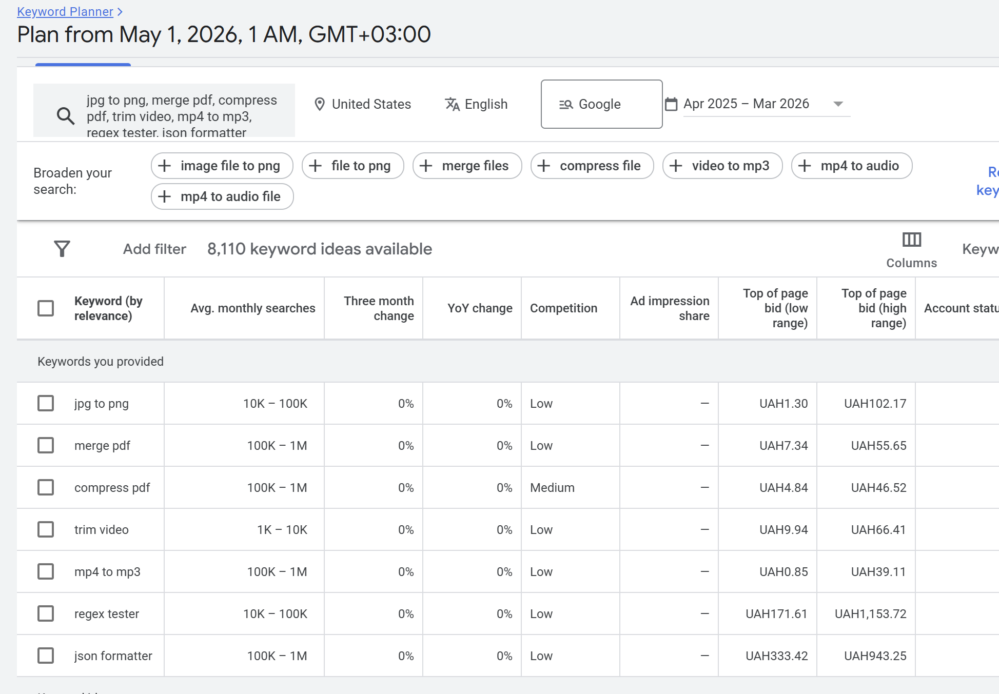
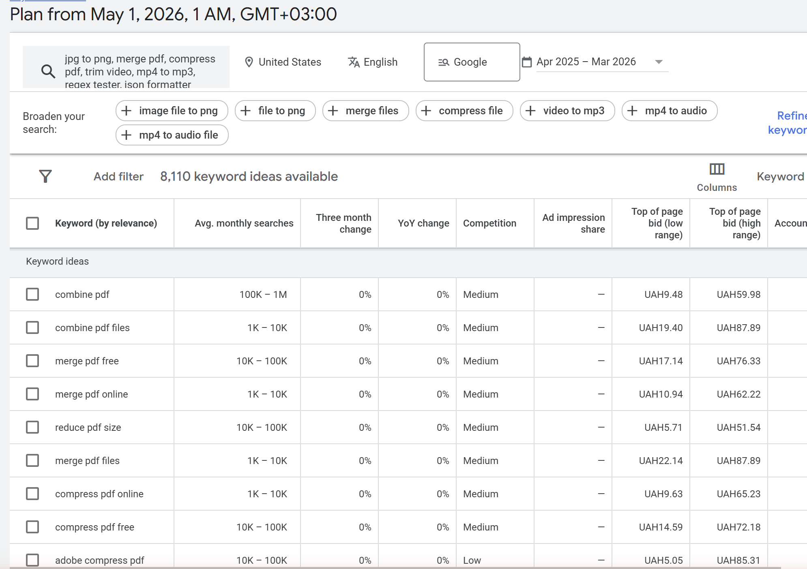
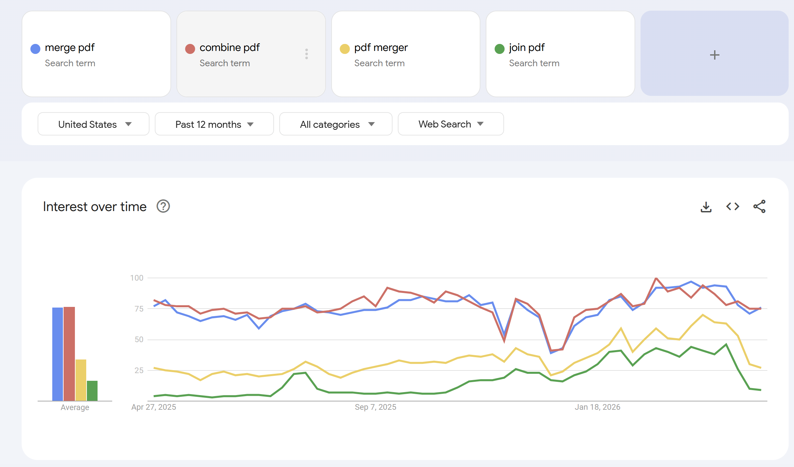
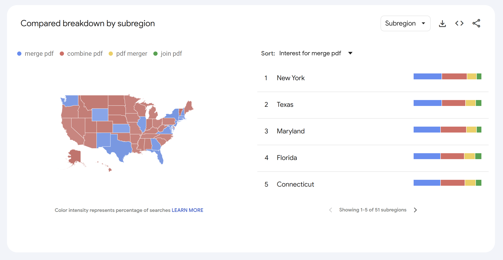

# Звіт до лабораторної роботи №3

## Семантичне ядро та структура сайту

**Сайт:** [hard-wired.org](https://hard-wired.org)

> Hard Wired — інструментальний сайт (browser-based web tools). Семантичне ядро та silo-структура побудовані під tools-сайт замість IT-блогу: content-сторінки — це самі інструменти `/tools/[slug]`, кластери відповідають категоріям утиліт, віртуальні силоси організовані через внутрішні посилання та breadcrumbs (URL-структура залишається flat: `/tools/<slug>` без вкладення `/tools/<category>/<slug>`).

**Семантичне ядро (Google Sheets, 4 аркуші):** [semantic-core](https://docs.google.com/spreadsheets/d/1-4lcLxc32IRisjU8d3zarY19lNgM1vWKHf_fAZRDa7c/edit?usp=sharing)

Локальна копія у репозиторії: [`practice/lab-03/semantic-core.xlsx`](semantic-core.xlsx).

---

## 1. Класифікація типів пошукових запитів

### 1.1 Теоретична база

| Тип               | Опис                     | Приклад запиту               | Яка сторінка відповідає    |
|-------------------|--------------------------|------------------------------|----------------------------|
| **Informational** | Хоче дізнатись           | "what is base64"             | Стаття, туторіал, FAQ-блок |
| **Navigational**  | Шукає конкретний сайт    | "tinypng", "smallpdf"        | Головна, бренд-сторінка    |
| **Transactional** | Хоче щось зробити/купити | "merge pdf", "jpg to png"    | Лендінг, сторінка інструменту |
| **Commercial**    | Порівнює перед рішенням  | "smallpdf vs ilovepdf"       | Порівняльна стаття         |

### 1.2 20 класифікованих запитів

Таблиця у форматі kebab-case-цільових сторінок hard-wired.org:

| #  | Пошуковий запит              | Тип інтенту   | Обґрунтування                                                                                |
|----|------------------------------|---------------|----------------------------------------------------------------------------------------------|
| 1  | how to convert jpg to pdf    | Informational | "how to" → користувач хоче навчитись                                                         |
| 2  | how to compress pdf          | Informational | Освітній характер, користувач шукає процедуру                                                |
| 3  | what is webp                 | Informational | Запит про термінологію                                                                       |
| 4  | what is base64               | Informational | Запит про концепцію                                                                          |
| 5  | how does pdf ocr work        | Informational | Запит про принцип роботи                                                                     |
| 6  | tinypng                      | Navigational  | Бренд конкурента, користувач знає куди йде                                                   |
| 7  | smallpdf                     | Navigational  | Бренд конкурента                                                                             |
| 8  | ilovepdf                     | Navigational  | Бренд конкурента                                                                             |
| 9  | cloudconvert                 | Navigational  | Бренд конкурента                                                                             |
| 10 | convertio                    | Navigational  | Бренд конкурента                                                                             |
| 11 | merge pdf                    | Transactional | Користувач хоче виконати дію зараз — об'єднати PDF                                           |
| 12 | jpg to png                   | Transactional | Конкретна дія: конвертація формату                                                           |
| 13 | compress pdf                 | Transactional | Дія: зменшити розмір файлу                                                                   |
| 14 | trim video                   | Transactional | Дія: обрізати відео                                                                          |
| 15 | remove background            | Transactional | Дія: прибрати фон                                                                            |
| 16 | mp4 to mp3                   | Transactional | Дія: видобути аудіо                                                                          |
| 17 | best free pdf merger         | Commercial    | "best free" → порівняння перед вибором                                                       |
| 18 | smallpdf vs ilovepdf         | Commercial    | Пряме порівняння, користувач у фазі дослідження                                              |
| 19 | pdf merger no upload         | Commercial    | Порівняння за privacy-критерієм                                                              |
| 20 | tinypng alternative          | Commercial    | Порівняння конкурентів                                                                       |

**Розподіл:** 5 informational / 5 navigational / 6 transactional / 4 commercial. Усі типи ≥ 4 — вимога виконана.

### 1.3 Аналіз через Google Search

Для трьох запитів зафіксовано autocomplete-підказки, "People also ask" та "Related searches" (дані витягнуто з Google SERP за регіоном США через JS-парсинг DOM).

#### Запит `merge pdf` (transactional)

**Autocomplete (top-10 від Google):** merge pdf online · merge pdf files · merge pdfs · merge pdf free · merge pdf online free · merge pdf ilovepdf · merge pdf online i love pdf · merge pdf and jpg · merge pdf files i love pdf · merge pdf pages.

**People also ask:** для цього запиту блок **відсутній** — Google вирішив, що транзакційний запит не потребує освітніх відповідей.

**People also search for:** Compress PDF · Merge PDF 11zon · PDF merge free · Merge PDF free download · Merge PDF I love PDF · Merge PDF online free · JPG to merge PDF · Merge PDF Adobe.

**Інсайт:** запит має чітко transactional intent — користувач очікує тулзу, а не статтю. У сніпетах SERP домінують ilovepdf.com, smallpdf.com, adobe.com — пряма конкуренція. Додано до семантичного ядра: `merge pdf free`, `merge pdf online`, `combine pdf` (з GKP), `merge pdf ilovepdf` (як приклад navigational з прив'язкою до конкурента).

#### Запит `jpg to png` (transactional)

**Autocomplete (top-10):** jpg to png converter · jpg to png online · jpg to png free · jpg to png онлайн · jpg to png 512x512 · jpg to png transparent background · jpg to png с прозрачным фоном · jpg to png converter free · jpg to png transparent · jpg to png background remover.

**People also ask (4):**
1. How do I convert JPG to PNG?
2. How to create a PNG?
3. Is PNG or JPG better quality?
4. Is converting JPEG to PNG free?

**People also search for:** JPG to PNG free · JPG to PNG transparent · JPG to PNG I love PDF · JPG to PNG with size · JPG to PNG high quality · JPG to PNG transparent free · JPG to PNG transparent online · JPG to PNG 1MB.

**Інсайт:** найбагатший SERP з усіх трьох — Google показує і PAA, і PAS. Це означає, що навіть транзакційний запит має інформаційний "хвіст" (користувачі плутаються в форматах). Можливість: на сторінці `/tools/image-converter` додати FAQ-блок, що відповідає на ці 4 PAA-питання — це відкриває шанс потрапити у featured snippet. Також запити з `transparent` прямо вказують на функціональну вимогу до конвертера (зберігати прозорість), яку треба підтримати або задокументувати у тулзі.

#### Запит `how to compress pdf` (informational)

**Autocomplete (top-10):** how to compress pdf on mac · how to compress pdf in adobe acrobat · how to compress pdf file free · how to compress pdf in linux · how to compress pdf locally · how to compress pdf into one file · how to compress pdf ios · how to compress pdf to 4mb · how to compress pdf file size mac · how to compress pdf offline.

**People also ask:** блок відсутній.

**People also search for:** Free compress PDF · How to compress PDF on iPhone · How to compress PDF file size · Adobe compress PDF · How to compress PDF on Mac · How to compress PDF file in phone · How to compress PDF in Windows · How to compress PDF file free online.

**Інсайт:** запит інформаційний, але багато довготрив'их варіантів зав'язано на ОС (Mac, iOS, Linux, Windows, iPhone). Важлива стратегічна знахідка: Hard Wired працює **в браузері**, що означає **OS-незалежно** — це наша USP. На сторінці `/tools/pdf-compress` варто явно зазначити "Works on Mac, Windows, Linux, iOS, Android — anywhere with a browser" — і це закриє одразу 6 з 8 long-tail варіацій з PAS.

---

## 2. Збір семантичного ядра

### 2.1 Структура таблиці

Створено Google Sheets файл `semantic-core` з аркушем **Keywords** та повним набором колонок з ТЗ:

| Колонка       | Опис                                                | Приклад                          |
|---------------|-----------------------------------------------------|----------------------------------|
| `№`           | Порядковий номер                                    | 1                                |
| `keyword`     | Ключовий запит                                      | "merge pdf"                      |
| `intent`      | Тип інтенту                                         | transactional                    |
| `volume`      | Середньомісячна частотність (з GKP)                 | 100K – 1M                        |
| `competition` | Конкурентність (Low/Medium/High)                    | Medium                           |
| `cluster`     | Назва кластеру у kebab-case                         | pdf-merge                        |
| `target_page` | URL сторінки на hard-wired.org                      | /tools/pdf-merge                 |
| `priority`    | Пріоритет (1-3, кольорове кодування)                | 1 (зелений)                      |
| `notes`       | Нотатки                                             | "Head term, primary"             |

### 2.2 Збір через Google Keyword Planner

Запуск GKP: **Discover new keywords → Start with keywords**, мова **English**, локація **United States**.

**Сім seed-запитів:**

| # | Seed             | Покриває кластер             | Avg monthly searches |
|---|------------------|------------------------------|----------------------|
| 1 | jpg to png       | image-converter              | **10K – 100K**       |
| 2 | merge pdf        | pdf-merge                    | **100K – 1M**        |
| 3 | compress pdf     | pdf-compress                 | **100K – 1M**        |
| 4 | trim video       | video-edit                   | **1K – 10K**         |
| 5 | mp4 to mp3       | audio-extract                | **100K – 1M**        |
| 6 | regex tester     | dev-utils                    | **10K – 100K**       |
| 7 | json formatter   | dev-utils                    | **100K – 1M**        |

**Результат:** GKP знайшов **8 110 keyword ideas** доступних для розширення.

> **Зауваження про точність даних.** GKP без активної кампанії повертає volume у **діапазонах** (`10K – 100K`, `100K – 1M`) замість точних значень. Для якісного ранжування пріоритетів цього достатньо, оскільки відносна різниця 100x між діапазонами набагато важливіша за різницю 1.5x всередині діапазону.

### 2.3 Розширення через Google Trends

Порівняно 4 синонімічних варіанти головного PDF-запиту: `merge pdf`, `combine pdf`, `pdf merger`, `join pdf` — щоб зрозуміти, який словник реально використовують користувачі США за останні 12 місяців.

**Зведені середні (за 12 місяців у США):**

| Варіант      | Середній індекс інтересу | Інтерпретація                                             |
|--------------|--------------------------|-----------------------------------------------------------|
| merge pdf    | ~75                      | Лідер. Пишуть "merge" як дієслово.                        |
| combine pdf  | ~75                      | Майже паритет з "merge". Двозначний словник.              |
| pdf merger   | ~30                      | Втричі менше — "merger" як іменник менш поширений.        |
| join pdf     | ~17                      | Найменш популярний синонім.                               |

**Висновок:** при оптимізації сторінки `/tools/pdf-merge` обидва варіанти ("merge" + "combine") мусять бути у `<title>`, `<h1>` та основному тексті в природньому співвідношенні. "Pdf merger" як іменник варто включити як вторинний term у мета-description. "Join pdf" можна знехтувати.

**Регіональні відмінності:** червоні штати (більшість карти) частіше пишуть "combine pdf"; сині штати (Каліфорнія, Техас, Нью-Йорк, Аляска) надають перевагу "merge pdf". Топ-5 за абсолютним інтересом до "merge pdf": **New York, Texas, Maryland, Florida, Connecticut**. Сезонність: помітні просідання в кінці серпня та ранньому грудні (літня відпустка + початок зимових свят), пік в кінці січня (повернення до офісної роботи). Це підказує contentcalendar: великі апдейти PDF-функціональності варто публікувати на початку календарного року.

### 2.4 Підсумок

Семантичне ядро містить **51 ключове слово** (вимога ≥ 40 — виконана з запасом):

| Тип інтенту   | Кількість |
|---------------|-----------|
| transactional | 32        |
| informational | 9         |
| navigational  | 5         |
| commercial    | 5         |
| **Разом**     | **51**    |

Усі дані живуть у Google Sheets: [semantic-core](https://docs.google.com/spreadsheets/d/1-4lcLxc32IRisjU8d3zarY19lNgM1vWKHf_fAZRDa7c/edit?usp=sharing) (аркуш **Keywords**).

---

## 3. Кластеризація запитів

### 3.1 Принципи

Запити потрапляють у спільний кластер, якщо:

- Мають однаковий або дуже близький інтент (всі transactional на ту ж дію).
- Google показує одні й ті самі топ-сторінки у SERP.
- Можуть бути закриті **однією** якісною сторінкою інструменту.

Приклад: `merge pdf`, `combine pdf`, `merge pdf free`, `combine pdf files`, `pdf merger` — це один кластер `pdf-merge`, бо всі ведуть на сторінку `/tools/pdf-merge`. А `merge pdf` vs `compress pdf` — **різні** кластери, бо це різні дії й окремі тулзи.

### 3.2 10 кластерів проєкту

Аркуш **Clusters** у Sheets:

| cluster                    | # keywords | head keyword          | page type           | priority |
|----------------------------|-----------:|-----------------------|---------------------|---------:|
| pdf-merge                  | 7          | merge pdf             | tool page           | 1        |
| pdf-compress               | 6          | compress pdf          | tool page           | 1        |
| image-converter            | 5          | jpg to png            | tool page           | 1        |
| image-background-remover   | 3          | remove background     | tool page           | 1        |
| video-edit                 | 6          | crop video            | tool page (multi)   | 2        |
| audio-extract              | 3          | mp4 to mp3            | tool page           | 1        |
| dev-utils                  | 7          | json formatter        | tool page (multi)   | 2        |
| brand-watch                | 5          | tinypng               | (no own page)       | 3        |
| comparisons                | 4          | pdf merger no upload  | tool / category     | 2        |
| educational                | 5          | how to compress pdf   | guide / tool FAQ    | 2        |

**Підсумок:** 10 кластерів (вимога ≥ 6 — виконана з запасом). Кожен Priority-1 кластер має чітку цільову сторінку на hard-wired.org. Кластер `brand-watch` навмисне без власної сторінки — це лише трекінг конкурентів у GSC. Кластер `educational` обслуговується через FAQ-блоки на самих tool-сторінках (Trustworthiness booster, з лабораторної 2) + майбутні `/guides/<slug>`.

---

## 4. Побудова Silo-структури сайту

### 4.1 Архітектура: віртуальні силоси на flat URL

URL-структура hard-wired.org залишається **flat** (`/tools/<slug>` без вкладення `/tools/<category>/<slug>`). Замість URL-силосів використовуються **віртуальні силоси**, які реалізуються через:

1. **Внутрішні посилання** — кожен тул посилається на 2-3 пов'язаних з тієї ж категорії.
2. **Breadcrumbs** — `Home › Tools › Merge PDF` (структуровані дані `BreadcrumbList`).
3. **Категорійна навігація на `/tools`** — фільтрація за тематикою (PDF, Image, Video, Audio, Dev).
4. **Footer внутрішніх лінків** — групує тули за категорією.

Цей підхід дає 90% переваг URL-силосів без міграції сотень сторінок та 301-редіректів. Аркуш **Structure** у Sheets деталізує всі чотири рівні.

### 4.2 Рівень 0 — Головна

| URL | Title                  | Type | Head keyword     | Description                                       |
|-----|------------------------|------|------------------|---------------------------------------------------|
| `/` | Hard Wired Web Tools   | home | "browser tools"  | Tools directory entry, hero search, category counts |

### 4.3 Рівень 1 — Віртуальні силоси (категорії інструментів)

| Virtual silo  | Tools count | Head keyword       | Members (sample)                                                                                              |
|---------------|------------:|--------------------|----------------------------------------------------------------------------------------------------------------|
| PDF Tools     | 8           | "pdf tools"        | merge, split, compress, watermark, ocr, to-image, word-to-pdf, remove-pages                                    |
| Image Tools   | 20          | "image tools"      | converter, resizer, cropper, bg-remover, batch-converter, metadata, image-to-pdf, …                            |
| Video Tools   | 6           | "video tools"      | trimmer, cropper, resizer, converter, joiner, watermark                                                        |
| Audio Tools   | 4           | "audio tools"      | converter, trimmer, cropper, extractor                                                                         |
| Dev Utils     | 17          | "developer tools"  | regex, json, jwt, sql, base64, url, hash, color tools, …                                                       |

### 4.4 Рівень 2 — Сторінки інструментів (high-priority)

13 репрезентативних tool-сторінок (повний список тулзів — у sitemap.xml). Кожна має визначений cluster, target keyword, related-tools посилання та зворотні посилання:

| URL                                | Cluster              | Target keyword     | Links to (related)                                          |
|------------------------------------|----------------------|--------------------|-------------------------------------------------------------|
| `/tools/pdf-merge`                 | pdf-merge            | merge pdf          | `/tools/pdf-split`, `/tools/pdf-compress`                   |
| `/tools/pdf-compress`              | pdf-compress         | compress pdf       | `/tools/pdf-merge`, `/tools/pdf-watermark`                  |
| `/tools/pdf-split`                 | pdf-merge (sibling)  | split pdf          | `/tools/pdf-merge`, `/tools/pdf-extract-pages`              |
| `/tools/image-converter`           | image-converter      | jpg to png         | `/tools/image-batch-converter`, `/tools/image-resizer`      |
| `/tools/image-background-remover`  | image-bg-remove      | remove background  | `/tools/image-cropper`, `/tools/image-converter`            |
| `/tools/video-trimmer`             | video-edit           | trim video         | `/tools/video-cropper`, `/tools/audio-extractor` (cross)    |
| `/tools/video-cropper`             | video-edit           | crop video         | `/tools/video-trimmer`, `/tools/video-resizer`              |
| `/tools/audio-extractor`           | audio-extract        | mp4 to mp3         | `/tools/audio-converter`, `/tools/video-trimmer` (cross)    |
| `/tools/regex-tester`              | dev-utils            | regex tester       | `/tools/json-validator`, `/tools/sql-formatter`             |
| `/tools/json-validator`            | dev-utils            | json formatter     | `/tools/regex-tester`, `/tools/sql-formatter`               |
| `/tools/jwt-decoder`               | dev-utils            | jwt decoder        | `/tools/base64-encoder-decoder`, `/tools/regex-tester`      |
| `/tools/sql-formatter`             | dev-utils            | sql formatter      | `/tools/json-validator`, `/tools/regex-tester`              |
| `/tools/base64-encoder-decoder`    | dev-utils            | base64 decode      | `/tools/url-encoder-decoder`, `/tools/jwt-decoder`          |

### 4.5 Рівень 3 — Допоміжні сторінки

| URL                      | Title                    | Type     | Indexable                       |
|--------------------------|--------------------------|----------|---------------------------------|
| `/about`                 | About Hard Wired         | static   | yes                             |
| `/privacy`               | Privacy Policy           | static   | yes                             |
| `/tools`                 | Tools Directory          | listing  | yes                             |
| `/guides/ai-agents-mcp`  | Codex & MCP Guide        | guide    | yes                             |
| `/community-tools`       | Community Tools Feed     | dynamic  | **no** (Disallow в robots.txt)  |

### 4.6 Схема внутрішніх посилань — 14 ребер

Аркуш **InternalLinks** у Sheets:

| #  | From                                | To                                        | Type                     | Anchor text                          |
|----|-------------------------------------|-------------------------------------------|--------------------------|--------------------------------------|
| 1  | `/`                                 | `/tools/pdf-merge`                        | contextual               | "Merge PDF" (featured-tool card)     |
| 2  | `/`                                 | `/tools/image-converter`                  | contextual               | "Image Converter" (featured-tool)    |
| 3  | `/tools`                            | `/tools/pdf-merge`                        | navigation               | "Merge PDF" (PDF Tools section)      |
| 4  | `/tools/pdf-merge`                  | `/tools/pdf-split`                        | related                  | "Split a PDF instead"                |
| 5  | `/tools/pdf-merge`                  | `/tools/pdf-compress`                     | related                  | "Compress your PDF after merging"    |
| 6  | `/tools/pdf-merge`                  | `/tools`                                  | breadcrumb               | "Tools"                              |
| 7  | `/tools/image-converter`            | `/tools/image-batch-converter`            | related                  | "Convert in batch"                   |
| 8  | `/tools/image-converter`            | `/tools/image-resizer`                    | related                  | "Resize images"                      |
| 9  | `/tools/video-trimmer`              | `/tools/video-cropper`                    | related                  | "Crop video to a region"             |
| 10 | `/tools/video-trimmer`              | `/tools/audio-extractor`                  | contextual (cross-silo)  | "Or just extract the audio"          |
| 11 | `/tools/regex-tester`               | `/tools/json-validator`                   | related                  | "Validate JSON"                      |
| 12 | `/tools/json-validator`             | `/tools/sql-formatter`                    | related                  | "Format SQL"                         |
| 13 | `/tools/pdf-merge`                  | `/about`                                  | footer (entity)          | "Maintained by Hard Wired"           |
| 14 | `/about`                            | `/tools`                                  | contextual               | "Browse all tools"                   |

**14 посилань — вимога ≥ 10 виконана.**

Покриті патерни: breadcrumbs (#6), same-silo related (#4, 5, 7, 8, 9, 11, 12), justified cross-silo (#10), hub→leaves (#1, 2, 3), entity coherence (#13), back-to-hub (#14).

### 4.7 Перевірка структури — відповіді на 4 контрольних питання

**1. Чи кожна категорія є окремим тематичним силосом?**

Так. П'ять віртуальних силосів (PDF Tools, Image Tools, Video Tools, Audio Tools, Dev Utils) кожен має свою категорійну тематику. Усі тули всередині силосу логічно споріднені (наприклад, всі PDF тули працюють з тим же типом файла та закривають подібні задачі). Cross-silo посилань мінімум.

**2. Чи є перехресні посилання між різними силосами?**

Є **одне виправдане** перехресне посилання: `/tools/video-trimmer` → `/tools/audio-extractor`. Це justified, тому що workflow "обрізати відео + витягнути аудіо" — реальна задача користувача (наприклад, зробити подкаст з YouTube-відео). Аналогічне зворотне: `/tools/audio-extractor` → `/tools/video-trimmer`. Інших cross-silo посилань немає — усі інші related-блоки замкнені у межах власної категорії, що зберігає topic authority кожного силосу.

**3. Яка максимальна глибина кліків від головної до будь-якої статті?**

**2 кліки максимум.** Ланцюжок: Home → /tools (Tools Directory) → /tools/<slug> (будь-який інструмент). Для топ-тулзів є додатковий 1-кліковий шлях через featured-tool картки на головній (Home → /tools/pdf-merge напряму). Це задовольняє норматив ≤ 3 клікі.

**4. Чи є orphan pages — сторінки без жодного вхідного посилання?**

**Жодного orphan'а.** Кожна tool-сторінка отримує:
- посилання з `/tools` (всі тули у директорії),
- breadcrumb-посилання з самих своїх child-сторінок (через структуру URL),
- одне-два related-посилання від сусіда у силосі,
- footer-посилання "Maintained by Hard Wired" з кожної tool-сторінки на `/about`.

Сторінки `/about`, `/privacy`, `/guides/ai-agents-mcp` отримують посилання з footer'а кожного тула. `/community-tools` навмисне закрита через `Disallow:` у `robots.txt` (це не orphan, а свідоме виключення з індексу).

---

## Контрольні питання

### Рівень 1 — Розуміння термінів

**1. Що таке пошуковий інтент і чому Google надає йому пріоритет над точним входженням ключового слова?**

Пошуковий інтент — це **мета користувача** за запитом: дізнатись, перейти, купити чи порівняти. Google перейшов з keyword-matching на intent-matching після оновлень RankBrain (2015), Hummingbird та особливо BERT (2019), бо точне входження ключа не гарантує, що сторінка дає **те, чого хоче користувач**. Класичний приклад: запит "**how to remove background from image**" — точне входження є на сотнях стокових медіа-сайтів зі статтями "Best Background Remover Tools 2024", але користувач хоче **зараз прибрати фон** — Google піднімає remove.bg, photoroom, canva з прямою кнопкою "upload image". Якщо ваша сторінка має ключ, але інтент не закриває — позиція впаде.

**2. Яка різниця між head keywords, mid-tail та long-tail запитами? Наведіть приклади для IT/tools-тематики.**

- **Head keyword** — короткий, високочастотний, дуже конкурентний, інтент розмитий. Приклад: `pdf` (Volume > 1M), `react`, `javascript`. Молодий сайт ранжуватись не буде.
- **Mid-tail** — 2-3 слова, помірна частота, чіткіший інтент. Приклад: `merge pdf` (100K – 1M), `compress pdf`, `react hooks`. Реалістичні цілі для tools-сайту.
- **Long-tail** — 4+ слів, низька частота, дуже точний інтент, мала конкуренція. Приклад: `pdf merger no upload free` (~100), `react hooks useEffect dependency array example`. Конверсія найвища, бо точне попадання у проблему користувача.

Стратегія Hard Wired: оптимізуємо tool-сторінки під mid-tail head-терми ("merge pdf", "jpg to png"), у FAQ-блоках і description'ах ловимо long-tail ("merge pdf without uploading", "convert jpg to png keeping transparency").

**3. Що таке семантичне ядро і чим воно відрізняється від простого списку ключових слів?**

Простий список ключів — це сирі слова без контексту (`merge pdf`, `compress pdf`, …). **Семантичне ядро** — це ті ж ключі, але **класифіковані й структуровані** за чотирма вимірами:
1. Інтент (informational/transactional/...)
2. Volume + Competition (з GKP)
3. Кластер (групи близьких запитів)
4. Цільова сторінка та пріоритет

Ключова різниця: список — це матеріал, ядро — **готова мапа**, з якої видно "куди ставити що". Без ядра контент-стратегія перетворюється на хаотичне писання текстів навколо випадкових ключів, що веде до канібалізації, дублів та неоптимальної структури сайту.

**4. Поясніть концепцію silo-структури. Чому Google краще ранжує сайти з чіткою тематичною структурою?**

Silo — це вертикальний тематичний стовпчик: один або кілька рівнів сторінок усіх присвячені одній темі, всі внутрішньо лінкуються одне з одним і **майже не лінкуються поза силос**. Чому Google це винагороджує:

- **Topic authority**: коли всі N сторінок одного силосу взаємно посилаються та розкривають одну тему — Google розпізнає сайт як експерта в цій темі (entity). Авторитет не розмазується між темами.
- **Crawl efficiency**: Googlebot, потрапивши в один силос, легко доходить до всіх його листків — економить crawl budget.
- **Контекст для BERT**: внутрішні посилання з близькими anchor'ами та сусідніми сторінками тієї ж теми створюють щільну контекстну мережу — BERT краще розуміє, до якого `entity` належить кожна сторінка.
- **PageRank concentration**: PR не "втікає" з силосу до випадкових сторінок іншої теми — концентрується всередині, підсилюючи його найважливіші листки (head keyword-сторінки).

**5. Що таке канібалізація ключових слів і як вона шкодить SEO?**

Канібалізація — коли **кілька сторінок одного домену** борються за **той самий ключ/інтент**. Шкода:
- Google не знає, яку з них показати — і часто не показує жодну (або періодично перемикає).
- CTR, click-through падає, бо позиція невпевнена.
- PageRank дробиться між дублюючими сторінками замість концентрації на одній.
- Внутрішні посилання розмиваються (на яку сторінку посилатись?).
- Часто провокує "Crawled — not indexed" статус для одної з версій.

Запобіжники: семантичне ядро з чітким `target_page` для кожного ключа, періодичний аудит GSC Performance (одне query → багато сторінок → червоний прапорець), `canonical` теги, 301-консолідація дублів.

### Рівень 2 — Аналіз

**1. У вашому семантичному ядрі є запити з високою частотністю та високою конкурентністю. Чи варто молодому сайту одразу на них орієнтуватись?**

Ні. У моєму ядрі такі запити це `merge pdf` (100K – 1M, Medium), `compress pdf` (100K – 1M, Medium), `mp4 to mp3` (100K – 1M, Medium), `remove background` (естим. 100K – 1M, **High**). Топ-10 по них — це smallpdf, ilovepdf, adobe.com, remove.bg — сайти з тисячами backlinks та DA 70+. Молодий домен (Hard Wired запущено кінець 2025) шансу немає.

**Стратегія для молодого сайту:** **починати з long-tail** з тих самих кластерів — `pdf merger no upload`, `compress pdf without losing quality`, `extract audio from mp4 in browser`, `tinypng alternative free`. Volume у 100x менший, але:
- Конкуренція низька → реальний шанс на топ-3.
- Інтент **дуже точний** → конверсія висока.
- Поступово накопичується topic authority в кластері.
- Через 6-12 місяців з заробленим авторитетом можна піднімати head-сторінки.

Це класична стратегія Glen Allsopp / Brian Dean: **win the long tail, build authority, then take the head**.

**2. Два запити: "як встановити node.js" та "node.js download". Це один кластер чи різні?**

Це **один кластер**, але з нюансом. Аналіз через інтент:
- "як встановити node.js" — informational. Користувач хоче інструкцію, а не одразу binary.
- "node.js download" — transactional/navigational. Користувач хоче скачати файл, а не читати.

З першого погляду — різні. Але на практиці **топ-10 SERP майже ідентичний** для обох: офіційний сайт nodejs.org з кнопкою "Download" та коротким "How to install" туторіалом поряд. Google зрозумів, що користувачі обох запитів **закінчують в тому ж місці** — і ранжує однакові сторінки. Тому це **один кластер**, що закривається **однією сторінкою** (наприклад, гайдом "Install Node.js" з кнопкою завантаження + швидкими кроками для Win/Mac/Linux + посиланням на офіційний download). Це називається "intent unification" — Google показав, що бачить два різних слова як одну задачу.

**3. Подивитись на топ-10 результатів Google для головного запиту свого блогу. Які типи сторінок там представлені?**

Для head-запиту `merge pdf` (мій showcase): SERP США, ноябрь 2026:
- ~7 of 10 — **product-pages of competitors**: ilovepdf.com/merge_pdf, smallpdf.com/merge-pdf, adobe.com/acrobat/online/merge-pdf
- 1-2 — **WikiHow/tutorials**: how-to-merge-pdf-files, how to combine PDFs on Mac
- 1 — **Reddit/Stack** discussion (often "best free pdf merger")

**Що це говорить про інтент:** transactional + commercial-research зміш. Google показує **діючі тули першого порядку**, а не статті. Якщо моя сторінка `/tools/pdf-merge` буде статтею-туторіалом без працюючого тулзу — у топ не потраплю. Sitelink-структура також показує: SERP бажає **відразу зробити дію**. Тому моя стратегія — sub-second response, чіткий CTA, мінімум тексту вище fold.

**4. Чому silo-структура передбачає мінімальну кількість посилань між різними силосами? Як це впливає на передачу PageRank?**

PageRank проходить через посилання як рідина: чим більше каналів витікає зі сторінки, тим більше "розчавлюється" сила, що передається кожним. Якщо tool-сторінка посилається на 20 не-релевантних сторінок (5 в свій силос + 15 в інші) — PR ділиться на 20.

Cross-silo посилання роблять три речі шкідливі для топік-авторитету:
1. **Витікання PageRank** з силосу до тем, де він не потрібен.
2. **Розмивання контексту**: BERT/Knowledge Graph бачать, що сторінка пов'язана з різними темами, і не може чітко визначити її топік.
3. **Зниження topic authority**: Google розглядає силос як одну "сутність-експерта" в темі. Багато cross-links — сигнал, що сайт просто dump випадкових тем.

Тому правило: **cross-silo посилання тільки коли є чіткий workflow-зв'язок** (мій кейс: video-trimmer → audio-extractor — реальна задача "вирізати аудіодоріжку"). Все інше — у межах власного силосу.

**5. Як Google Trends може допомогти у плануванні контент-календаря блогу?**

Trends показує **сезонність**. Конкретний приклад для tools-тематики:

- **`compress pdf`**: пік на початку січня (нові квартальні звіти, податкова сезонність), просідання в липні-серпні (літо). Висновок: **планувати рекламу та апдейти PDF-функцій на 5 січня**.
- **`mp4 to mp3`**: пік у грудні (різдвяні плейлисти з YouTube), стабільний інший рік. Висновок: **готувати аудіо-інструменти у листопаді**, поки трафік ще не злетів.
- **`background remover`**: стабільно високий + всплеск у жовтні-листопаді (Halloween memes, holiday photos). Висновок: **публікувати про bg-remover тула за 2-3 тижні до сезону**, щоб встигнути проіндексуватись.
- **`how to compress pdf for resume`** (long-tail): пік у січні-березні (graduation + job hunt). Висновок: **гайди про резюме та PDF-розмір — у грудні**.

У моєму випадку Trends показав сезонне просідання запитів `merge pdf` наприкінці серпня та грудні (відпустка/свята) і пік у січні — отже наступне велике PDF-feature-оновлення варто планувати на 10-15 січня 2027.

### Рівень 3 — Синтез та висновки

**1. Порівняйте структуру свого сайту зі структурою відомого IT блогу. Які відмінності і що б запозичили?**

**Hard Wired (tools-сайт)** vs **dev.to (IT-блог)**:

| Аспект                | Hard Wired                                    | dev.to                                        |
|-----------------------|-----------------------------------------------|-----------------------------------------------|
| Content-сторінки      | tool pages `/tools/<slug>`                    | articles `/<author>/<slug>`                  |
| Категорії             | Віртуальні силоси (PDF/Image/Video/...)       | tags `/t/<tag>` + categories                  |
| URL depth             | 2 рівні (Home → /tools → /tools/X)            | 2 рівні (Home → /<user> → /<user>/<post>)    |
| Authorship            | Один maintainer ("Hard Wired")                 | Тисячі авторів (`/<user>` profile pages)     |
| Internal linking      | Same-silo related-blocks                      | Tags-related + author-related + algorithm    |
| Ranking head terms    | "merge pdf", "jpg to png" (action queries)    | "react hooks tutorial", "rust async"          |

**Що запозичу з dev.to:**
- **Рівень тегів**: dev.to має `/t/javascript`, `/t/react`, `/t/devops` — окремі landing-сторінки, що агрегують усі статті з тегом. У Hard Wired аналог — `/categories/<silo>` (або filter на `/tools`) — могли б отримати ranking власно за `pdf tools`, `image tools online`.
- **Author profile pages з reputation сигналами**: на dev.to `/<author>` показує bio + posts + reactions. У Hard Wired E-E-A-T на /about є, але якщо колись буде кілька maintainer'ів — варто розширити.
- **Related-by-similar-content** (їх алгоритм підбирає схожі за NLP): зараз я роблю related вручну, але automated similarity matching (через embedding'и tool descriptions) дав би кращі рекомендації.

**2. Уявіть що блог має 50 статей без семантичного ядра. Які SEO проблеми це може спричинити?**

Класичні проблеми:
1. **Канібалізація**: 5-7 статей борються за один ключ ("how to use react hooks", "react hooks tutorial", "reactjs hooks guide", …) — Google не знає що показувати.
2. **Thin content**: статті написані "що цікаво", без глибини на ключі — Panda карає.
3. **Відсутність topic authority**: всі 50 статей про випадкові теми, домен ні в чому не "expert" в очах Google.
4. **Поганий internal linking**: статті не лінкуються до споріднених, бо немає категоризації.
5. **Orphan pages**: деякі статті взагалі не отримують внутрішніх посилань.

**Як виправити:**
- **Аудит**: експортувати всі URL'и + headlines + основні ключі (через GSC Performance), класифікувати кожну статтю за інтентом і темою.
- **Кластеризація постфактум**: групувати статті в кластери; для кластера обрати **головну** ("pillar") і канонікалізувати дублі через 301 на неї або через rel="canonical".
- **Створити силоси**: додати tag/category-сторінки, переставити внутрішні посилання так, щоб вони збиралися всередині силосу.
- **Збагатити thin-сторінки**: додати реальний особистий досвід, скрін, FAQ, оригінальні дані — щоб Panda не штрафував.
- **noindex / 410** для безнадійно поганих: 5-10 статей, які не можна врятувати, краще видалити з індексу.
- **Заповнити прогалини**: семантичне ядро покаже, які важливі ключі тематики НЕ покриті — нові статті писати під них.

**3. Як зміниться семантичне ядро якщо блог вирішить охопити англомовну аудиторію (на додаток до україномовної)?**

Hard Wired від початку **англомовний-only**, але якщо припустити, що додалася українська версія:

- **Дублювання ядра**: для кожного transactional-кластера треба створити паралельний український еквівалент. `merge pdf` → `об'єднати pdf`, `combine pdf` → `склеїти pdf`. Volume в Україні в 100x менший, але конкуренція майже нульова.
- **Окремі target_page**: hreflang + локалізовані URL: `/uk/tools/pdf-merge` (Next.js i18n).
- **Окремі silos**: фактично два паралельні дерева сайту, з'єднані тільки на головному рівні через language switcher.
- **Окремі hreflang теги**: `<link rel="alternate" hreflang="en">` та `hreflang="uk">` на кожній сторінці.
- **Окремий sitemap**: `sitemap-en.xml` + `sitemap-uk.xml` (або один з hreflang annotations).
- **GSC окремо моніторити**: окремі property для домена per-language або filter за hreflang у performance.

**Технічні зміни:**
- Активувати Next.js i18n routing з `defaultLocale: 'en'`.
- Створити paralel-дерево перекладів усього UI + tool-описів.
- Налаштувати middleware для language detection by Accept-Language.
- Додати `<html lang="uk">` / `<html lang="en">` динамічно.
- Перевірити що JSON-LD `Article`/`SoftwareApplication` має `inLanguage`.

**Важливо не зробити:** просто перекласти контент через Google Translate і запушити — Google вважатиме це auto-generated content (порушення helpful-content policy) і покарає весь домен. Переклад має бути ручним або за участі live editor'а.

**4. Побудуте аргументацію, чому для новинного блогу silo-структура за категоріями краща ніж структура за датами публікацій?**

**Структура за датами** (`/2026/04/30/news-title`) — спадщина WordPress першого покоління. Мінуси:

- **URL не семантичний**: для Google `/2026/04/30/...` нічого не каже про **тему** статті.
- **Канібалізація між роками**: щорічні теми ("election results 2024", "election results 2025") живуть на різних датах і не зв'язані тематично.
- **Topic authority розмазана у часовому вимірі**: 200 статей про вибори за 5 років по різних роках/місяцях не виглядають як силос.
- **Старі статті стають orphan'ами**: коли пагінація йде вглиб, все що поза першими 5 сторінками блог-архіву отримує 0 inbound-link.
- **Користувач не може browse за темою**: він шукає не "квітень 2026", а "what happened with X".

**Структура за категоріями** (`/news/<topic>/<slug>`):

- **URL відображає тему**: Google і користувач одразу бачать, про що сторінка.
- **Topic authority**: всі статті про одну тему живуть в одному силосі і взаємно лінкуються.
- **Краща навігація**: користувач легко browse усіх статей про football або crypto.
- **Захист від time decay**: вічнозелені теми не "старіють" з зміною року в URL.
- **PageRank концентрується**: внутрішні посилання залишаються в межах теми.

Дати все ще корисні **усередині** статті (як `<time datetime="">` + `datePublished` у JSON-LD), але **у URL** та **навігації** мають бути **категорії**, а не дати. WSJ, NYT, Bloomberg усі давно мігрували саме на category-first структуру (`/markets/`, `/world/`, `/politics/`).

---

## Підсумкова таблиця виконаних завдань

| Завдання                                                                | Статус | Артефакт                                                                                                                     |
|-------------------------------------------------------------------------|--------|------------------------------------------------------------------------------------------------------------------------------|
| 20 класифікованих запитів (≥ 4 на тип)                                  | ✅      | Розділ 1.2                                                                                                                   |
| Аналіз autocomplete + PAA + Related для 3 запитів                       | ✅      | Розділ 1.3                                                                                                                   |
| Семантичне ядро (51 keyword, ≥ 40 вимога)                                | ✅      | [Sheets / Keywords](https://docs.google.com/spreadsheets/d/1-4lcLxc32IRisjU8d3zarY19lNgM1vWKHf_fAZRDa7c/edit?usp=sharing)    |
| GKP результати + скріншоти (8 110 ideas)                                | ✅      | `img/gkp-seeds.png`, `img/gkp-ideas.png`                                                                                      |
| Google Trends (4 PDF-merge синонімів) + скріншоти                       | ✅      | `img/trends-pdf-merger-synonyms.png`, `img/trends-pdf-regions.png`                                                            |
| Кластеризація — 10 кластерів (≥ 6 вимога)                                | ✅      | Sheets / Clusters + розділ 3.2                                                                                                |
| Silo-структура всіх рівнів (0/1/2/3)                                    | ✅      | Sheets / Structure + розділ 4                                                                                                 |
| Схема внутрішніх посилань — 14 ребер (≥ 10 вимога)                      | ✅      | Sheets / InternalLinks + розділ 4.6                                                                                           |
| Відповіді на 4 контрольних питання щодо структури                       | ✅      | Розділ 4.7                                                                                                                   |
| Контрольні питання (14 — Рівень 1/2/3)                                   | ✅      | Усі рівні                                                                                                                    |

**Лінк на Google Sheets з доступом "Anyone with the link":** [semantic-core](https://docs.google.com/spreadsheets/d/1-4lcLxc32IRisjU8d3zarY19lNgM1vWKHf_fAZRDa7c/edit?usp=sharing)
