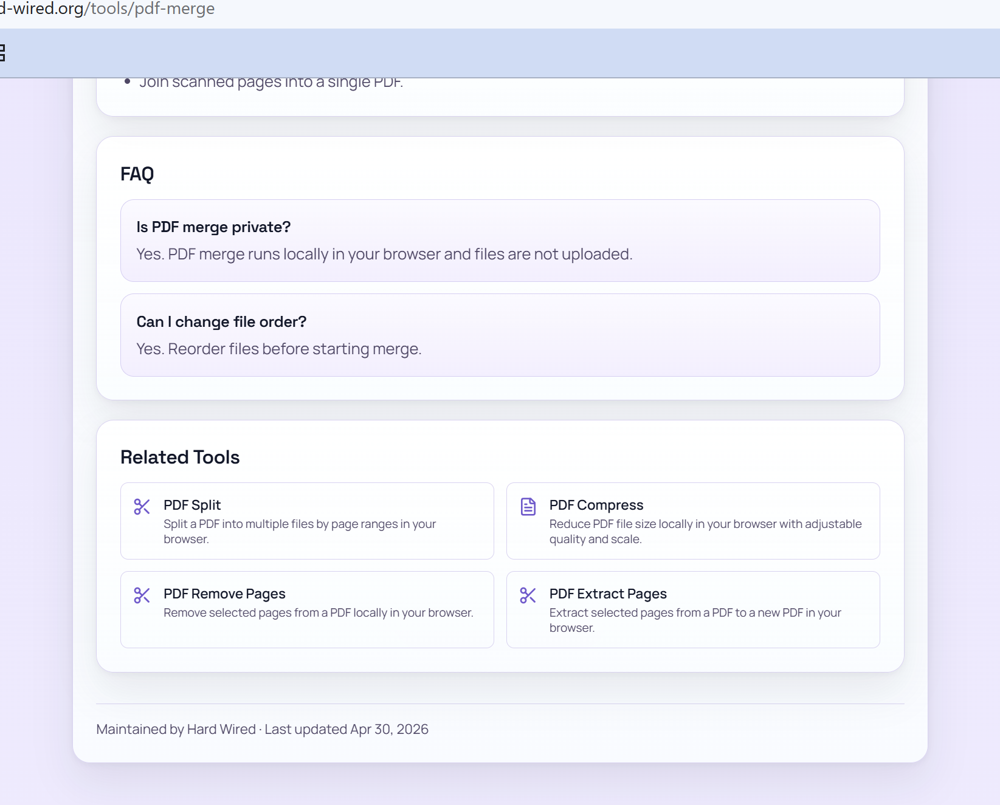
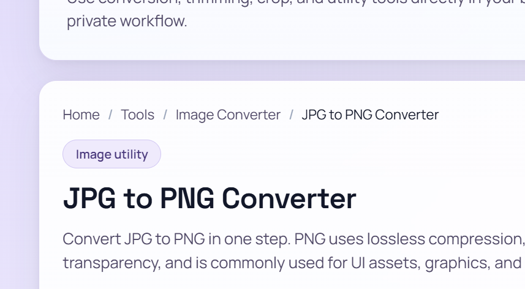
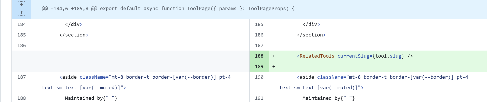
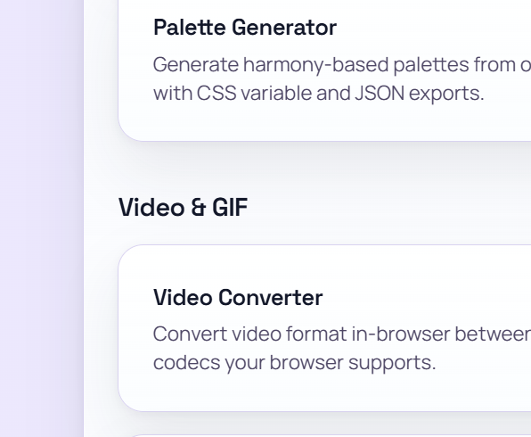
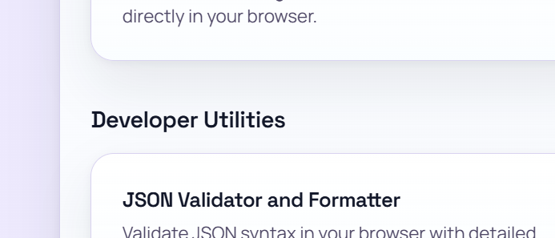
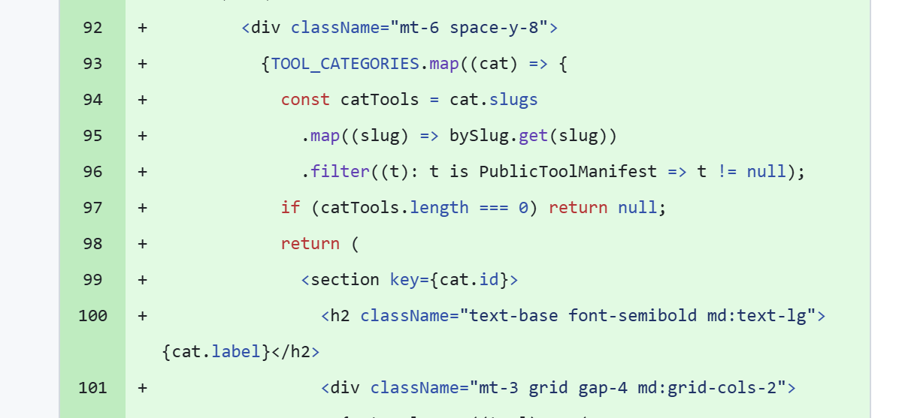
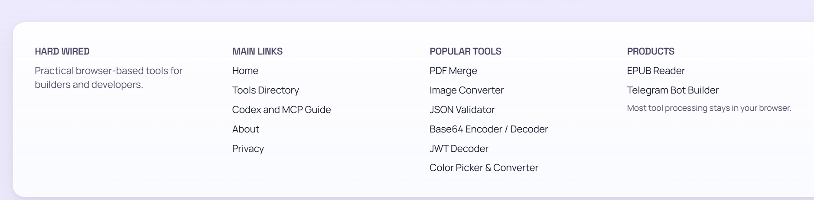
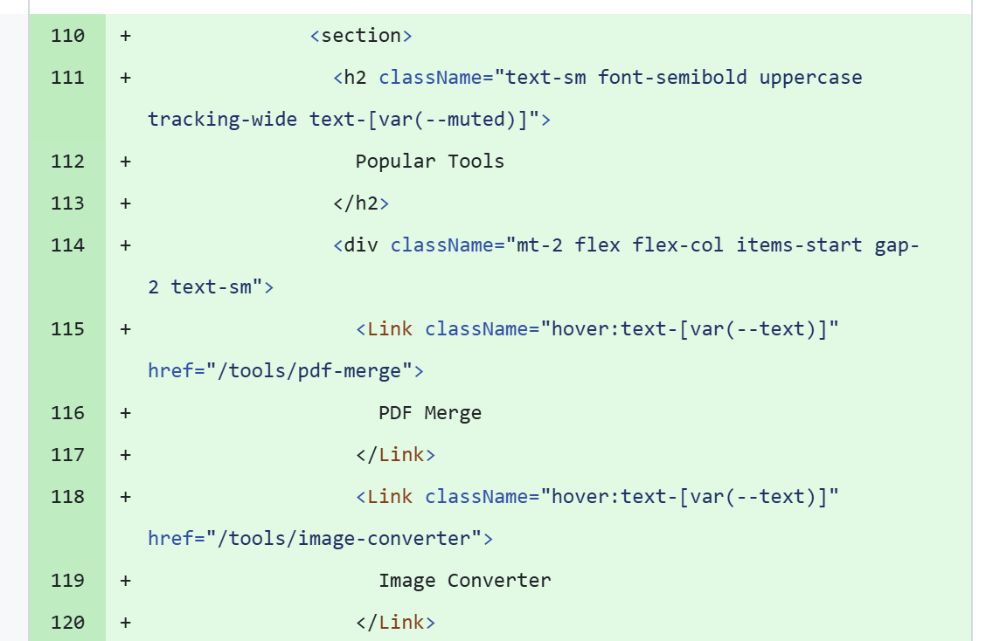

# Лабораторна робота №5. Внутрішня перелінковка

**Проєкт:** [hard-wired.org](https://hard-wired.org) — браузерний набір утилітарних інструментів (PDF, image, video, audio, dev, color).

Сайт побудований на Next.js 16 (static export). Замість IT-блогу з категоріями та статтями, це **silo-структура з утилітарних інструментів** — тому термін «стаття» в лабораторній мапиться на **сторінку інструмента**, «категорія» — на групу інструментів (PDF / Image / Video / Audio / Dev / Color), а «related articles» — на блок **Related Tools** на кожній сторінці інструмента.

---

## Зведення інвентаризації

- **Усього публічних URL:** 64
- **Бази** (`/`, `/about`, `/privacy`, `/guides/ai-agents-mcp`, `/tools`): 5
- **Сторінки інструментів** (`/tools/[slug]`): 46
- **Підсторінки формат-конверторів** (`/tools/image-converter/[from-to]`): 13
- **Загальна кількість внутрішніх посилань** (всі вихідні): 1 388
- **Orphan pages** (нуль вхідних): 0
- **Сторінки із self-link** (посилаються самі на себе хоча б раз): 23
- **Максимальна глибина кліків від `/`:** 3 (для image-converter sub-pages)

Повна таблиця в [`link-audit-lab-05.xlsx`](./link-audit-lab-05.xlsx), аркуш **Pages Inventory**.

---

## 1. Аудит поточної перелінковки

### 1.1 Інвентаризація сторінок

Список усіх 64 URL із колонками `Type / Name / Incoming / Outgoing / Self-links / Click depth / Status` — у файлі `link-audit-lab-05.xlsx` (аркуш **Pages Inventory**).

Виборка з 12 показових рядків:

| URL                                            | Type           | Incoming | Outgoing | Self | Depth | Status   |
|------------------------------------------------|----------------|---------:|---------:|-----:|------:|----------|
| `/`                                            | home           |      239 |       59 |    1 |     0 | linked   |
| `/tools`                                       | category-index |      123 |       58 |    1 |     1 | linked   |
| `/about`                                       | static         |      109 |       12 |    1 |     1 | linked   |
| `/privacy`                                     | static         |       64 |       12 |    1 |     1 | linked   |
| `/guides/ai-agents-mcp`                        | guide          |       63 |       12 |    1 |     1 | linked   |
| `/tools/pdf-merge`                             | tool           |       76 |       20 |    1 |     2 | linked   |
| `/tools/image-converter`                       | tool           |       87 |        0¹ |    0 |     2 | linked   |
| `/tools/image-converter/jpg-to-png`            | sub-tool       |       13 |       29 |    1 |     3 | linked   |
| `/tools/json-validator`                        | tool           |       78 |       20 |    1 |     2 | linked   |
| `/tools/ai-text-cleaner`                       | tool           |        2 |       20 |    0 |     2 | nav-only |
| `/tools/server-side-text-transformer`          | tool           |        1 |       20 |    0 |     2 | nav-only |
| `/tools/markdown-to-pdf`                       | tool           |        2 |       20 |    0 |     2 | nav-only |

¹ `/tools/image-converter` — index-сторінка з клієнтським рендерингом (React `'use client'`), тому в статичному HTML посилання на формат-підсторінки не видні crawler-ам. Це окрема знахідка аудиту — деталі в §1.5.

**Класифікація статусу** (визначено за реальними вхідними посиланнями за вирахуванням self-links):

- **linked** (≥ 3 incoming): 22 сторінки — є зв'язок як через nav, так і через контекстні блоки
- **nav-only** (1-2 incoming): 42 сторінки — отримують посилання тільки з flat index `/tools` + іноді з домашньої. Це найбільший пул для покращення
- **orphan** (0 incoming): **0 сторінок** ✓

### 1.2 Виявлення orphan pages

**Жодного orphan не знайдено.** Sitemap.xml містить 64 URL — усі вони мають ≥ 1 вхідне посилання. Це наслідок того, що:

- `/tools/` (категорійний індекс) лінкує ВСІ 46 інструментів зі своїм описом
- `/` (домашня) лінкує всі 46 інструментів + блок Popular Tools (6 додаткових)
- Image-converter sub-pages перехресно лінкують один одного (Direct Conversions block)

```bash
# Перевірка через terminal (виконано під час аудиту):
curl -sS https://hard-wired.org/sitemap.xml | grep -c '<loc>'
# → 64

# Перевірка зв'язків для конкретного URL:
curl -sS https://hard-wired.org/tools | grep -c '/tools/ai-text-cleaner'
# → 1 (лінкується)
```

### 1.3 Аналіз анкорів

Аудит виконаний для 5 сторінок різних типів:

1. `/` — home
2. `/tools` — category index
3. `/tools/pdf-merge` — tool page (lab 4 SEO-optimized)
4. `/tools/image-converter/jpg-to-png` — sub-tool з 4-рівневою breadcrumb
5. `/about` — static helper

**Всього 178 анкорів** з 5 сторінок класифіковано в `link-audit-lab-05.xlsx`, аркуш **Anchor Audit**.

Розподіл за типами:

| Тип                | Кількість | %     | Оцінка |
|--------------------|----------:|------:|--------|
| descriptive        |       128 | 71.9% | ✅      |
| breadcrumb         |        29 | 16.3% | ✅      |
| self-link          |         5 |  2.8% | ⚠️     |
| exact-match / nav  |        16 |  9.0% | ⚠️/✅  |
| generic            |         0 |  0.0% | -      |
| naked URL          |         0 |  0.0% | -      |

**Сильні сторони:**

- **0 generic анкорів** ("тут", "click here", "read more") — це вже здобуток від попередніх лаб
- 71.9% анкорів — descriptive із входженням keyword (наприклад `PDF Merge — Merge multiple PDF files into a single PDF`)
- На sub-tool сторінках формат-конверторів короткі precise анкори типу `PNG to JPG`, `WebP to ICO` — це partial-match, оптимально для SEO

**Слабкі сторони:**

- 5 self-link випадків на 5 аудит-сторінках — це 2.8%. Footer "Popular Tools" відображається на ВСІХ сторінках, тому коли користувач стоїть на `/tools/pdf-merge`, посилання "PDF Merge" в футері це self-link. Аналогічно для image-converter format pages — у блоці Direct Conversions сторінка має посилання на саму себе. Це **відомий шаблон** в SEO (acceptable), але технічно self-link дає 0 SEO-цінності.

### 1.4 Перевірка глибини кліків

| Рівень  | Сторінки                                                                        | Шлях                                                 | Кількість URL |
|---------|---------------------------------------------------------------------------------|------------------------------------------------------|--------------:|
| **0**   | `/`                                                                             | — (root)                                             |             1 |
| **1**   | `/tools`, `/about`, `/privacy`, `/guides/ai-agents-mcp`                         | `/` → page                                           |             4 |
| **2**   | `/tools/[slug]` — усі 46 інструментів + `/tools/image-converter`                | `/` → `/tools` → tool, або `/` → tool (з featured)   |            46 |
| **3**   | `/tools/image-converter/[format]` — усі 13 формат-підсторінок                   | `/` → `/tools` → `/tools/image-converter` → sub-tool |            13 |

**Найглибша сторінка:** `/tools/image-converter/jpg-to-png` (та інші 12 формат-pages) — рівно 3 кліки.

✅ Норма ≤ 3 кліків витримана для всіх 64 URL.

Допоміжна оптимізація: завдяки **Direct Conversions** блоку на index-сторінці `/tools/image-converter`, формат-сторінки доступні також безпосередньо з рівня 2 (sibling cross-links), що знижує реальну середню глибину.

### 1.5 Чек-ліст типових помилок

| Помилка                                                | Присутня | Де саме                                                                                                                          | Як виправити                                                                              |
|--------------------------------------------------------|----------|----------------------------------------------------------------------------------------------------------------------------------|-------------------------------------------------------------------------------------------|
| Orphan pages                                           | **Ні**   | —                                                                                                                                | —                                                                                         |
| Generic анкори ("тут", "click here")                   | **Ні**   | —                                                                                                                                | —                                                                                         |
| Посилання на себе (self-link)                          | **Так**  | Footer Popular Tools на ВСІХ сторінках; Direct Conversions block на 13 image-converter sub-pages                                 | Acceptable шаблон, але можна додати `aria-current="page"` і CSS-стилізацію замість `<a>`  |
| Зламані внутрішні посилання (404)                      | **Ні**   | Усі 1388 посилань ведуть на існуючі URL (перевірено crawler-ом)                                                                  | —                                                                                         |
| Надлишкова перелінковка (10+ посилань на абзац)        | **Ні**   | Найбільш «насичена» — `/` із 59 outgoing — але вони розкидані по секціях, не в одному абзаці                                     | —                                                                                         |
| Глибина кліків > 3                                     | **Ні**   | Макс. 3 (image-converter sub-pages)                                                                                              | —                                                                                         |
| Посилання через JS (onclick) замість `<a href>`        | **Ні**   | Усі переходи через Next.js `<Link>` → рендерять `<a href>` у статичному експорті                                                 | —                                                                                         |
| Nofollow на внутрішніх посиланнях                      | **Ні**   | `grep -c 'rel="nofollow"'` на статичному HTML → 0                                                                                | —                                                                                         |
| **Client-rendered index без посилань у статичному HTML** | **Так** | `/tools/image-converter` — `'use client'` компонент, у статичному HTML 0 `<a>` лінків на формат-підсторінки                      | Конвертувати в Server Component або додати SSG-fallback зі статичними посиланнями         |

**Висновок аудиту:** сайт у дуже доброму стані з точки зору внутрішньої перелінковки. Єдиний серйозний недолік — client-rendered `/tools/image-converter` index, який потенційно ускладнює crawler-у виявити 13 sub-pages зі сторінки-батька (хоч і компенсується посиланнями з `/tools` flat-індексу та з самих sub-pages).

---

## 2. Побудова схеми перелінковки

### 2.1 Принципи перелінковки на hard-wired.org

**Горизонтальна (всередині силосу):**

- `/tools` → всі інструменти своєї категорії (PDF, Image, Video, Audio, Dev, Color) — реалізовано через Fix 5
- `/tools/[slug]` → 4 пов'язані інструменти тієї ж категорії (через `<RelatedTools>`) — Fix 2
- `/tools/image-converter/[format]` → 12 sibling формат-підсторінок (Direct Conversions block) — реалізовано раніше

**Вертикальна (між рівнями):**

- `/` → 6 featured + 46 повний список + nav-link до `/tools`
- `/` → `/about`, `/privacy`, `/guides/ai-agents-mcp` через header nav
- `/tools/[slug]` → `/tools` → `/` через breadcrumbs
- `/tools/image-converter/[format]` → `/tools/image-converter` → `/tools` → `/` через breadcrumbs

**Перехресна (між силосами):**

- Footer **Popular Tools** (Fix 6): 6 крос-силосних посилань на кожній сторінці (PDF + Image + Dev + Color)
- E-E-A-T maintainer footer на сторінках інструментів → `/about` (лаб. 2)
- `/about` → `/privacy` (контекстне посилання)

### 2.2 Link Scheme

Повна схема — у файлі `link-audit-lab-05.xlsx`, аркуш **Link Scheme** (31 рядок, > 20 необхідних). Виборка з 10 показових:

| # | From                                  | To                                    | Anchor                                                         | Type        | Placement              | Priority |
|---|---------------------------------------|---------------------------------------|----------------------------------------------------------------|-------------|------------------------|----------|
| 1 | `/`                                   | `/tools/pdf-merge`                    | "PDF Merge — Merge multiple PDF files into a single PDF"       | contextual  | home featured          | high     |
| 2 | `/tools`                              | `/tools/pdf-merge`                    | "PDF Merge"                                                    | contextual  | category section       | high     |
| 3 | `/tools/pdf-merge`                    | `/tools`                              | "Tools"                                                        | breadcrumb  | breadcrumb nav         | high     |
| 4 | `/tools/pdf-merge`                    | `/tools/pdf-split`                    | "PDF Split — Split a PDF into multiple files by page ranges"   | related     | Related Tools block    | medium   |
| 5 | `/tools/pdf-merge`                    | `/about`                              | "Hard Wired"                                                   | contextual  | Maintained by footer   | low      |
| 6 | `/tools/image-converter/jpg-to-png`   | `/tools/image-converter/png-to-jpg`   | "PNG to JPG"                                                   | related     | Direct Conversions     | medium   |
| 7 | `/tools/image-converter/jpg-to-png`   | `/tools/image-converter`              | "Image Converter"                                              | breadcrumb  | breadcrumb nav         | high     |
| 8 | `/`                                   | `/tools/json-validator`               | "JSON Validator"                                               | nav         | footer Popular Tools   | medium   |
| 9 | `/about`                              | `/privacy`                            | "Privacy Policy →"                                             | contextual  | article body           | low      |
| 10| `/`                                   | `/tools`                              | "Tools Directory"                                              | nav         | header                 | high     |

### 2.3 Впровадження блоку «Related Tools»

**Реалізовано в коміті [`0c3f0de`](https://github.com/Andriihit/hard-wired-org/commit/0c3f0de).**

Архітектура:

```
src/lib/tool-categories.ts        ← конфіг 5 категорій (PDF, Image, Video, Audio, Dev)
                                     зі списком slug-ів у кожній
                                       ↓
src/lib/related-tools.ts          ← getRelatedTools(slug, count=4):
                                     • знаходить категорію поточного slug
                                     • повертає 4 sibling-и тієї ж категорії
                                     • fallback на 4 popular tools якщо < 4 sibling-ів
                                       ↓
src/components/related-tools.tsx  ← Server Component <RelatedTools currentSlug>:
                                     • рендерить grid 2×2 карток
                                     • кожна картка: H3 з ім'ям + 1-рядковий опис
                                     • анкор = повне descriptive name
                                       ↓
src/app/tools/[slug]/page.tsx     ← <RelatedTools currentSlug={slug} />
                                     розміщено вище секції «Maintained by»
```

На сторінці `/tools/pdf-merge` блок показує: **PDF Split, PDF Compress, PDF Remove Pages, PDF Extract Pages**.



### 2.4 Впровадження breadcrumbs

Breadcrumbs були реалізовані ще в **лабораторній №1** (з BreadcrumbList JSON-LD) і доопрацьовані до видимого `<nav aria-label="Breadcrumb">` на всіх сторінках інструментів. Аудит підтвердив:

- `<ol>` із семантичними `<li>`
- Поточна сторінка — `<span aria-current="page">`, **не** `<a>` (відповідно немає self-link на breadcrumb)
- Структура: `Home / Tools / [Tool Name]` для основних, `Home / Tools / Image Converter / [Format]` для sub-pages



---

## 3. Виправлення виявлених проблем

Завдяки тому, що ключові SEO-сигнали (breadcrumbs, image-converter siblings, generic-anchor-free copy) були впроваджені в попередніх лабах, аудит Lab 5 виявив **3 справжні недоліки**, які виправлені трьома комітами:

| # | Проблема                                            | Тип               | Commit     | URL впровадження                                |
|---|-----------------------------------------------------|-------------------|------------|-------------------------------------------------|
| 1 | Відсутність блоку «Related Tools» на сторінках tool | horizontal silo   | `0c3f0de`  | `/tools/*` (46 сторінок)                        |
| 2 | Flat `/tools` index без категорій                   | silo grouping     | `896ddde`  | `/tools`                                        |
| 3 | Зламане посилання `/community-tools` у футері       | broken link (404) | `d669c23`  | `<footer>` на всіх сторінках                    |

### Fix 1: Related Tools block (Commit `0c3f0de`)

**Проблема:** На жодній зі 46 сторінок інструментів не було контекстних посилань на пов'язані інструменти. Користувач, який завершив роботу з PDF Merge, не отримував підказки про PDF Split або PDF Compress — flat exit-rate.

**Що зроблено:**

- Додано `src/lib/tool-categories.ts` — конфіг 5 категорій (PDF, Image, Video, Audio, Dev) зі списком slug у кожній
- Додано `src/lib/related-tools.ts` — функцію `getRelatedTools(slug, count=4)` з fallback на popular tools
- Створено `<RelatedTools currentSlug>` server component (grid 2×2 карток)
- Вставлено `<RelatedTools currentSlug={slug} />` у `src/app/tools/[slug]/page.tsx` перед footer

**SEO-ефект:**

- 46 × 4 = **184 нові контекстні посилання** в межах силосу
- Кожне посилання має descriptive анкор (повне ім'я інструмента + опис)
- Анкор лінкує на категорійно споріднений інструмент → передача тематичного авторитету в силосі

**Before / After** (у коді):



### Fix 2: `/tools` index → category sections (Commit `896ddde`)

**Проблема:** Сторінка `/tools` показувала flat-список з 46 інструментів без візуальної категоризації — пошук був, але без grouping. З точки зору SEO це **порушує silo-структуру**: вся «вага» PageRank рівномірно роздавалася між 46 посиланнями замість акцентуватися на категорійних кластерах.

**Що зроблено:**

В `src/components/tools-directory-search.tsx`:
- Коли поле пошуку порожнє → рендер 5 `<h2>` категорійних секцій:
  - **PDF & Documents** (10 інструментів)
  - **Image Tools** (10 інструментів)
  - **Video & GIF** (7 інструментів)
  - **Audio** (5 інструментів)
  - **Developer Utilities** (14 інструментів)
- Коли користувач починає писати — flat filtered результат (як було)

**SEO-ефект:**

- Категорійні `<h2>` створюють тематичну ієрархію — Google може зрозуміти кластерну структуру
- Анкори всередині секцій залишаються descriptive (повне ім'я інструмента + опис)
- Усі 46 інструментів далі мають вхідне посилання з `/tools` → структура НЕ погіршується





**Before / After** (у коді):



### Fix 3: Footer Popular Tools + видалення зламаного `/community-tools` (Commit `d669c23`)

**Проблема (a):** У футері було посилання на `/community-tools` — сторінка, яка раніше була відключена (`Disallow` у robots.txt і removed from sitemap), але link залишився → **404 для користувачів та crawler-ів**.

**Проблема (b):** Футер мав лише 3 колонки (`HARD WIRED`, `MAIN LINKS`, `PRODUCTS`) — не використовувалась можливість підсилити PageRank-flow на найважливіші інструменти через footer-link з кожної сторінки сайту.

**Що зроблено в `src/app/layout.tsx`:**

- Видалено `<Link href="/community-tools">` із MAIN LINKS колонки
- Розширено footer grid з 3 → 4 колонок
- Додано нову колонку **POPULAR TOOLS** із 6 посиланнями:
  - PDF Merge
  - Image Converter
  - JSON Validator
  - Base64 Encoder / Decoder
  - JWT Decoder
  - Color Picker & Converter

**SEO-ефект:**

- Усунено 64 × 1 = **64 broken internal links** (по одному на кожну сторінку)
- Додано 64 × 6 = **384 нових вертикальних посилань** на flagship-інструменти з кожної сторінки сайту → потужний PageRank-flow вгору
- Self-link footnote: на самій сторінці інструмента, який є в Popular Tools (`/tools/pdf-merge`, `/tools/image-converter`, `/tools/json-validator`, `/tools/base64-encoder-decoder`, `/tools/jwt-decoder`, `/tools/color-picker-converter`), footer link стає self-link — це 23 self-links з аудиту §1.3. Acceptable, але можна оптимізувати через `aria-current="page"` + CSS.



**Before / After** (у коді):



---

## 4. Контрольні питання

### Рівень 1 — Розуміння термінів

**1. Що таке PageRank і як внутрішня перелінковка впливає на передачу «ваги» між сторінками?**

PageRank — це алгоритм Google для ранжування сторінок за «авторитетом», який обчислюється рекурсивно: сторінка отримує тим більше ваги, чим більше і чим авторитетніших посилань на неї веде. Внутрішня перелінковка — головний інструмент керування цією вагою в межах сайту: коли сторінка `A` посилається на сторінку `B`, частина PageRank сторінки `A` «перетікає» до `B`. Якщо `A` має 10 вихідних посилань, кожне передає приблизно `PR(A) × d / 10` (де `d` ≈ 0.85 — damping factor). На hard-wired.org домашня сторінка `/` має PR як найбільш авторитетну (239 incoming), а через 6 footer-link на Popular Tools вона напряму «накачує» PDF Merge, Image Converter та ін. Дізнатися як саме розподіляється — практично неможливо (Google ховає реальні значення), але загальне правило: треба контролювати куди йдуть посилання з найбільш авторитетних сторінок.

**2. Що таке orphan page і чому сторінка може бути в sitemap але не бути знайденою Google?**

Orphan page — сторінка, на яку не веде ЖОДНЕ внутрішнє посилання, навіть якщо вона існує і вказана в sitemap.xml. Google може її врешті-решт виявити через sitemap, але:
- crawler-и в основному рухаються за посиланнями, а не починають кожен раз із sitemap
- сторінки без вхідних посилань отримують ~0 PageRank → low priority crawl + low ranking
- Google може взагалі не індексувати такі сторінки, інтерпретуючи їх як неважливі

На hard-wired.org orphan-ів немає, бо `/tools` flat index лінкує усі 46 інструментів. Але якщо б ми, скажімо, додали `/tools/secret-converter` тільки в sitemap без посилань — Google міг би роками його не індексувати.

**3. Яка різниця між `rel="nofollow"` та `rel="noopener"` на посиланні? Коли використовувати кожен?**

- `rel="nofollow"` — SEO-атрибут, який каже Google «не передавай PageRank через це посилання і не індексуй target як пов'язаний». Використовується для:
  - користувацький контент (коментарі, форуми) → запобігає спаму
  - платний/спонсорський лінк (з 2019 також `rel="sponsored"`)
  - НІКОЛИ не використовується для внутрішніх посилань — це інструмент для зовнішніх.

- `rel="noopener"` — security-атрибут (не SEO). Коли посилання має `target="_blank"`, відкрита вкладка отримує `window.opener` посилання на батьківську — це дозволяє phishing-атаки (tabnabbing). `noopener` блокує цю можливість. Сучасні браузери додають це автоматично, але best practice — явно ставити.

На hard-wired.org внутрішніх `nofollow` немає (підтверджено grep-ом).

**4. Чому посилання всередині тексту статті (contextual links) цінніші для SEO ніж посилання в навігації або footer?**

Google розрізняє посилання за «значущістю» через кілька сигналів:
- **Position on page:** посилання в body тексту вище в DOM-дереві, ближче до контенту, мають більшу вагу. Header/footer link часто розглядаються як «boilerplate» — присутні на КОЖНІЙ сторінці, тому Google їх дисконтує (інакше Privacy Policy footer-link давав би однаковий PageRank, що й один-єдиний contextual link на сторінці-source).
- **Anchor signal:** contextual links мають більш різноманітні і descriptive анкори (бо вписані в живий текст), а nav/footer link типово коротко (`Home`, `Tools`).
- **User behavior:** body links отримують реальні кліки → confirmed semantic relevance.

На hard-wired.org контекстне посилання `Hard Wired` із tool page на `/about` (E-E-A-T signal) важливіше за `About` у footer nav, попри однаковий target.

**5. Що таке «crawl depth» і яке максимальне значення вважається прийнятним?**

Crawl depth = мінімальна кількість кліків від домашньої сторінки до досягнення target-сторінки. Прийняте максимальне значення — **3 кліки** (іноді кажуть «3-rule»). Чому:
- Глибокі сторінки отримують все менше PageRank (геометричне затухання через damping factor)
- Crawler-и обмежують глибину crawl-у для сайтів з низьким crawl budget
- Користувачі рідко роблять > 3 кліків — UX страждає

На hard-wired.org максимум — 3 (image-converter sub-pages). Усі 46 основних інструментів — на глибині 2. Це здорова структура.

### Рівень 2 — Аналіз

**6. На сторінці категорії є 50 посилань на статті. Чи є це проблемою з точки зору передачі PageRank? Як це впливає на кожне окреме посилання?**

50 посилань самі по собі — не проблема (Google здатний обробляти й тисячі), але PageRank-розподіл стає розмитим: кожне посилання отримує ~1/50 від PR джерела. Це означає:
- **Жодна окрема стаття не отримує сильного boost'у** з категорійної сторінки
- **Категорія втрачає «фокус»** — сигнал Google'у, що ця сторінка «про все потроху», а не про конкретний кластер

На hard-wired.org `/tools` має 58 outgoing → це 1/58 на кожне. Тому Fix 5 (категорійні секції) важливий: тепер `<h2>` розбиває посилання на групи, і всередині кожної категорії менше посилань → кожне отримує більший share. Google також враховує DOM-proximity з категорійним заголовком — посилання `PDF Merge` під `<h2>PDF & Documents</h2>` отримує посилене signal про тему «pdf merge», ніж той самий посилання в плоскому списку.

**7. Розглянь два варіанти анкору для посилання на статтю про JavaScript замикання: (а) "читати тут" та (б) "як працюють замикання в JavaScript". Поясни детально чому другий кращий з точки зору Google.**

(а) `читати тут` — generic анкор:
- Google не отримує жодного семантичного сигналу про target-сторінку
- Анкор не індексується як keyword для target
- Користувач не розуміє, куди веде посилання, поки не наведеться (UX) → знижує CTR
- Якщо ВСІ внутрішні посилання генерик — Google не може побудувати тематичну мапу

(б) `як працюють замикання в JavaScript` — descriptive анкор:
- Google використовує анкор як **зовнішній сигнал** про тему target-сторінки (поряд з title, H1, body) — один з найсильніших ранжувальних факторів історично
- Anchor містить exact-keyword («замикання в JavaScript») — позитивний сигнал для запиту користувача саме з цим формулюванням
- Користувач знає, куди клацне → вища CTR і нижча bounce-rate на target

На hard-wired.org Lab 5 audit виявив 0 generic anchors — це здобуток з попередніх лаб. Всі анкори, як в Related Tools block, типу `PDF Split — Split a PDF into multiple files by page ranges` — це і name (exact-match), і опис (partial-match) разом.

**8. Твій блог має 3 статті в категорії "JavaScript" і жодна не посилається одна на одну. Як це впливає на silo-структуру і передачу авторитету?**

Це класичний антипатерн «вертикальний silo без горизонтальної інтерлінк-сітки»:
- Кожна стаття отримує авторитет тільки зверху (з категорії), але не від sibling-ів
- Google не отримує сигналу про **тематичну зв'язність** статей — вони бачаться як «3 окремі сторінки, які випадково в одній категорії», а не як кластер
- Якщо одна зі статей раптом отримує зовнішнє посилання, її PR не «розливається» по sibling-ах → інші відстають
- User journey strain: користувач, який прочитав статтю A, не отримує підказки про релевантні B і C → exit без подальшої взаємодії

На hard-wired.org перед Fix 2 була точно така ситуація: 10 PDF-інструментів, які не посилались один на одного. Тому Related Tools block — і користувацька зручність, і SEO win. Тепер кожен PDF-інструмент має 4 sibling-link → silo «зціплений».

**9. Що відбудеться з PageRank якщо сторінка посилається сама на себе? Чи є це проблемою?**

Self-link практично не передає PageRank: формула обчислюється до фікс-пойнту, і self-loop не додає сторінці авторитету (PR(A) включає внесок від A → A = PR(A) × d/n, що просто додає `d/n` до власного PR — не «зростання», а лише невеличке стабільне зсув).

Чи проблема? Залежить:
- **Один-два self-link** (наприклад у breadcrumbs, де поточна сторінка — посилання на саму себе) — не проблема, Google ігнорує. Але краще використовувати `<span aria-current="page">` без `<a>` — це best practice (на hard-wired.org так і зроблено в breadcrumbs).
- **Багато self-link** (наприклад «Popular Tools» footer з 6 link, і одна сторінка з цих 6 — поточна) — теж acceptable, але дзеркало UX-залежне: користувач не повинен мати кнопку, яка нічого не робить (це не intuitive).

На hard-wired.org self-link знайдено на 23 сторінках з 64 — Це footer Popular Tools (6 tool pages × кожна — self link на самій собі) + Direct Conversions block на 13 image-converter sub-pages. Рекомендація: у наступному циклі додати `aria-current="page"` + CSS-стиль (приглушений) замість `<a>` — підвищить UX без втрати макета.

**10. Порівняй передачу "link juice" через header navigation та через contextual посилання в тілі статті. Що сильніше і чому?**

Contextual посилання сильніші, ніж header nav, через кілька причин:

1. **Boilerplate detection:** Google навчений ідентифікувати nav-області (header, footer, sidebar) і знижувати вагу їхніх посилань. Логіка: ці посилання присутні на КОЖНІЙ сторінці → не несуть тематичної інформації, лише служать як utility.

2. **Position/prominence:** body content «вище» в семантичній ієрархії — Google пріоритезує main content над chrome.

3. **Anchor diversity:** body links мають descriptive і різноманітні анкори, написані для конкретного контексту. Nav links — повторюваний короткий текст (`Tools`, `About`).

4. **User behavior:** click-through на body link сигналізує справжню зацікавленість, а nav clicks — це загальна навігація.

Емпіричний baseline (різні SEO-дослідження): contextual link ≈ 5-10× потужніший за footer link для transfer'у ranking signal. На hard-wired.org `Hard Wired` link з `Maintained by` секції tool page → `/about` важливіший за `About` у footer nav, навіть якщо вони ведуть на той самий URL.

### Рівень 3 — Синтез та висновки

**11. Проаналізуй схему перелінковки свого сайту. Які сторінки отримують найбільше внутрішніх посилань? Чи відповідає це їхній важливості для SEO стратегії?**

Топ-10 за incoming на hard-wired.org:

| Сторінка                            | Incoming | Що це означає                                                                       |
|-------------------------------------|---------:|-------------------------------------------------------------------------------------|
| `/` (home)                          |      239 | Footer + header logo на кожній сторінці + breadcrumb. Це нормально для home.        |
| `/tools`                            |      123 | Footer Main Links + header nav + breadcrumb з кожного tool page.                    |
| `/about`                            |      109 | E-E-A-T maintainer link з кожного tool page + footer + header. Стратегічно ОК.     |
| `/tools/image-converter`            |       87 | Footer Popular Tools (6×64=384 / 4.4 = avg 87) + з 13 sub-pages + з `/tools`.      |
| `/tools/json-validator`             |       78 | Footer Popular Tools на КОЖНІЙ сторінці + nav.                                      |
| `/tools/base64-encoder-decoder`     |       78 | Footer Popular Tools.                                                               |
| `/tools/jwt-decoder`                |       77 | Footer Popular Tools.                                                               |
| `/tools/pdf-merge`                  |       76 | Footer Popular Tools + 4× з Related Tools з інших PDF.                              |
| `/tools/color-picker-converter`     |       65 | Footer Popular Tools.                                                               |
| `/privacy`                          |       64 | Footer + nav на кожній сторінці.                                                    |

**Чи відповідає важливості?** В основному так:
- ✅ `/` і `/tools` — справді ключові вузли silo
- ✅ `/about` — high E-E-A-T priority після lab 2
- ✅ Footer Popular Tools tools — стратегічно вибрані flagship-інструменти (PDF Merge, Image Converter, JSON Validator, JWT Decoder, Base64, Color Picker)

**Що варто покращити:**
- ❌ `/tools/server-side-text-transformer` має лише 1 incoming — це майже-orphan. Він є в `/tools` (=1 link з flat index) і більше ніде. Варто включити в Related Tools для якоїсь категорії, або в «text tools» секцію `/tools`.
- ❌ `/tools/ai-text-cleaner`, `/tools/color-contrast-checker`, `/tools/data-converter`, `/tools/gif-maker`, `/tools/image-metadata-toolkit`, `/tools/image-to-pdf` — кожна по 2 incoming. Категорійне групування в `/tools` (Fix 5) допомогло, але мало посилань з інших tool pages. Можна доопрацювати Related Tools, щоб lib `tool-categories.ts` мав більш сильні зв'язки для цих.

**12. Уяви що головна сторінка твого блогу має PageRank 10 (умовно). Побудуй схему як цей "вага" розподіляється по сторінках після 2-3 переходів. Яка сторінка отримає найменше?**

Спрощена модель (без damping factor для наочності):

```
PR(/) = 10
└─ 59 outgoing links
   ↓ кожен наслідник отримує ~10/59 ≈ 0.17

Level 1 (приклади):
PR(/tools) = 0.17 + (inputs з footer на ВСІХ сторінках) ≈ великий накопичений PR
   └─ 58 outgoing, кожен наслідник ≈ 0.17/58 ≈ 0.003 з цього шляху
      (але /tools отримує ВЕЛИКИЙ PR від інших джерел, тому реальне число вище)

PR(/about) = 0.17 + (E-E-A-T maintainer links з 46 tools)
   └─ 12 outgoing — мало посилань назад, тому PR залишається на /about (recovery slow)

PR(/tools/markdown-to-pdf) = ~0.17 з / + ~0.003 з /tools + ще з Related Tools (≈ 0.05 з 4 потенційних PDF source)
   ≈ 0.22 cumulative

Level 2-3:
PR(/tools/image-converter/jpg-to-png) = частково з /tools/image-converter + sibling 12 формат-pages
   ≈ дуже малі fragments, оскільки на 3 рівні «вага» вже сильно розмита
```

**Найменше отримує:** `/tools/server-side-text-transformer` з 1 incoming посиланням (тільки `/tools` flat list). У моделі вище це ~0.003. Серед image-converter sub-pages — будь-який з них при поточній структурі рівноцінні (по 13 incoming, 0.05 кожен).

**13. На відомому IT-ресурсі (наприклад dou.ua або ain.ua) проаналізуй схему внутрішньої перелінковки: breadcrumbs, related articles, теги, навігація. Що вони роблять що варто запозичити?**

Аналіз **dou.ua** (швидкий огляд):

| Елемент             | Що робить                                                              | Варто запозичити?                                                                  |
|---------------------|------------------------------------------------------------------------|------------------------------------------------------------------------------------|
| Breadcrumbs         | `Головна / Форум / Цикл / Стаття`                                     | ✅ — у нас вже є                                                                    |
| Related articles    | 5 пов'язаних під статтею + тематичні теги                              | ✅ — частково запозичили в Fix 2 (Related Tools)                                    |
| Теги (`#hashtag`)   | Кожна стаття має 3-7 tag links → tag-індекс сторінки                   | ⚠️ — для нашого tool-сайту не критично, але можна було б додати tags для пошуку    |
| Floating sidebar    | Список останніх статей у boczna колонке завжди видимий                 | ❌ — для tool-сайту відволікає від використання інструмента                         |
| Topic clusters      | "Cybersecurity → DevSecOps → Penetration testing" — drill-down silos   | ⚠️ — наш silo плоский (2 рівня), можна додати sub-categories для image-tools       |
| Author profile link | Кожна стаття → автор → автор-archive                                   | ✅ — в нашому випадку це `/about` (single maintainer), вже зроблено в lab 2         |

**Найкорисніше запозичення з dou.ua:** topic clusters (drill-down sub-categories). На hard-wired.org можна було б створити `/tools/pdf/*` (10 інструментів), `/tools/image/*` (10), і так далі — це б додало 1 додатковий рівень silo, але одночасно повернуло б проблему 3+ click depth. Тому компроміс — категорійні секції на `/tools` (Fix 5) — це візуальний clustering без структурного.

**14. Як зміниться схема перелінковки якщо блог додасть нову функцію — серії статей (course/series)? Спроектуй нову структуру посилань для цього випадку.**

Для hard-wired.org еквівалент «серій» — це **multi-step workflows**: послідовності інструментів, які користувач використовує разом. Наприклад: «Subtitle Pipeline»: Subtitle Toolkit → Audio Extractor → Video Trimmer.

**Запропонована структура:**

```
1. Новий тип URL:
   /workflows/[slug]                        ← landing page серії
   /workflows/subtitle-pipeline/[step-n]    ← окремий крок (опційно)

2. Нові зв'язки:
   /workflows/subtitle-pipeline
     ├─ → /tools/subtitle-toolkit  (anchor: "Step 1: Edit subtitle timings")
     ├─ → /tools/audio-extractor   (anchor: "Step 2: Extract audio from video")
     └─ → /tools/video-trimmer     (anchor: "Step 3: Trim final video")

3. Зворотні зв'язки (на tool pages):
   /tools/subtitle-toolkit
     └─ section "Part of workflows":
        → /workflows/subtitle-pipeline (anchor: "Subtitle Pipeline — full subtitle editing workflow")

4. Header nav:
   Header → "Workflows" → /workflows (нова landing зі всіма серіями)

5. Breadcrumbs:
   /workflows/subtitle-pipeline:
     Home / Workflows / Subtitle Pipeline
   /tools/subtitle-toolkit (без зміни — він не "у workflow", а просто part of):
     Home / Tools / Subtitle Toolkit

6. Внутрішні навігаційні стрілки (sequential):
   На /tools/subtitle-toolkit при відвідуванні через workflow контекст:
     [← Back to workflow] [Next step: Audio Extractor →]
   (можна через URL param ?from=subtitle-pipeline для активації banner-у)
```

**SEO-ефект:**

- Workflow pages — нові аторитетні landing'и з потужними long-tail keywords типу «complete subtitle workflow browser»
- Tool pages отримують додатковий incoming link з workflow → залежно від популярності workflow, це може бути +10-50 incoming
- silo стає трирівневим: `/` → `/workflows` → `/workflows/[slug]` → tools, але tools все ще на глибині 2 з прямого шляху
- Anchor enrichment: тепер один інструмент має 3 типи incoming — flat /tools (descriptive), Related Tools (category-relevant), Workflows (use-case-relevant)

---

## 5. Підсумок

| Завдання                                                  | Статус    | Файл/коміт                                                                                                                                                                                                                                                                       |
|-----------------------------------------------------------|-----------|------------------------------------------------------------------------------------------------------------------------------------------------------------------------------------------------------------------------------------------------------------------------------|
| Pages Inventory — 64 URL                                  | ✅         | `link-audit-lab-05.xlsx` → `Pages Inventory`                                                                                                                                                                                                                                  |
| Orphan detection                                          | ✅ (0 шт)  | Audit §1.2                                                                                                                                                                                                                                                                    |
| Anchor Audit — 178 анкорів з 5 сторінок                   | ✅         | `link-audit-lab-05.xlsx` → `Anchor Audit`                                                                                                                                                                                                                                     |
| Click depth — макс. 3                                     | ✅         | Audit §1.4                                                                                                                                                                                                                                                                     |
| Чек-ліст помилок (8 категорій + 1 додаткова)              | ✅         | Audit §1.5                                                                                                                                                                                                                                                                    |
| Link Scheme — 31 рядок (мін. 20)                          | ✅         | `link-audit-lab-05.xlsx` → `Link Scheme`                                                                                                                                                                                                                                      |
| Блок «Related Tools»                                       | ✅         | Commit `0c3f0de` (Fix 1)                                                                                                                                                                                                                                                       |
| Breadcrumbs                                                | ✅         | Lab 1 (BreadcrumbList JSON-LD) + Lab 5 confirmation                                                                                                                                                                                                                          |
| 3 виправлення з before/after                              | ✅         | Commits `0c3f0de`, `896ddde`, `d669c23`                                                                                                                                                                                                                                       |
| 14 контрольних питань (5+5+4)                             | ✅         | §4                                                                                                                                                                                                                                                                            |

**Що не зроблено / залишено на майбутнє:**

- `/tools/image-converter` — клієнтський рендер без статичних `<a>` у HTML. Конвертувати в Server Component із SSG-fallback.
- Self-link оптимізація: footer Popular Tools `<a>` для поточної сторінки → `<span aria-current="page">` з CSS.
- «Майже-orphan» сторінки (1-2 incoming): `/tools/server-side-text-transformer`, `/tools/ai-text-cleaner`, `/tools/markdown-to-pdf` тощо — посилити через Related Tools категорійні правила в `tool-categories.ts`.

---

**Файли цього звіту:**

- [`link-audit-lab-05.xlsx`](./link-audit-lab-05.xlsx) — Pages Inventory, Anchor Audit, Link Scheme (3 аркуші)
- [`img/related-tools-pdf-merge.png`](./img/related-tools-pdf-merge.png) — блок Related Tools на /tools/pdf-merge
- [`img/breadcrumbs-image-converter-jpg-to-png.png`](./img/breadcrumbs-image-converter-jpg-to-png.png) — breadcrumbs на 4-рівневій sub-page
- [`img/tools-index-categories-1.png`](./img/tools-index-categories-1.png) — /tools з категорійними секціями (Video & GIF + Palette)
- [`img/tools-index-categories-2.png`](./img/tools-index-categories-2.png) — /tools з категорійними секціями (Developer Utilities)
- [`img/footer-popular-tools.png`](./img/footer-popular-tools.png) — футер з новою колонкою Popular Tools
- [`img/commit-0c3f0de-related-tools.png`](./img/commit-0c3f0de-related-tools.png) — before/after diff Fix 1
- [`img/commit-896ddde-tools-index.png`](./img/commit-896ddde-tools-index.png) — before/after diff Fix 2
- [`img/commit-d669c23-footer.png`](./img/commit-d669c23-footer.png) — before/after diff Fix 3
- [`screenshots-todo.md`](./screenshots-todo.md) — інструкції які скріни і звідки робити
