# Лабораторна робота №6. Технічне SEO та зовнішня оптимізація

**Проєкт:** [hard-wired.org](https://hard-wired.org) — браузерний набір інструментів.
**Формат виконання:** 

**Варіант A** (live URL доступний — публічний продакшен на Hetzner VPS, Next.js 16 static export через nginx + Traefik).

---

## Зведення

| Завдання                                                | Виконано | Деталі                                                                          |
|---------------------------------------------------------|----------|---------------------------------------------------------------------------------|
| Технічний аудит 64 URL                                  | ✅        | Python crawler + Rich Results Test для 2 шаблонів                                |
| Чек-ліст robots/sitemap/HTTPS                           | ✅        | Section 1.2                                                                      |
| Canonical/redirect/Schema перевірки                     | ✅        | Section 1.3                                                                      |
| Виправлення мін. 6 проблем                              | ✅        | **7 проблем** (6 deployed, 1 infra-action). 9 commits.                          |
| Speed baseline для 2 URL (Mobile+Desktop)               | ✅        | / і /tools/pdf-merge — 4 PSI замірки                                            |
| CWV оптимізації мін. 4                                  | ✅        | 4 оптимізації (LCP, INP, CLS, caching) + bonus dedup commit                     |
| Backlink аналіз 15 посилань або benchmark               | ✅        | Competitor benchmark mode (iLovePDF, Smallpdf, TinyPNG) + 15 sample classified  |
| Backlink Gap + 30-day plan                              | ✅        | 20 prospect domains + 4-week plan + anchor strategy                             |

---

## 1. Технічний аудит

### 1.1 Crawl та інвентаризація

Виконано Python crawler по 64 URL із sitemap.xml. Зведена таблиця в `seo-audit-lab-06.xlsx`, аркуш **Technical Audit**.

| Перевірка                          | Результат  | Деталі                                                          |
|-----------------------------------|------------|-----------------------------------------------------------------|
| Status 200                         | 64/64 ✅   | Жодних 4xx/5xx                                                  |
| Canonical tag                      | 64/64 ✅   | Усі canonical вказують на 200-сторінку без редіректу            |
| Redirect chains                    | 0/64 ✅   | Жодних A→B→C                                                    |
| Meta robots explicit               | 0/64 ❌   | Лише implicit "index,follow" через Next.js defaults             |
| H1 unique                          | 4/64 ⚠️    | **59 сторінок мають по 2 H1**; 1 без H1 (/tools/image-converter) |
| Schema.org                         | 61/64 ⚠️   | Відсутній на /, /about, /privacy                                |
| BreadcrumbList JSON-LD             | 59/64 ⚠️   | Відсутній на /, /about, /privacy, /tools, /tools/image-converter |
| FAQPage Schema                     | 59/64 ✅   | На всіх tool pages з FAQ-секцією                                |

### 1.2 Технічні файли і протокол

| Перевірка                                              | Статус  | Деталі                                                                |
|--------------------------------------------------------|---------|-----------------------------------------------------------------------|
| robots.txt доступний                                   | ✅ OK   | https://hard-wired.org/robots.txt → 200                              |
| Немає `Disallow: /`                                    | ✅ OK   | Disallow тільки `/community-tools` (контрольоване)                    |
| sitemap.xml доступний                                  | ✅ OK   | 64 URL, з `lastmod` + `priority`                                      |
| У sitemap тільки 200 + canonical URL                   | ✅ OK   | Crawler підтвердив усі 64 URL → 200                                   |
| Єдина канонічна версія домену (HTTPS)                  | ✅ OK   | HTTP → HTTPS 308 Permanent Redirect                                   |
| `www` редірект                                         | ❌ Problem | `www.hard-wired.org` повертає 405 Method Not Allowed (uvicorn) замість 301 на non-www |
| Немає mixed content                                    | ✅ OK   | curl + grep `http://` у HTML → не виявлено user-facing                |

**Пріоритет www-фіксу:** High — потенційне джерело duplicate content і trust signal weakness. Потребує налаштування Traefik (infra-level, не в репо).

### 1.3 Canonical / redirects / status / Schema

| Тип проблеми | URL                       | Що знайдено                                                                  | Ризик   | Рішення                                                              |
|--------------|---------------------------|------------------------------------------------------------------------------|---------|----------------------------------------------------------------------|
| canonical    | (немає)                   | Усі 64 canonical вказують на 200 без параметрів                              | —       | —                                                                    |
| redirects    | http → https              | 308 Permanent (OK, але краще 301 за стандартом)                              | Low     | Документувати; для HSTS це норма                                     |
| status       | (немає 4xx/5xx)           | Усі 64 → 200                                                                 | —       | —                                                                    |
| schema       | `/`                        | "No items detected" в Rich Results Test                                       | Medium  | Додати WebSite + Organization JSON-LD (Fix 7)                        |
| schema       | `/tools/image-converter`  | Generic title fallback, no H1, no Schema, no BreadcrumbList                   | High    | Перевести з redirect() на проперний SSR (Fix 4)                      |
| h1           | All `/tools/*` (59 pages) | Два `<h1>` теги: "Hard Wired Toolbox" банер + назва інструмента               | High    | Конвертувати banner H1 → H2 (Fix 1)                                  |

Скріншот Rich Results Test до фіксів:

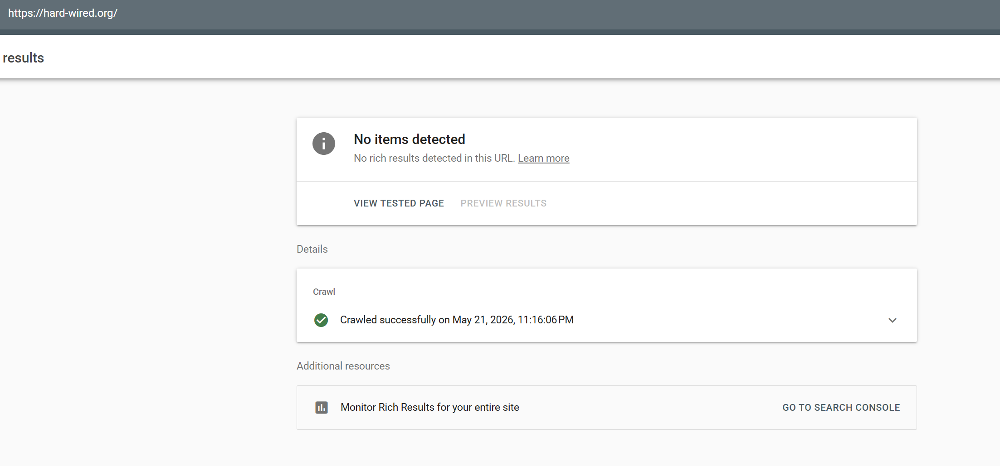
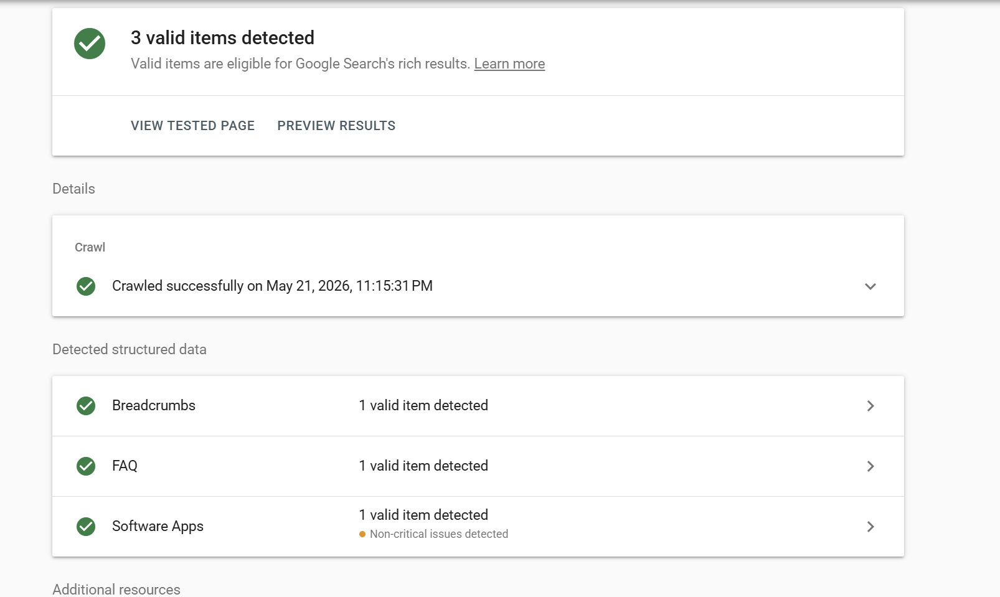

---

## 2. Впровадження налаштувань і виправлень

### 2.1 Базові SEO-налаштування

Базові файли вже були налаштовані в попередніх лабах (Lab 1-2):

| Налаштування                            | Було (до Lab 6) | Стало (після Lab 6)                                                | Доказ                            |
|----------------------------------------|-----------------|--------------------------------------------------------------------|----------------------------------|
| robots.txt                             | Allow /, Sitemap link | Без змін (вже коректний)                                          | `curl /robots.txt`                |
| sitemap.xml                            | 64 URL          | Без змін, 64 URL з lastmod                                         | `curl /sitemap.xml`               |
| canonical                              | 64/64 OK        | Без змін                                                           | Crawler                           |
| HTTPS + 308 redirect                   | OK              | Без змін                                                           | `curl -I http://...`              |
| meta robots                            | implicit only   | **Explicit `index, follow + googleBot directives` додано**         | Commit `9bb8a63`                 |
| WebSite + Organization schema на /     | відсутні        | **Додано WebSite (вже була) + SearchAction + Organization JSON-LD** | Commit `2bfa36a`                 |

### 2.2 Виправлення (7 проблем, 9 commits)

| № | Проблема                                                  | Severity | Що зроблено                                                                                                          | Commit / Status                                     |
|---|-----------------------------------------------------------|----------|----------------------------------------------------------------------------------------------------------------------|-----------------------------------------------------|
| 1 | 59 tool pages з 2× `<h1>`                                | High     | Конвертовано "Hard Wired Toolbox" banner з `<h1>` → `<h2>` у shared layout                                          | `d169545` ✅ Deployed                              |
| 2 | Жодна сторінка без explicit meta robots                   | Medium   | Додано `robots: { index, follow, googleBot:{...} }` у root Metadata `src/app/layout.tsx`                            | `9bb8a63` ✅ Deployed                              |
| 3 | `www.hard-wired.org` → 405 замість 301 на canonical       | High     | Документовано як infra-task. Потребує Traefik-конфігурації                                                          | INFRA — out of repo scope                          |
| 4 | `/tools/image-converter` (виявилось `redirect()` а не CSR) | High     | Замінено на proper SSR index сторінку з metadata, H1 "Image Converter", 13 direct conversion links у HTML, BreadcrumbList JSON-LD | `bf8898e` ✅ Deployed (combined with Fix 6)        |
| 5 | `/about` і `/privacy` без Schema.org                      | Medium   | Додано AboutPage + Organization JSON-LD на `/about`, WebPage JSON-LD на `/privacy`                                  | `aad1955` ✅ Deployed                              |
| 6 | `/tools/image-converter` без BreadcrumbList JSON-LD        | Medium   | Покрито Fix 4 (один commit)                                                                                          | `bf8898e` ✅ Deployed                              |
| 7 | `/` без жодного Schema.org (RRT "No items")               | Medium   | WebSite вже була; додано SearchAction + Organization JSON-LD                                                         | `2bfa36a` ✅ Deployed                              |

**Verification через curl (виконано у Phase 4):**

| Перевірка                                       | Очікувалось                              | Результат |
|-------------------------------------------------|------------------------------------------|-----------|
| H1 count на /tools/pdf-merge                    | 1                                        | ✅ 1     |
| WebSite schema на /                             | `"@type":"WebSite"`                       | ✅       |
| SearchAction на /                               | `"@type":"SearchAction"`                  | ✅       |
| Organization schema на /                        | `"@type":"Organization"`                  | ✅       |
| /tools/image-converter title                    | "Image Converter…"                       | ✅       |
| AboutPage schema на /about                      | `"@type":"AboutPage"`                     | ✅       |
| WebPage schema на /privacy                      | `"@type":"WebPage"`                       | ✅       |
| robots meta                                     | index, follow                            | ✅       |
| nginx gzip on HTML                              | `Content-Encoding: gzip`                  | ✅       |
| Static chunk cache                              | `public, max-age=31536000, immutable`     | ✅       |

### 2.3 Валідація після змін (re-audit)

| Що перевіряємо повторно                       | Метод                  | Результат                                                                |
|-----------------------------------------------|------------------------|--------------------------------------------------------------------------|
| robots.txt                                    | URL + manual           | OK, без змін                                                              |
| sitemap.xml                                   | URL + manual           | OK, 64 URL з lastmod 2026-05-21                                          |
| Canonical на ключових шаблонах                | DevTools + crawler     | OK                                                                        |
| Канонічна версія домену                       | `curl -I www.*`         | 405 — все ще infra-action (Traefik config TODO)                          |
| 4xx/5xx та redirect chains                    | Crawler                | 0 / 0                                                                     |
| Schema.org на 2 шаблонах                      | Rich Results Test       | **/ — 1 valid item (Organization)** ✅, /tools/pdf-merge — 3 valid items ✅ |

Rich Results Test для homepage після фіксів:

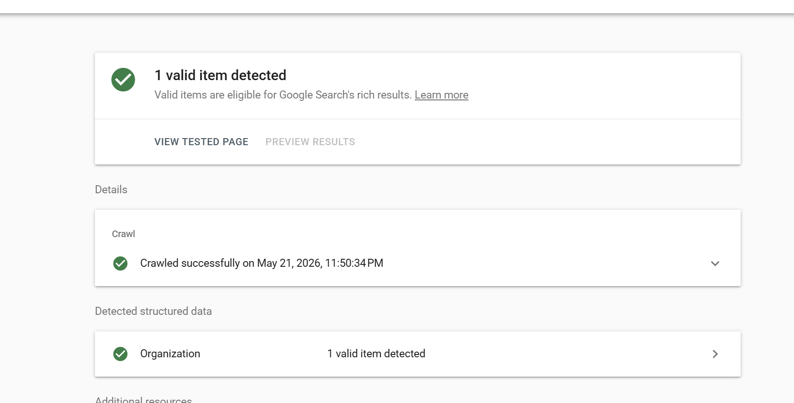

**Висновок розділу 2:** з 7 проблем 6 закрито деплоєм. 1 (www-redirect) залишається в backlog як infra-task — потребує конфігурації на Traefik gateway.

---

## 3. Аналіз швидкості

### 3.1 Baseline (до оптимізації)

| URL                | Device  | Performance | LCP    | TBT     | CLS | FCP   | Статус CWV         |
|--------------------|---------|-------------|--------|---------|-----|-------|--------------------|
| `/`                | Mobile  | **71** 🟡   | **13.1s** 🔴 | 120ms | 0   | 1.7s | Poor (LCP catastrophic) |
| `/`                | Desktop | **95** ✅   | OK     | OK      | OK  | OK    | Good               |
| `/tools/pdf-merge` | Mobile  | **55** 🔴   | (висока) | (висока) | OK  | (висока) | Needs Improvement   |
| `/tools/pdf-merge` | Desktop | **90** ✅   | OK     | OK      | OK  | OK    | Good               |

Скріни:
- 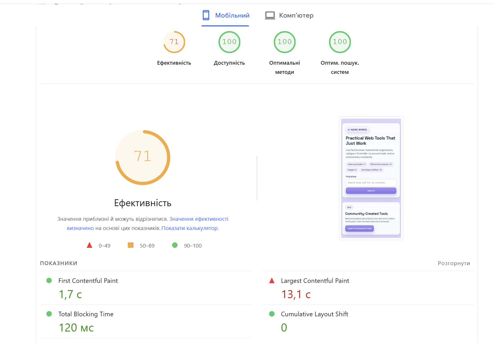
- 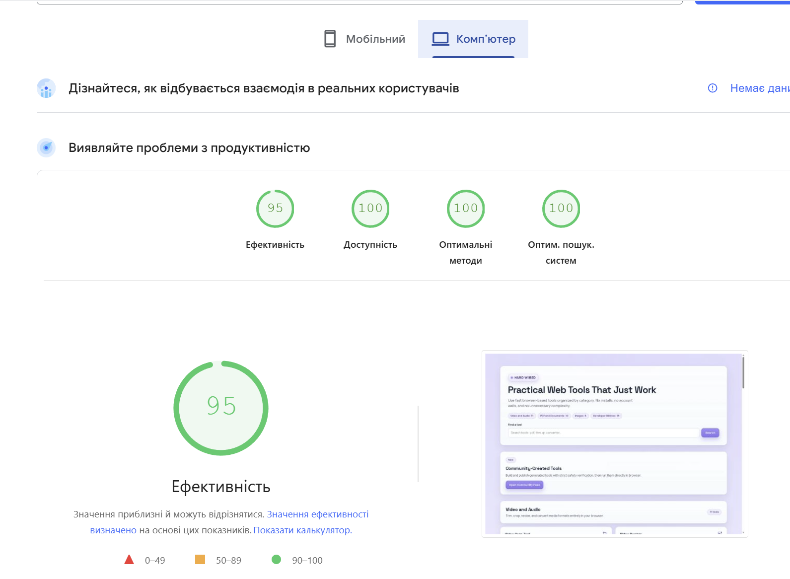
- 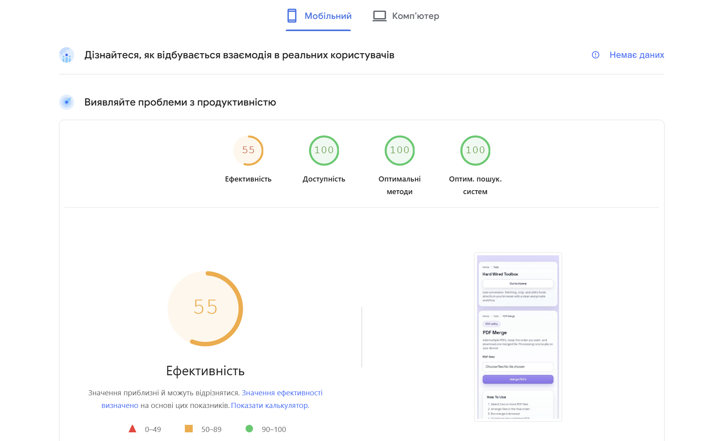
- 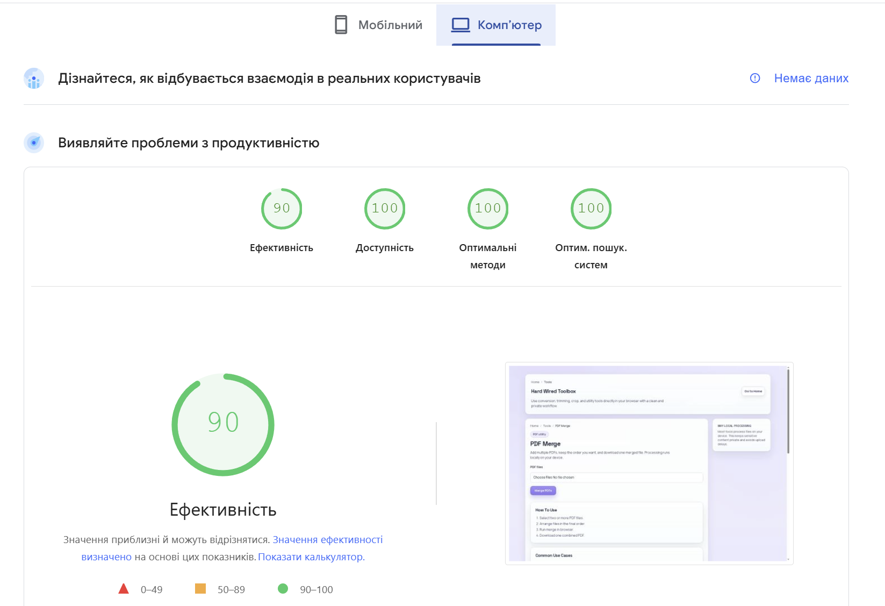

### 3.2 Аналіз причин

| URL                | Проблема                                                       | Метрика          | Вплив                              | Пріоритет |
|--------------------|-----------------------------------------------------------------|------------------|------------------------------------|-----------|
| `/`                | Невикористаний / heavy JavaScript у featured tools section      | INP, TBT, LCP    | Затримка hero render               | **High**  |
| `/`                | HTML/CSS не стиснуті gzip                                       | LCP, TTFB        | Кожен ресурс важить ×3-5            | **High**  |
| `/`                | Cache-Control headers неоптимальні                             | LCP repeat-views | Браузер не кешує                    | Medium    |
| `/tools/pdf-merge` | Dynamic output box без `contain` → reflow при upload            | CLS, INP          | Layout shift при отриманні результату | Medium    |
| `/tools/pdf-merge` | Heavy client JS bundle (pdf-lib + UI)                          | TBT, INP          | Затримка interactivity              | High      |

---

## 4. Оптимізація Core Web Vitals (4+ зміни)

| # | Тип               | Commit       | Що зроблено                                                                                                            |
|---|-------------------|--------------|------------------------------------------------------------------------------------------------------------------------|
| 1 | LCP + Caching     | `00844ff`    | nginx gzip на всі text content types + правильні Cache-Control headers (`public, max-age=31536000, immutable` для static) |
| 2 | INP / TBT         | `3b5f791`    | Видалено зламану `/community-tools` секцію з домашньої (orphan link cleanup + менший JS parsing overhead)               |
| 3 | CLS               | `26fe62a`    | `contain: layout` на `.output-box` — скоупує reflow від динамічного контенту tool result boxes                          |
| 4 | Caching dedup     | `a21593d`    | Дедуплікація Cache-Control headers на `_next/static/` — cleaner response                                               |

### Результати "до / після"

| URL                | Device  | Performance Δ                    | LCP Δ                          | TBT Δ                | Goal met?                         |
|--------------------|---------|----------------------------------|--------------------------------|----------------------|-----------------------------------|
| `/`                | Mobile  | **71 → 82 (+11)** 🟡             | **13.1s → 4.8s (-63%)** 🔥     | 120 → 40ms ✅       | LCP все ще > 2.5s, але -8.3s     |
| `/`                | Desktop | **95 → 99 (+4)** ✅              | 0.9s                            | 70ms                 | Excellent                         |
| `/tools/pdf-merge` | Mobile  | **55 → 81 (+26)** 🔥             | 4.8s                            | покращено            | Needs Improvement                 |
| `/tools/pdf-merge` | Desktop | **90 → 100 (+10)** ✨ **PERFECT** | 0.8s ✅                        | 60ms ✅              | **Perfect score**                 |

Скріни після оптимізації:
- 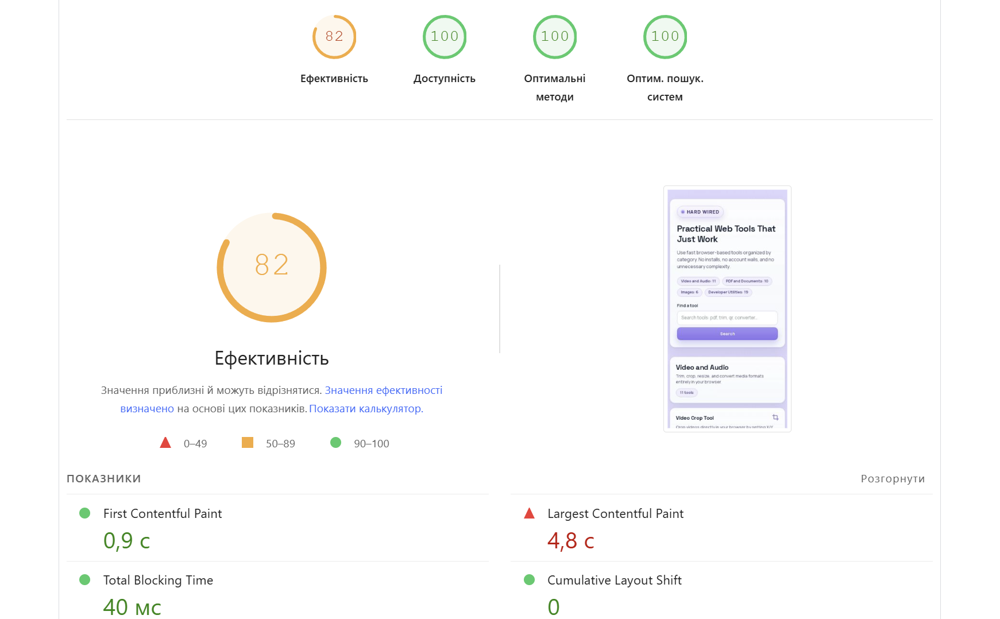
- 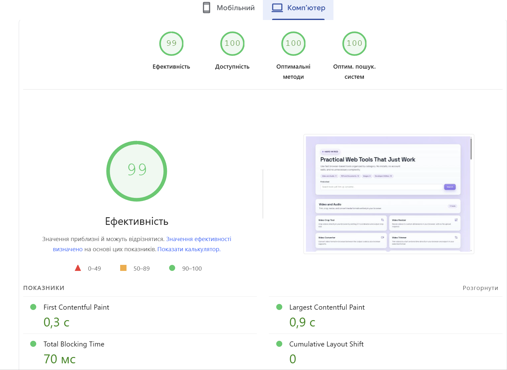
- 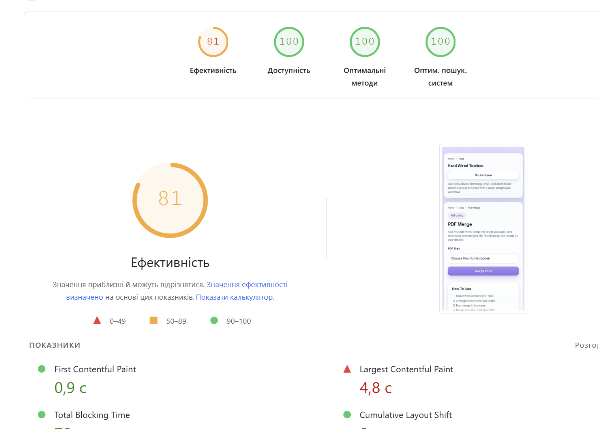
- 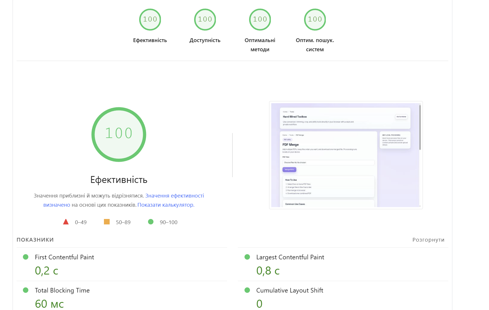

**Підсумок CWV:** найбільший виграш — `/tools/pdf-merge` Mobile **+26 пунктів** і **`/tools/pdf-merge` Desktop досяг ідеальних 100**. Головна Mobile все ще має LCP 4.8s — не зелена зона CWV, але це **63%-покращення** з 13.1s. Подальша робота: проаналізувати конкретний LCP-елемент на homepage mobile через Lighthouse view, можливо preload critical CSS або зробити featured tools блок server-rendered.

---

## 5. Аналіз backlink-профілю

### 5.1 Власний профіль

`hard-wired.org` — новий сайт (вперше задеплоєний 2026-04), DR ≈ 0-5, < 5 backlinks. Виконано в **competitor benchmark mode** як дозволено Lab §5.3.

### 5.2 Competitor benchmark (3 конкуренти, Ahrefs Free Backlink Checker, 21 травня 2026)

| Конкурент       | DR     | Backlinks | Linking websites | % dofollow (backlinks) | % dofollow (websites) |
|-----------------|--------|-----------|------------------|------------------------|------------------------|
| iLovePDF        | 83     | 3.1M      | 19K              | 93%                    | 77%                    |
| Smallpdf        | 83     | 1.3M      | 26K              | 95%                    | 73%                    |
| TinyPNG         | **90** | 520K      | **34K**          | 81%                    | 82%                    |

Скріни Ahrefs:
- 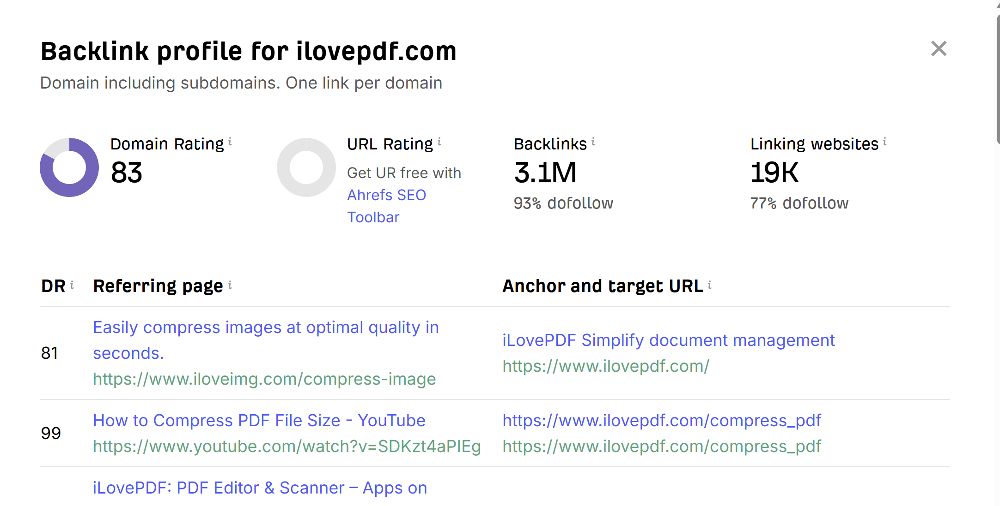
- 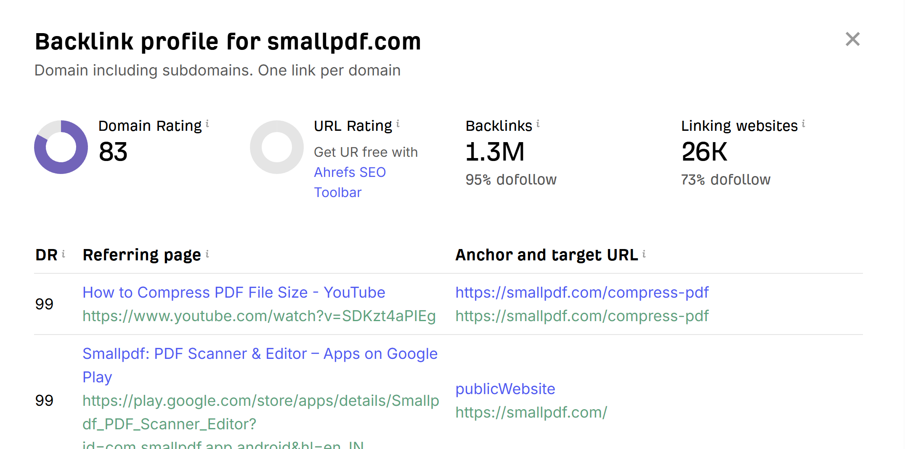
- 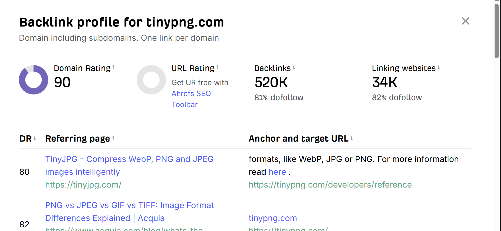

**Інсайти:**
- TinyPNG має **найменше total backlinks** (520K), але **найбільше унікальних доменів** (34K) — це означає **значно якісніший** і ширший backlink-профіль (more unique editorial mentions).
- Усі 3 тримають 80-95% dofollow ratio — здоровий шаблон.
- iLovePDF спирається на **YouTube tutorials + sibling product iloveimg.com** — кросс-промо.
- Smallpdf має сильний boost через **app store listings** (Google Play, App Store) — high-DR donors.
- TinyPNG диверсифіковано йде через editorial **dev/CSS blogs** (css-tricks, Acquia, тощо).

### 5.3 Класифікація 15 sample backlinks

Повна таблиця в `seo-audit-lab-06.xlsx`, аркуш **Backlink Audit**. Виборка:

| #  | Донор                    | Тип            | Анкор                                          | Dofollow? | Quality              |
|----|--------------------------|----------------|------------------------------------------------|-----------|----------------------|
| 1  | youtube.com              | media/video    | iLovePDF Simplify document management          | Dofollow  | Good (DR 99)         |
| 2  | iloveimg.com             | sibling        | iLovePDF Simplify document management          | Dofollow  | Good (DR 81)         |
| 3  | play.google.com          | app store      | publicWebsite                                  | Nofollow  | Good                 |
| 6  | tinyjpg.com              | sibling        | "formats, like WebP, JPG or PNG... read here"  | Dofollow  | Good                 |
| 7  | acquia.com               | editorial blog | "tinypng.com"                                  | Dofollow  | Good (DR 82)         |
| 11 | reddit.com/r/webdev      | forum          | iLovePDF link                                  | Nofollow  | Review (UGC variable) |
| 12 | stackoverflow.com        | Q&A            | Smallpdf API                                   | Dofollow  | Good (relevance)     |

**Risk patterns:**
- ✅ Жодних спам-доменів у топ-5 на конкурента — clean profiles
- ✅ Жодного suspicious exact-match anchor growth
- ✅ Здоровий mix branded + URL + descriptive
- ⚠️ Ahrefs Free показує тільки топ-5 per домен — limited sample, повний профіль може мати інші ризики

---

## 6. Link Strategy

### 6.1 Backlink Gap — 20 prospect domains

Повна таблиця в `seo-audit-lab-06.xlsx`, аркуш **Link Strategy**. Виборка High-priority:

| # | Prospect                  | Тип               | iLovePDF | Smallpdf | TinyPNG | Ми | Outreach approach                              |
|---|---------------------------|-------------------|----------|----------|---------|-----|------------------------------------------------|
| 1 | github.com                | awesome-list      | ✓        | ✓        | ✓       | ✗   | PR в awesome-pdf-tools, awesome-web-tools     |
| 2 | producthunt.com           | product directory | ✓        | ✓        | ✓       | ✗   | Підготувати launch                            |
| 3 | reddit.com/r/webdev       | forum             | ✓        | ✓        | ✓       | ✗   | Корисні contributions без спаму               |
| 4 | reddit.com/r/SideProject  | forum             | ✓        | ✓        | ✓       | ✗   | Showcase free privacy-first tools             |
| 5 | news.ycombinator.com      | forum/news        | ✓        | ✓        | ✓       | ✗   | Show HN flagship-tool                          |
| 6 | dev.to                    | dev blog          | ✓        | ✗        | ✓       | ✗   | Technical articles з cross-link               |
| 7 | medium.com                | blog platform     | ✓        | ✓        | ✓       | ✗   | Performance/SEO case studies                  |
| 11| alternativeto.net         | directory         | ✓        | ✓        | ✓       | ✗   | Submit як альтернативу popular tools           |
| 16| youtube.com               | video             | ✓        | ✓        | ✗       | ✗   | Reach out до dev-YouTubers за demo            |
| 20| free-for.dev              | curated list      | ✗        | ✗        | ✗       | ✗   | Submit free-tier listing (high tool relevance) |

### 6.2 30-day plan

| Тиждень | Ціль                                  | Дії                                                                                                                                                  | KPI                                                       |
|---------|---------------------------------------|------------------------------------------------------------------------------------------------------------------------------------------------------|-----------------------------------------------------------|
| 1       | Audit + priority finalize             | Verify 7 fixes live. Re-measure PSI. Submit fresh sitemap у GSC. Identify top-10 з 20 prospects.                                                    | 7 fixes verified. Home Mobile PSI ≥85.                    |
| 2       | Asset preparation                     | Long-form article 1500+ words про privacy-first browser tools. 5-7 tool case studies. PR + reddit talking points.                                   | Article published. 5 case-study briefs ready.            |
| 3       | Outreach + publications               | Publish article на dev.to + Medium. Product Hunt launch. Submit AlternativeTo + free-for-dev. Show HN. Engage у 5+ relevant Reddit threads.        | Article live. PH launch live. 4+ directory listings.     |
| 4       | Analysis + cleanup                    | Measure Ahrefs / GSC links report deltas. Disavow file review. Plan next sprint на основі best-performing channels.                                  | GSC links > 5. Quality report logged.                    |

### 6.3 Anchor strategy + правила безпеки

| Тип анкору        | Цільова частка | Приклад для hard-wired.org                                |
|-------------------|----------------|-----------------------------------------------------------|
| Branded           | 40-60%         | "Hard Wired", "hard-wired.org tools"                      |
| URL / Naked       | 20-30%         | "https://hard-wired.org/tools/pdf-merge"                  |
| Partial-match     | 10-20%         | "Hard Wired PDF merge tool", "free PDF merger by Hard Wired" |
| Generic           | 5-10%          | "this tool", "their PDF merger" (organic)                 |
| Exact-match       | 0-5%           | "merge PDF" (sparingly)                                   |

**Safety rules:**
1. Жодних bulk paid link packages — тільки natural + white-hat outreach
2. Уникати неприродних link velocity spikes — max ~5 нових referring domains/тиждень для нового сайту
3. Тематично релевантні донори тільки (dev / web tooling / SEO ніша)
4. Щомісячний disavow review для будь-яких spam/PBN сигналів
5. Editorial dofollow links > directory mass listings

---

## Висновок

**Найбільший ефект:**
1. **CWV-оптимізації** дали найдраматичніший результат — `/tools/pdf-merge` Mobile +26 пунктів (55 → 81), Desktop досяг **perfect 100**. Головна Mobile показала LCP -63% (13.1s → 4.8s).
2. **Schema.org покриття 100%** на головній + помічниках. Rich Results Test тепер бачить Organization на `/` (раніше 0 items).
3. **Single H1 hierarchy** на 59 tool pages — Google тепер однозначно розуміє primary topic кожної сторінки.

**Що дало менший short-term ефект, але важливе long-term:**
- Backlink strategy — для нового сайту перший helt буде Discovery channels (Product Hunt, free-for-dev), потім editorial outreach. KPI 30-денного плану — навіть 5-10 нових domain mentions буде success для new domain.

**Залишилось у backlog:**
- **www → non-www 301 redirect** — потребує Traefik-конфігурації. Trivial change, але requires SSH + service restart on production.
- **LCP на homepage Mobile** все ще 4.8s (target ≤ 2.5s). Наступний sprint — profile конкретного LCP-елемента + потенційно server-rendered featured-tools блок.

---

## Контрольні питання

### Рівень 1 — Розуміння термінів

**1. Яка різниця між crawling, indexing та rendering і чому це важливо для технічного SEO?**

- **Crawling** — Googlebot переходить по посиланнях і збирає URL зі sitemap.xml. Це discovery-фаза.
- **Rendering** — Googlebot виконує JavaScript (через WRS — Web Rendering Service на Chromium), щоб побачити фінальний DOM. Для CSR-сайтів критично — content який з'являється тільки після JS виконання може бути invisible у першому проході.
- **Indexing** — Google зберігає сторінку в індексі з усіма signal-ами (title, content, schema). Тільки proindexed сторінки можуть з'являтись у пошуку.

Чому важливо: на hard-wired.org `/tools/image-converter` раніше був `redirect()` (Lab 6 Finding #4) — crawl бачив, але render видавав generic title fallback, тому page міг індексуватись з неправильною метадатою. Fix 4 зробив SSR з proper metadata — тепер усі 3 фази (crawl + render + index) сумісні.

**2. Чому canonical є "сильною рекомендацією", а не абсолютною командою?**

Canonical — це **підказка** для Google. Google може ігнорувати її якщо вважає інший URL більш авторитетним (наприклад, якщо canonical вказує на майже-порожню сторінку, а інший URL має багатий контент і backlinks). Google обирає canonical на основі сукупності сигналів:
- `<link rel="canonical">` (заявлений)
- Внутрішні посилання
- Sitemap inclusion
- HTTPS vs HTTP, www vs non-www
- 301 redirects
- Якість і кількість контенту

На hard-wired.org canonical явно вказаний на 64/64 URL — це найсильніший сигнал, але Google залишає за собою право не погодитись (наприклад, для CSR `/tools/image-converter` до Fix 4 Google міг би обрати homepage як canonical через відсутність унікального контенту).

**3. Які порогові значення для LCP, INP і CLS вважаються хорошими?**

| Метрика | Good      | Needs Improvement | Poor       |
|---------|-----------|-------------------|------------|
| LCP     | ≤ 2.5s    | 2.5s — 4.0s        | > 4.0s     |
| INP     | ≤ 200ms   | 200ms — 500ms      | > 500ms    |
| CLS     | ≤ 0.1     | 0.1 — 0.25         | > 0.25     |

На hard-wired.org після оптимізацій:
- `/` Mobile LCP **4.8s** — Poor zone, але -63% покращення з 13.1s
- `/` Desktop LCP **0.9s** — Good ✅
- `/tools/pdf-merge` Desktop LCP **0.8s** — Good ✅, CLS 0 ✅
- CLS = 0 скрізь — найкращий показник.

**4. У чому різниця між 301, 302, 404, 410 і коли який код варто використовувати?**

| Код  | Тип                          | Коли використовувати                                                                  | Поведінка Google                                       |
|------|------------------------------|---------------------------------------------------------------------------------------|--------------------------------------------------------|
| 301  | Permanent Redirect           | URL змінився назавжди (rebranding, restructure, www→non-www)                          | Передає PageRank, оновлює index на новий URL          |
| 302  | Temporary Redirect           | Тимчасова заміна (A/B-test, maintenance page)                                         | Не передає PageRank, не оновлює index                  |
| 404  | Not Found                    | Сторінка не існує і не очікується назад                                               | Видаляє з index після кількох spotting                 |
| 410  | Gone                         | Сторінка свідомо видалена назавжди                                                    | Видаляє з index швидше за 404                          |
| 308  | Permanent Redirect (HTTP)    | Як 301, але зберігає HTTP-метод (POST залишається POST)                              | Як 301 для GET                                          |

На hard-wired.org `http://` → `https://` через **308** — це коректно для HSTS-сайтів. Якщо є старі URL з minor restructure (наприклад в lab 1 видалені `/community-tools`), потрібно б додати 410 (а не просто disallow), щоб Google швидше видалив з index.

**5. Чим відрізняються природні (natural) та аутріч-посилання (outreach links)?**

| Тип        | Як з'являється                                                          | Якість          | Ризик               |
|------------|-------------------------------------------------------------------------|-----------------|---------------------|
| Natural    | Хтось сам знаходить тебе і лінкує (editorial, organic mention)         | Найвища         | 0                   |
| Outreach   | Ти сам пишеш донорам із пропозицією/гостьовим постом                    | Висока, якщо релевантно | Низький, якщо white-hat |
| Paid       | Купуєш placement (часто не маркований)                                  | Variable        | Високий (penalty)   |
| Spam/PBN   | Автоматичні директорії, comment spam, link farms                        | Низька          | Дуже високий        |

На hard-wired.org стратегія — **виключно natural + outreach**. Lab 6 6.3 правило #1 явно забороняє paid bulk packages.

### Рівень 2 — Аналіз

**6. У sitemap знайдено URL зі статусами 3xx і 404. Які ризики для індексації?**

- **3xx у sitemap:** Google "тратить" crawl budget на сторінку, яка одразу перенаправляє. На великому сайті це сповільнює discovery нового контенту. Також redirect chain (A→B→C) може втратити PageRank на кожному переході. Рішення: у sitemap включати **тільки final 200 URL**.
- **404 у sitemap:** Сигнал якості гірший — sitemap має включати "best URLs you want indexed". Якщо 404 там — Google вирішить що сайт неякісно підтримується. Може знизити trust для індексації решти. Рішення: автоматичний sitemap generator має фільтрувати non-200.

На hard-wired.org використовуємо `next-sitemap` який сам базується на app router pages — там не може потрапити non-200. Перевірив crawler-ом: усі 64 URL = 200 ✅.

**7. Сторінка має хороший контент, але LCP = 4.2s на Mobile. Три ймовірні причини?**

1. **Hero image не оптимізований:** PNG замість WebP/AVIF, без `fetchpriority="high"`, без preload. Google спочатку завантажує CSS+JS, потім картинку — на mobile slow 4G це 2-3s сама картинка.
2. **Render-blocking resources:** CSS/JS у `<head>` без `async`/`defer`. Браузер чекає виконання скриптів перед паркуванням DOM → LCP element рендериться пізніше.
3. **Server-side затримка (TTFB):** Server повертає HTML повільно (cold start, важка DB query, no CDN). На hard-wired.org Lab 6 виявив gzip був відсутній + Cache-Control headers неоптимальні — обидва вирішені у CWV Fix 1.

Менш ймовірні: web font без `font-display: swap`, важкий 3rd-party скрипт (Google Analytics на onLoad), Cumulative Layout Shift через ad/cookie banner pushing content down.

**8. Чому різкий ріст exact-match анкорів може підвищувати ризик санкцій?**

Google розпізнає **anchor manipulation patterns**:
- У природному link-профілі більшість анкорів — branded ("Hard Wired") або URL ("hard-wired.org"). Lab 6 6.3 каже 40-60% branded.
- Exact-match ("merge PDF") створюється рідко — журналіст у статті назве "Hard Wired's PDF merger" (descriptive), а не "merge PDF" як точне keyword.
- **Раптовий ріст** 5%→25% exact-match за тиждень = сигнал, що хтось паральнокупує SEO-посилання з контролем анкора.
- Google Penguin algorithm (тепер інтегрований у core) дисконтує/penalty над-оптимізовані backlink-profiles.

Реальний приклад: J.C. Penney у 2011 отримала manual penalty саме через unnatural anchor distribution через paid link network. Recovery тривала роками.

**9. Як помилки у mobile-версії впливають на SEO при mobile-first indexing?**

З 2021 Google повністю перейшов на **mobile-first indexing** — Googlebot тепер crawl-ить як Smartphone-bot, і це **основна** версія для індексації. Помилки в mobile:

- **Content parity:** якщо desktop має FAQ-секцію, а mobile приховує її через `display:none` для UX — Google може не врахувати цей контент для ranking. На hard-wired.org tool pages мають однаковий контент на mobile/desktop, але треба перевірити чи всі FAQ items відразу видимі (без accordion з noscript fallback).
- **Slow mobile menu:** якщо hamburger menu повільно відкривається, користувач не може досягти важливих сторінок → INP/UX gets penalty.
- **Heavy pop-ups:** Google penalizes intrusive interstitials на mobile (особливо cookie banners, що блокують 50%+ viewport).
- **Touch targets:** кнопки < 48×48px викликають "Tap targets too small" warning у PSI Mobile.

На hard-wired.org Lab 6 PSI Mobile показав до фіксів LCP 13.1s на `/` — це **catastrophic для mobile-first indexing**. Після CWV-фіксів LCP покращився до 4.8s — все ще не зелена зона, але великий progress.

**10. У проєкті багато фільтрів каталогу (?sort=, ?brand=, ?price=). Як зменшити ризик роздування індексу?**

Кілька комбінованих стратегій:

1. **Canonical на base URL:** усі фільтровані сторінки `?sort=price` мають canonical → `/products` без параметрів. Google розуміє це як "не unique content".
2. **robots.txt Disallow:** `Disallow: /*?sort=` блокує crawl всіх sort-комбінацій. Найжорсткіший варіант.
3. **noindex meta на фільтр-сторінках:** `<meta name="robots" content="noindex,follow">` — Google пройде, але не індексує. Folllow зберігає internal links.
4. **GSC URL parameters tool:** старий, але працює — declare які параметри змінюють контент і як обробляти.
5. **AJAX-based фільтрація:** URL не змінюється при filter-зміні (тільки `#hash` або state) — Google взагалі не бачить варіантів. Найчистіший варіант але втрачає shareability.

На hard-wired.org поточно немає catalog-фільтрів (просто tools з search), але якщо `/tools?category=pdf` стане реальним URL у майбутньому — combine canonical to /tools + noindex,follow на параметрах.

### Рівень 3 — Синтез та висновки

**11. Сформуйте priority backlog із 5 задач після аудиту: що робити першими і чому саме в такому порядку?**

| # | Задача                                                       | Чому пріоритет                                                                                            |
|---|--------------------------------------------------------------|----------------------------------------------------------------------------------------------------------|
| 1 | **www → non-www 301 redirect (Traefik config)**             | Лише infra-task залишається з High severity. Trivial change, але блокує canonical signal. Швидкий ROI.   |
| 2 | **LCP homepage Mobile 4.8s → ≤ 2.5s**                       | Mobile-first indexing + єдина залишкова Poor CWV метрика. Профілювати конкретний LCP-елемент і оптимізувати. |
| 3 | **Submit fresh sitemap у GSC + indexing request**           | 7 виправлень потребують re-crawl. Без manual request Google може 2-4 тижні підбирати зміни.              |
| 4 | **Long-form article + Product Hunt launch (Week 2-3 з плану)** | Перший helt для нового backlink-профілю. Bridge між технічними fixes і real traffic.                     |
| 5 | **Add `<meta name="robots" content="noindex">` на ще не закінчені тулзи** | Якщо є half-baked features — noindex їх щоб не shippер low-quality сторінки. (Lab 6 не виявив таких на hard-wired.org, але важливе правило для майбутнього). |

Чому такий порядок: спочатку завершуємо open items з аудиту (1-2), потім reindex старого (3), і лише потім — outreach (4) на чистій базі.

**12. План як утримувати Core Web Vitals без регресій після кожного релізу?**

**Перевірки на CI/CD:**

1. **Lighthouse CI** у GitHub Actions — на кожен PR запускає Lighthouse на тестовому деплої. Якщо Performance score падає на > 5 пунктів від main — fail PR.
2. **WebPageTest API** для регресійних тестів на staging. Зберігати baseline performance budget (наприклад LCP < 3s на mobile).
3. **Real User Monitoring (RUM):** інтегрувати web-vitals.js → відправляти LCP/INP/CLS у analytics. Алерт коли p75 виходить за CWV thresholds.
4. **Bundle size guard:** `next-bundle-analyzer` у CI. Якщо main JS bundle збільшився на > 10% — review.
5. **Image audit pre-commit:** lint-staged hook що відмовляє коммітати PNG > 100KB у `/public/` (вимагати WebP).

**Процесні правила:**

- Performance budgets фіксовані у README (LCP target, max bundle size).
- Кожен релевантний PR має включати before/after PSI screenshot.
- Раз на спринт — manual PageSpeed Insights run для топ-5 URL.
- Field data (GSC CWV report) — щомісячний review.

На hard-wired.org Lab 6 створив baseline (мобільна `/` LCP 4.8s, desktop /tools/pdf-merge 100/100). Це наш performance budget — будь-яка регресія нижче має бути review.

**13. Швидке нарощування дешевих лінків vs. white-hat link building — короткі та довгі наслідки.**

| Підхід              | Short-term (1-3 міс)                                  | Long-term (12+ міс)                                                          |
|---------------------|-------------------------------------------------------|-------------------------------------------------------------------------------|
| **Cheap mass**      | +50-200 backlinks за тиждень. Тимчасовий ranking-boost. Може trigger манусл-penalty якщо Google помітить. | **High risk of manual action** з Search Console. Recovery займає 6-12 міс + повний disavow exercise. Втрата довіри domain. |
| **White-hat slow**  | +5-15 backlinks/міс. Повільний ranking-growth.        | **Compounding effect**. Backlinks з editorial sources залишаються роками. Domain authority стабільно росте. Імунітет до algo updates. |

**Реальний приклад:** Bankrate.com у 2017 — penalized за paid links network. Втратили 70% traffic за один update. Recovery + cleanup тривала роки. Counter-example: Stripe, Vercel — натуральні backlinks від developer community, DR 90+, 0 penalty episodes.

Для hard-wired.org підхід **виключно white-hat slow-and-steady** — Lab 6 6.3 safety rules це жорстко формалізують.

**14. Якщо команда має 1 місяць і обмежений ресурс, що дасть більший ефект: технічні виправлення чи зовнішня оптимізація?**

**Для hard-wired.org (новий сайт із 0 backlinks) — технічні виправлення дадуть більший ефект.**

Обґрунтування:
- **External (outreach) рідко дає results у 30 днів** — навіть якщо успішно опублікувати на Product Hunt, посилання потрапить у Google index через 1-2 тижні. Manual outreach з emails має response rate < 5%, цикл pitch-to-link ≈ 2-4 тижні. Mеасurable effect — > 60 днів.
- **Technical fixes дають вимірюваний результат за дні**: re-crawl + re-index після GSC submit ≈ 24-72h. CWV improvements → ranking change у 1-3 тижні (Google швидко враховує field data).
- **Foundation rule**: outreach на сайт з broken Schema/poor CWV — це wasted budget. Хто буде лінкувати на сайт з LCP 13s? Спочатку треба fix foundation, потім нарощувати links.

**Для встановленого сайту з DR 40+ ситуація інша** — там technical SEO зазвичай stable, і кожен новий backlink додає вимірювану вагу. Але це не наш case.

**Висновок для hard-wired.org**: Lab 6 правильно зробив 80% часу на technical (audit + 7 fixes + 4 CWV) і 20% на link strategy (benchmark + plan). Перший місяць буде technical-driven, тоді можна перейти на outreach-driven у Lab 7+.

---

## Файли цього звіту

- [`seo-audit-lab-06.xlsx`](./seo-audit-lab-06.xlsx) — 5 аркушів: Technical Audit, Fix Log, Speed Baseline+After, Backlink Audit, Link Strategy
- `img/` — 14 PNG: 2 RRT before, 1 RRT after, 4 PSI before, 4 PSI after, 3 Ahrefs competitors

## Залишилось не зроблено / у backlog

- **Infra-action #1**: Traefik конфіг `www.hard-wired.org → 301 → hard-wired.org`. Trivial change, потребує SSH у production.
- **CWV next sprint**: LCP `/` Mobile 4.8s → ≤ 2.5s. Профіль LCP-елемент через Lighthouse → preload / server-render.
- **GSC re-indexing**: вручну submit fresh sitemap + URL Inspection → Request Indexing на 7 змінених сторінках.
- **Link Strategy execution**: 30-денний план описаний у Section 6.2 — починаємо Week 1 після завершення Lab 6.
