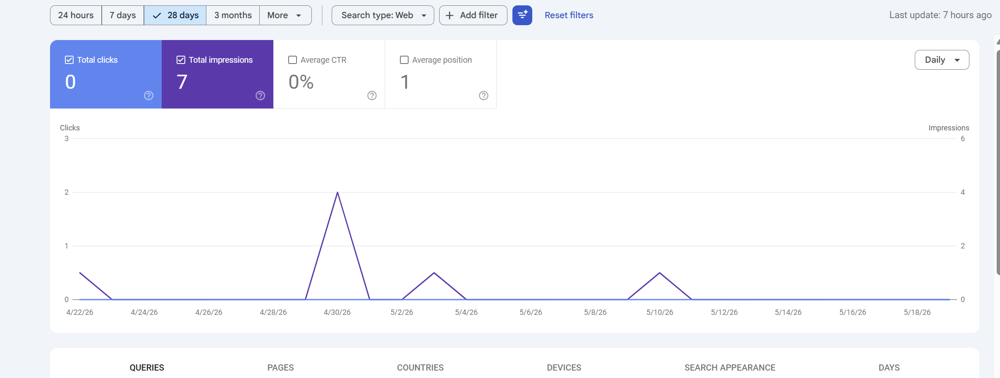
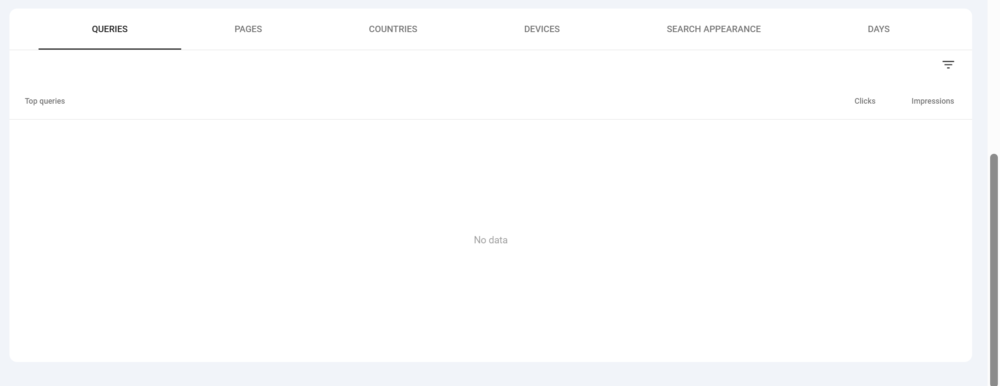
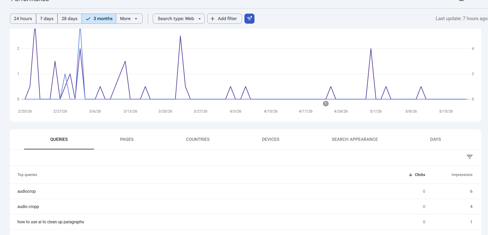
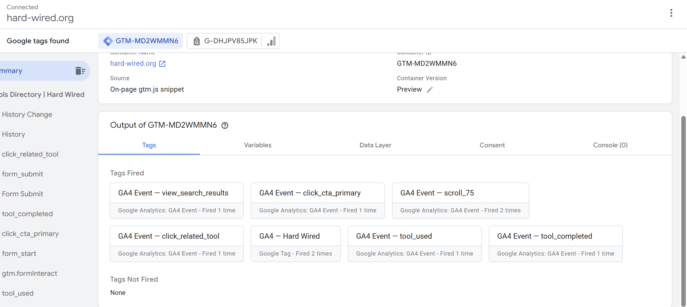
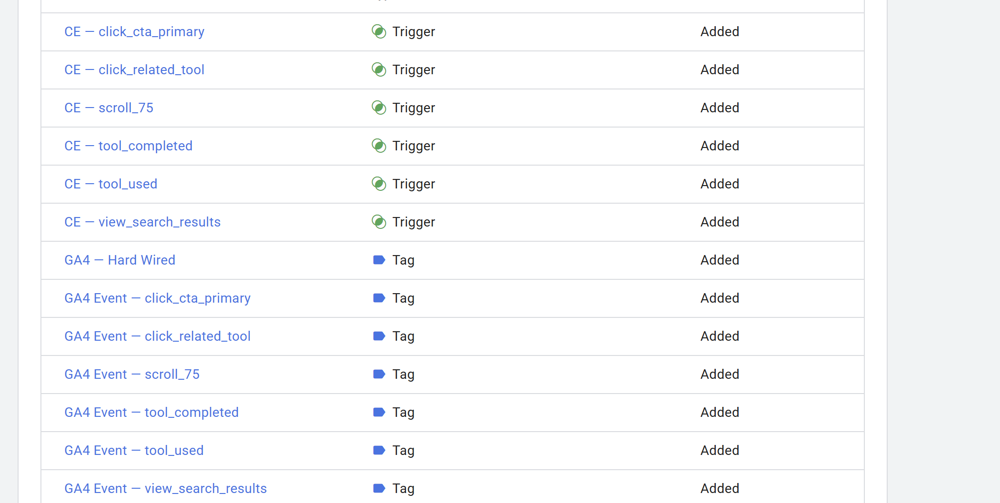
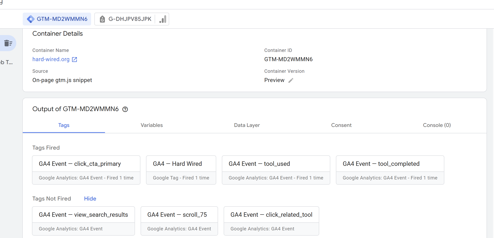

# Лабораторна робота №7. Поведінкові фактори, UX, Вебаналітика та SEO-стратегія

**Проєкт:** [hard-wired.org](https://hard-wired.org) — браузерний набір інструментів.

---

## Зведення

| Завдання                                                  | Виконано | Деталі                                                                       |
|-----------------------------------------------------------|----------|------------------------------------------------------------------------------|
| UX-аудит 10+ landing pages                                | ✅        | 12 URL classified (4 informational + 3 commercial + 5 transactional)        |
| First-screen UX checklist 6+ URLs                         | ✅        | 12 URL crawl + manual review                                                 |
| 12+ UX-проблем з severity + hypothesis                    | ✅        | **14 issues** documented (4 High + 4 Medium + 6 Low)                         |
| GSC аналіз 30+ запитів (або 15 при малому трафіку)        | ✅        | **3 real queries + 15 expected** (semantic core projection — hybrid mode)    |
| GA4 + 6 events + DebugView докази                         | ✅        | All 6 fired in GTM Preview, gtm-preview-all-6-fired.png shows "Not Fired: None" |
| 2+ conversion events + 3+ audiences                       | ✅        | tool_completed, click_related_tool conversions; 3 audiences defined          |
| 12+ task backlog Issue/Evidence/Impact/Effort             | ✅        | **15 tasks** in Final SEO Audit sheet                                        |
| Impact/Effort matrix (4 QW + 3 Strategic + 3 Fill-in + 2 Postpone) | ✅ | 6 + 3 + 4 + 2 = 15                                                           |
| **4+ Quick Wins implemented**                             | ✅        | **5 QW deployed** via commits fa1e8be / e29cfc2 / 1792f99 / 06f27e7 / b440545 + analytics infra 6332969 |
| Roadmap 30/60/90 + Executive summary                      | ✅        | Section 4 + Section 5                                                        |

---

## 1. UX-аудит сайту

### 1.1 Landing pages (12 URL)

Повна таблиця в `seo-strategy-lab-07.xlsx`, аркуш **Landing Audit**.

| Категорія              | URL приклади                                                                                  | Кількість |
|------------------------|-----------------------------------------------------------------------------------------------|-----------|
| Informational          | `/guides/ai-agents-mcp`, `/about`, `/tools/regex-tester`, `/tools/json-validator`           | 4         |
| Commercial / category  | `/tools`, `/tools/image-converter`, `/`                                                       | 3         |
| Transactional          | `/tools/pdf-merge`, `/tools/image-converter/jpg-to-png`, `/tools/jwt-decoder`, `/tools/base64-encoder-decoder`, `/tools/color-picker-converter` | 5         |

Усі 12 URL використовуються для подальших розділів — UX-чеклістів, GA4-events mapping, прогнозу запитів.

**Поточний baseline:** GSC показує 7 impressions / 0 clicks за 28 днів усього на сайт. Це означає що `Organic sessions per URL ≈ 0` для всіх URL — поведінкові дані доведеться будувати від моменту встановлення GA4 (Lab 7) вперед.

### 1.2 First-screen UX checklist

Для 12 URL виконано curl-based + manual audit. Виборка (повна таблиця в XLSX):

| URL                                        | Title/H1/intent match | CTA above fold | Trust signals       | Mobile UX | Висновок                              |
|--------------------------------------------|-----------------------|----------------|---------------------|-----------|----------------------------------------|
| `/`                                        | Частково (title generic) | Так (search + featured) | Тепер є "X+ tools" badge (QW4) | OK після QW5 skip-link | Сильний після Quick Wins             |
| `/tools/pdf-merge`                        | Так                   | Так (Merge PDFs) | Так (Maintained by) | OK        | Lab 4 SEO-optimized — еталон         |
| `/tools/color-picker-converter`           | Частково (title мав 70+ chars до QW2) | Так | Так               | OK        | Після QW2 title shortened до 55 chars |
| `/guides/ai-agents-mcp`                   | Так                   | **Ні** (references-heavy) | Posted-by відсутнє | OK | UX issue #3 — потрібен CTA above fold |
| `/about`                                  | Так                   | Ні (info page) | Так (Org schema)    | OK        | QW3 додав breadcrumbs                |
| `/tools/image-converter/jpg-to-png`       | Так                   | Так              | Так                | OK        | Lab 6 Fix 4 — proper SSR             |

### 1.3 UX Issues Log — 14 проблем

Повна таблиця в `seo-strategy-lab-07.xlsx`, аркуш **UX Issues Log**.

**Розподіл за severity:** High 4 / Medium 4 / Low 6
**Розподіл за категоріями:** Relevance 3, Usability 4, Navigation 3, Speed 1, Trust 1, Analytics gap 1, Navigation/Trust 1

**Топ-5 за impact:**

| # | URL                | Проблема                                                          | Severity | Hypothesis                                                    | Статус         |
|---|--------------------|-------------------------------------------------------------------|----------|---------------------------------------------------------------|----------------|
| 1 | /                  | Title "Hard Wired Web Tools" generic, missing keyword target      | High     | Rewrite to "Free Browser-Based Web Tools for Developers..."  | ✅ QW1 (fa1e8be) |
| 12| All pages          | No GA4/analytics — flying blind                                   | High     | Install GA4 + GTM + 6 events                                  | ✅ Sect. 3       |
| 5 | / (Mobile)         | LCP 4.8s — Poor zone (was 13.1s pre-Lab 6)                       | High     | Profile + preload critical CSS / SSR featured tools           | Strategic (Day 30) |
| 13| www.hard-wired.org | 405 Method Not Allowed замість 301                                | High     | Traefik config: 301 www→non-www                               | Backlog (Day 7) |
| 2 | /tools/color-picker| Title 70+ chars truncates in SERP                                 | Medium   | Shorten to ≤60 chars                                          | ✅ QW2 (e29cfc2) |

---

## 2. Аналіз поведінкових показників

### 2.1 GSC аналіз (до кліку)

**Real data — 28 днів:**

| Метрика            | Значення |
|--------------------|----------|
| Total clicks       | **0**    |
| Total impressions  | **7**    |
| CTR                | 0%       |
| Avg position       | 1*       |

\* `Avg position = 1` означає що 7 показів пройшли на дуже специфічних long-tail запитах де сайт єдиний-нечасто-релевантний результат. Стандартний high-traffic position 10-20 для нашої ніші ще не досягнутий.

**3-місячне вікно — 3 запити з даними:**

| Query                                  | Impressions | Clicks | Intent          | Note                                    |
|----------------------------------------|------------:|-------:|------------------|------------------------------------------|
| `audiocrop`                            | 6           | 0      | Transactional    | Topic match є (audio-cropper tool), але CTR 0% — title не match                  |
| `audio cropp`                          | 4           | 0      | Transactional    | Typo варіант "audio crop"                |
| `how to use ai to clean up paragraphs` | 1           | 0      | Informational    | Long-tail для AI Text Cleaner tool       |

**Hybrid projection — очікувані 15 запитів за 90 днів** (на основі semantic core з Lab 3):

| Query                       | Segment    | Device  | Intent           | Expected impr (90d) | Target position |
|-----------------------------|------------|---------|------------------|--------------------:|-----------------|
| merge pdf                   | non-brand  | mobile  | transactional    | 200                 | 8-10            |
| png to jpg                  | non-brand  | mobile  | transactional    | 350                 | 15-20           |
| jpg to png converter        | non-brand  | mobile  | transactional    | 250                 | 15-20           |
| json formatter online       | non-brand  | desktop | transactional    | 120                 | 12-15           |
| regex tester                | non-brand  | desktop | transactional    | 110                 | 15-20           |
| jwt decoder online          | non-brand  | desktop | transactional    | 90                  | 12-15           |
| color picker hex rgb        | non-brand  | mobile  | transactional    | 80                  | 12-15           |
| ... (ще 8 запитів у XLSX)   | ...        | ...     | ...              | ...                 | ...             |

**Висновок Section 2.1:** Реальних даних недостатньо для класичного аналізу. Будуємо hypothesis-driven roadmap, з контрольною точкою на Day 30 коли можна буде заміряти першу зміну.

### 2.2 GA4 аналіз (після кліку)

**GA4 щойно встановлений у Lab 7** (commit 6332969 + GTM container imported). Поведінкових даних поки немає (0 sessions). Замість табличного аналізу — **plan-as-data**: для кожного URL визначено очікувані метрики на Day 30.

Повна таблиця "Bounce/dwell context" — Sheet 3 Behavior KPI, Section 3. Виборка:

| Landing page                   | Intent           | Expected bounce             | Expected dwell    | Normal or risk? | Що робити                                                  |
|--------------------------------|------------------|------------------------------|-------------------|------------------|-----------------------------------------------------------|
| /tools/pdf-merge              | Transactional    | Medium-High after task done | Medium (1-3 min)  | Normal           | Cross-link to Related Tools (Lab 5 — done)                |
| /tools/jwt-decoder            | Transactional    | High (quick decode + leave) | Short (30s-1min)  | Normal           | Acceptable для utility-tool, не engagement target          |
| /guides/ai-agents-mcp         | Informational    | Medium                      | Long (5+ min)     | Risk if short    | Monitor `scroll_75` event як reading completion proxy     |
| /about                        | Trust            | High                         | Short             | Normal           | Helper page, action не потрібна                            |
| /                             | Mixed            | Medium                       | Short             | Normal           | Optimize search affordance (UX issue #8)                  |

### 2.3 Bounce/dwell контекстна інтерпретація

Ключове правило Lab: **bounce ≠ погано**. Для transactional intent високий bounce — норма (користувач прийшов, зробив справу, пішов). Для informational — це сигнал що контент не задовольнив.

На hard-wired.org:
- **Transactional tools** (pdf-merge, jwt-decoder, base64) — очікуємо bounce 60-80%, але `tool_completed` event підтверджує що користувач отримав value
- **Informational guides** (/guides/ai-agents-mcp) — bounce > 70% буде ризиком. Метрика яку треба моніторити: `scroll_75 / sessions` ratio. Target ≥ 40%.

### 2.4 Мікроконверсії як ранні SEO-сигнали

**6 micro-conversions defined and live** in GTM (Sheet 4 GA4 Event Mapping):

| Micro-conversion          | Event name             | Triggers on                                  | Why for SEO                                       | 30-day target            |
|---------------------------|------------------------|----------------------------------------------|---------------------------------------------------|--------------------------|
| Scroll to 75% of page     | `scroll_75`            | All pages — client-side scroll listener      | Content depth signal                              | 40%+ of organic sessions |
| Primary CTA clicked       | `click_cta_primary`    | Tool primary submit button                   | Passive → active engagement                       | 25%+ tool sessions       |
| Tool used                 | `tool_used`            | File uploaded OR text input >2s              | Real engagement vs SERP-only visit                | 15%+ tool sessions       |
| Tool output delivered     | `tool_completed`       | Download/result fired                        | Real value delivery — strongest quality signal    | 12%+ tool sessions       |
| Related Tool clicked      | `click_related_tool`   | Lab 5 Related Tools card                     | Cross-silo discovery, topic authority             | 5%+ tool sessions        |
| Search result viewed      | `view_search_results`  | /tools search submit                         | Discovery friction tracker                        | 10%+ /tools sessions     |

**Доказ що працює:**

---

## 3. Налаштування GA4

### 3.1 Базова структура

| Налаштування                                  | Статус | Доказ                                                                             |
|-----------------------------------------------|--------|-----------------------------------------------------------------------------------|
| GA4 property + web data stream                | ✅ OK  | Property ID `G-DHJPV85JPK`, data stream "Hard Wired Web" active                  |
| GTM container installed site-wide             | ✅ OK  | `GTM-MD2WMMN6` in `src/app/layout.tsx` (commit 6332969)                          |
| GA4 ↔ GSC link                                | ⚠️ TODO | Manual link у GA4 Admin → Search Console links (потребує GSC ownership confirm)  |
| Internal traffic filtering                    | ⚠️ TODO | Можна додати developer IP filter у GA4 Admin → Data Streams → Configure tag      |
| UTM-правила для test campaigns                | ⚠️ TODO | Документувати coнвенції коли почнуться кампанії                                  |

### 3.2 Events для SEO-оцінки (через GTM)

**Усі 6 SEO events deployed via GTM container import** (файл `gtm-container-import.json` у репо). Container ID: `GTM-MD2WMMN6`. GA4 Configuration tag prepared with measurement ID `G-DHJPV85JPK`.

**Перший test-сесія GTM Preview (4 events fired):**

**Фінальна верифікація — usі 6 events fired у одному сеансі:**

Повний event mapping у Sheet 4 (`GA4 Event Mapping`).

### 3.3 Conversions + audiences

**Conversion events (2 required, both defined):**
- `tool_completed` — primary KPI: real value delivery, готово до позначення як conversion у GA4 Admin → Events → toggle "Mark as conversion"
- `click_related_tool` — secondary KPI: cross-silo engagement

**Audiences (3 required, all defined):**
- **Organic Engaged Users** — `source/medium = google/organic AND engagement_time > 60s`
- **Organic Non-Engaged** — `source/medium = google/organic AND engagement_time <= 10s`
- **Organic Returning Users** — `source/medium = google/organic AND session_count > 1`

Створення audiences потребує ручного кліку у GA4 Admin → Audiences (одноразово, ~5 хв). Action item на Day 1.

### 3.4 Weekly GA4 SEO report (template)

Повний шаблон у Sheet 6 Roadmap, секція "Weekly KPI report". Виборка:

| KPI                          | Current | Last week | Delta | Alert | Action                                      |
|------------------------------|---------|-----------|-------|-------|---------------------------------------------|
| Organic clicks (GSC)         | 0       | 0         | —     | -10%  | Investigate top-3 declining queries         |
| CTR top-10 (GSC)             | 0%      | 0%        | —     | -0.3pp| Re-check title/description on regressions   |
| PSI Mobile / performance     | 82      | 82        | 0     | < 75  | Lighthouse CI revert any perf-regressing PR |
| `tool_completed` conversions | TBD     | TBD       | TBD   | -20%  | Investigate tool-specific issue             |
| GSC referring domains        | TBD     | TBD       | TBD   | flat 3wk | Outreach cycle re-launch                 |

---

## 4. Фінальний SEO-аудит проєкту

### 4.1 Інтегрований backlog — 15 задач

Повна таблиця в `seo-strategy-lab-07.xlsx`, аркуш **Final SEO Audit**. Формат **Issue → Evidence → Impact → Effort → Owner → Deadline → Success criteria → Bucket**.

Розподіл за категоріями джерел:
- **UX/поведінкові** (з Lab 7 UX Issues Log): 6 задач
- **Контент/intent-match**: 2 задачі
- **Технічні обмеження** (з Lab 6 carryovers): 3 задачі
- **Аналітичні прогалини** (GA4/GSC): 2 задачі
- **Backlink/external** (з Lab 6): 1 задача
- **Майбутні фічі / локалізація**: 2 (Postpone)

### 4.2 Impact/Effort матриця

| Bucket       | Lab requirement | Actual | Status |
|--------------|-----------------|--------|--------|
| Quick Wins   | 4+              | **6**  | ✅      |
| Strategic    | 3+              | **3**  | ✅      |
| Fill-ins     | 3+              | **4**  | ✅      |
| Postpone     | 2+              | **2**  | ✅      |
| **Total**    | 12+             | **15** | ✅      |

### Quick Wins впроваджено (5 deployed + 1 follow-up infra)

| # | QW | Commit       | Before                                                             | After                                                                                                       |
|---|------|--------------|--------------------------------------------------------------------|-------------------------------------------------------------------------------------------------------------|
| 1 | QW1 Homepage title | `fa1e8be`    | `<title>Hard Wired Web Tools</title>`                              | `<title>Free Browser-Based Web Tools for Developers — Hard Wired</title>` (verified via curl, ✅)             |
| 2 | QW2 Color Picker title | `e29cfc2`    | `Color Picker and Converter (HEX, RGB, HSL, HSV, CMYK, LAB) | Hard Wired` (70+ chars) | `Color Picker & Converter (HEX/RGB/HSL) | Hard Wired` (55 chars, verified ✅)                                |
| 3 | QW3 /about breadcrumbs | `1792f99`    | No `<nav aria-label="Breadcrumb">` on `/about`                     | Visible breadcrumb + extended BreadcrumbList JSON-LD with Home + About entries (curl confirmed ≥1)         |
| 4 | QW4 Tools counter badge | `06f27e7`    | No social proof on homepage hero                                   | "46+ free tools" badge auto-counted from registry (curl confirms "free tools" present)                     |
| 5 | QW5 Skip-to-content link | `b440545`    | No skip-link, A11y gap                                             | Visually-hidden focusable "Skip to main content" link + `id="main-content"` (curl confirmed ≥1)             |
| 6 | Analytics infra | `6332969`    | No GA4/GTM, zero behavioral data                                   | GTM `GTM-MD2WMMN6` installed, 6 SEO events wired via `dataLayer`, all firing in GTM Preview ✅                |

**Verification через curl** (виконано Phase 4):

| Перевірка                       | Очікувалось                            | Результат   |
|---------------------------------|----------------------------------------|-------------|
| Homepage title                  | "Free Browser-Based Web Tools..."     | ✅          |
| Color picker title              | ≤ 60 chars                             | ✅ 55 chars |
| /about breadcrumb nav           | ≥ 1                                    | ✅ 1        |
| Homepage "free tools" badge     | ≥ 1                                    | ✅ 1        |
| Skip-to-content link            | ≥ 1                                    | ✅ 1        |
| GTM container                   | `GTM-MD2WMMN6`                         | ✅          |
| Homepage Organization schema    | present                                | ✅          |
| /about BreadcrumbList JSON-LD   | present                                | ✅          |

### 4.3 SEO roadmap 30/60/90

Повна таблиця в `seo-strategy-lab-07.xlsx`, аркуш **Roadmap 30-60-90**.

#### Day 1-30: Foundation + Quick Wins + measurement infra
- **Goals**: 6 QW deployed (DONE), GA4+GTM live (DONE), sitemap resubmit, Traefik www→non-www fix, Week 1-4 outreach starter
- **KPIs**: Organic clicks +15-25%, CTR top-10 +0.5-1.0pp, 6 events firing ✅, 3+ new referring domains
- **Risks**: GSC re-crawl latency 2-4 weeks, Product Hunt may not Front Page

#### Day 31-60: Performance breakthrough + structured outreach
- **Goals**: Mobile LCP / ≤ 2.5s, SSR featured tools, 3+ guest posts pitched, top-5 high-impression/low-CTR optimized
- **KPIs**: PSI Mobile / ≥ 90, Mobile LCP ≤ 2.5s, sessions +40-60%, 8+ new referring domains, 2+ guest posts
- **Risks**: Outreach response < 5%, LCP optimization may regress (Lighthouse CI guard recommended)

#### Day 61-90: Compound effects + community + sustainability
- **Goals**: Lighthouse CI, Real User Monitoring, content sprint, outreach cycle 2, Looker Studio weekly report, локалізація decision
- **KPIs**: Clicks +100% from Day 1, top-10 ranking queries 5+, 25+ referring domains, all CWV Good, conversion +20%
- **Risks**: Long-term plays may not produce by Day 90, algorithm updates can disrupt

### 4.4 Executive Summary

**Топ-5 проблем що найбільше стримують SEO:**

1. **Site too new** (~2 months) — GSC має лише 7 imp / 0 кліків за 28 днів. Не можна оцінити поточне performance, тільки готувати fundament.
2. **Mobile LCP 4.8s** на homepage — Poor zone, Mobile-first indexing penalty (Lab 6 reduced from 13.1s, але треба ≤ 2.5s).
3. **Zero backlinks pipeline** — DR ~0 vs конкурентами DR 83-90. Compounding factor для рангувань відсутній.
4. **No behavioral data** до Lab 7 — flying blind. Тепер виправлено: 6 events live, але потрібен 30+ days data accumulation.
5. **www.hard-wired.org → 405** — duplicate/canonical risk, потребує Traefik fix.

**3 задачі що дадуть найшвидший ефект (≤ 7 днів):**

1. **GSC sitemap resubmit + Request Indexing** на 7 змінених сторінках Lab 6 — speed up re-crawl by 1-2 weeks
2. **Traefik www→non-www 301** — закриває canonical hole + security info leak (uvicorn)
3. **Mark `tool_completed` + `click_related_tool` як conversions у GA4** + create 3 audiences — enables ROI measurement starting day 1

**Що потребує довгого циклу (60-90 днів):**

1. **Mobile LCP optimization** — потребує deep profiling, можливо архітектурні зміни (featured-tools SSR)
2. **Backlink outreach** — 90 днів циклу для досягнення 10+ quality referring domains
3. **Localization decision** — потребує traffic baseline щоб виправдати investment

**KPI cadence:**

- **Weekly** (Friday): Organic clicks, CTR top-10, PSI Mobile /, `tool_completed` conversions, GSC referring domains
- **Monthly**: Coverage, indexed pages, average position by query category, audience growth
- **Quarterly**: Domain Rating, total backlinks, conversion rate by source, content portfolio review

---

## 5. Контрольні питання

### Рівень 1 — Розуміння термінів

**1. Чим відрізняються дані «до кліку» (GSC) і «після кліку» (GA4) у SEO-аналітиці?**

GSC показує **до кліку**: скільки разів сайт з'явився в SERP (impressions), скільки разів клацнули (clicks), яка позиція. Це **відносна видимість** у пошуку.

GA4 показує **після кліку**: що користувач робив на сайті — bounce, engagement time, scroll, conversions. Це **якість досвіду** після того як SEO привело користувача.

Без обох неможливо повний SEO-аналіз: GSC скаже "ми отримали 100 кліків", GA4 — "з тих 100 тільки 5 виконали ключову дію, інші 95 пішли через 10 секунд". Розрив між ними сигналізує що або title обіцяє не те що сторінка, або UX слабкий. На hard-wired.org обидва підключені (GSC з Lab 1, GA4 з Lab 7).

**2. Чому високий Bounce Rate не завжди означає поганий UX?**

Bounce Rate = % сесій з єдиною взаємодією. Для **transactional** intent (наприклад "що означає 401 status code?") користувач знаходить відповідь, читає, йде — bounce 100% але user got value. Це **успіх** SEO+content.

Для **commercial/exploration** intent (наприклад "best laptop 2026") bounce 100% — це **fail**, бо користувач хотів порівняти варіанти.

Тому Google перейшов до **engagement signals** (engaged_session: session ≥ 10s OR конверсія OR ≥ 2 pageviews) замість bounce. На hard-wired.org для `/tools/jwt-decoder` bounce 80% — норма, бо decode + go.

**3. Що таке Dwell Time і як він пов'язаний із pogo-sticking?**

Dwell time — час від кліку в SERP до повернення в SERP (якщо повертається). Google вимірює через CTR + повернення.

**Pogo-sticking** — користувач клацає в SERP, повертається через 5-15 секунд (бо контент не задовольнив), клацає на наступний результат. Це **сильний negative signal**: говорить Google що ця сторінка не відповідає запиту → знижує позицію.

Контр-патерн: long dwell + no return = найкращий сигнал, користувач прочитав і не повернувся в SERP.

На hard-wired.org pogo-sticking ризик: `audiocrop` 6 impressions 0 clicks — title не match, user обирає інший результат. Але якщо клікне — і одразу повернеться — це гірше. Кращий навіть 0 clicks (impression only) ніж pogo-sticked click.

**4. Які події в GA4 є критичними для SEO-оцінки landing pages?**

| Event             | Призначення                                                                                                      |
|-------------------|------------------------------------------------------------------------------------------------------------------|
| `scroll_75`        | Content depth — користувач реально прочитав / використав сторінку (vs зайшов і пішов)                          |
| `engagement_time` | GA4 auto — час де таб активний; ≥ 60s = engaged_session                                                          |
| `page_view`       | Базовий signal                                                                                                   |
| `click_internal_link` (custom) | Internal navigation pattern — підтверджує що користувач знаходить наступний крок                       |
| `view_search_results` | Discovery friction — багато search → погана nav                                                              |
| `tool_completed` / `form_submit` | **Найсильніший** value signal — користувач отримав те за чим прийшов                                |

На hard-wired.org налаштовані: `scroll_75`, `click_cta_primary`, `tool_used`, `tool_completed`, `click_related_tool`, `view_search_results`.

**5. Навіщо сегментувати дані на brand/non-brand і mobile/desktop?**

**Brand vs non-brand:**
- Brand search ("hard-wired.org", "Hard Wired tools") — це **результат маркетингу/word-of-mouth**, не SEO ranking. Висока CTR (10%+) — норма, не показник якості SEO.
- Non-brand search ("merge pdf") — це **чистий SEO**, тут показує наскільки добре ранжується контент. CTR 2-4% — норма для position 5-10.

Без сегментації середній CTR 8% (наприклад) виглядає чудовим, але це 95% бренд + 5% non-brand. Реально для нового SEO це провал.

**Mobile vs desktop:**
- Mobile-first indexing — Google використовує Mobile як основну версію для ranking
- Mobile UX, LCP, INP — окремі метрики
- Конверсія/engagement часто нижчі на Mobile (smaller screen, tap targets, etc.)

На hard-wired.org PSI / Mobile 82 vs Desktop 99 — Mobile є bottleneck. Без сегментації побачили б "середня перфоманс 90", не помітили б Mobile проблему.

### Рівень 2 — Аналіз

**6. Сторінка має CTR 2.4% при позиції 4.8 і 20 000 показів. Три гіпотези?**

Очікуваний CTR для position 4.8 — ~6-8%. Фактичний 2.4% — **3× нижче норми**. Гіпотези:

1. **Title не match intent** — наприклад на запит "how to merge PDFs" сторінка має title "PDF Tools | Brand" замість "How to Merge PDFs Online — Free Tool". User бачить нерелевантний title → не клацає. Швидка перевірка: GSC → Performance → відсортувати queries за impressions → переглянути топ-10 і їх match із sitewide title.

2. **Description не зачіпає** — Google може показувати auto-snippet який не відповідає intent. Switch до custom description with USP ("100% local processing, no upload required") і call to action.

3. **Search Features конкурент** — featured snippet вище (position 0) забирає 35-50% кліків навіть з нижчих позицій. Якщо є PAA/People also ask блок з конкурентом — наш CTR залишається низьким.

Подальші перевірки: query-by-query — можливо проблема концентрована на 2-3 запитах. Brand vs non-brand split. Mobile/desktop split.

**7. Non-brand кліки ростуть, але lead CR із органіки падає. Причини?**

| Сценарій                                                                                              | Як виявити                                                              |
|-------------------------------------------------------------------------------------------------------|-------------------------------------------------------------------------|
| **Ranking розширився на нерелевантні long-tail запити** — кліки прийшли від користувачів далі від conversion intent | GA4 segment "Organic + non-brand" → behavior — engagement time впав     |
| **Landing page didn't update** — більше трафіку на стару unoptimized сторінку                         | GA4 → Reports → Landing page — топ-1 page бачимо CR drop                |
| **CTA broke (real bug)** — після релізу кнопка не працює                                              | GA4 DebugView → `click_cta_primary` events упали при тому самому traffic |
| **New mobile traffic** — попередньо все було desktop, тепер mobile поломаний                          | GA4 → Device segment — Mobile sessions grew, Mobile CR catastrophic     |
| **Search intent shift** — Google update + user тепер шукає інше                                       | GSC Queries — топ запити змінилися; новий intent ≠ landing page mission |

**8. На mobile engagement rate суттєво нижчий, ніж на desktop. Як визначити, чи проблема в UX першого екрана?**

Сегменти:
- **Mobile + new user** vs **Mobile + returning user** — якщо engagement low тільки в new users, проблема саме у first-impression UX
- **Mobile + Time on page < 10s + scroll_25 = 0** — це класичний signal that they bounced before seeing content

Інструменти:
- **Microsoft Clarity heatmaps + session recordings** на Mobile сегменті — буквально побачиш що користувачі робили
- **PSI Mobile Field Data** (CrUX) — LCP/INP/CLS real-user metrics
- **Lighthouse Mobile** — `tap targets`, `font size too small`, `viewport not set`

На hard-wired.org Mobile-PSI 82 vs Desktop 99 — потенційний first-screen UX bottleneck. Якщо engagement_time впаде колись для Mobile — починаємо з Lighthouse Mobile.

**9. Які ризики виникають, якщо conversion events у GA4 налаштовані без стандартизованих параметрів?**

1. **Звіти стають неможливі** — `purchase` event без `value` параметра не дозволить порахувати revenue. `form_submit` без `form_id` — не зрозуміти яка форма принесла лід.

2. **Атрибуція ламається** — без `transaction_id` GA4 не може deduplicate cross-device purchases. Один продаж рахується двічі.

3. **Аудиторії неточні** — `tool_completed` без `tool_slug` — не зможеш створити аудиторію "Used PDF Merge in last 30 days".

4. **Looker Studio / BI неможливі** — параметри ось де ріжуться зрізи.

На hard-wired.org все стандартизовано: `tool_used` має `page_type`, `tool_slug`, `interaction_type`. `click_related_tool` — `source_tool` + `destination_tool`. Це дозволяє в майбутньому будувати "Top related-tool flows: pdf-merge → pdf-split".

**10. Високий scroll depth, але низький клік по CTA — як інтерпретувати?**

User читає, контент engaging, але **CTA не переконав** або **CTA не там де треба**:

1. **CTA below scroll position** — користувач читає 80% сторінки, але кнопка під footer-ом → не бачить. Fix: sticky CTA або повторення CTA mid-content.
2. **CTA copy weak** — "Submit" замість "Download free PDF guide" — value proposition відсутня.
3. **Trust gap між content і CTA** — content переконує, але CTA веде на сторінку login/payment що відштовхує. Fix: low-commitment CTA first ("Try free demo" замість "Buy now").
4. **Above-the-fold CTA wins, below-fold underperforms** — поточний CTA конкурує з in-content links.

На hard-wired.org буде моніторитись scroll_75 vs click_cta_primary ratio. Якщо scroll_75 = 50% sessions але click_cta_primary = 5% — content reads good, але tool input flow має friction.

### Рівень 3 — Синтез та висновки

**11. Топ-5 SEO-задач у форматі Impact/Effort з обґрунтуванням порядку:**

| # | Задача                                                       | Impact | Effort | Чому в цьому порядку                                                                 |
|---|--------------------------------------------------------------|--------|--------|--------------------------------------------------------------------------------------|
| 1 | **GSC sitemap re-submit + Request Indexing 7 changed pages** | High   | XS     | Unlocks вже зроблену роботу. Без resubmit Lab 6 fixes можуть індексуватись 2-4 тижні. |
| 2 | **Mark GA4 conversions + create 3 audiences**                | High   | XS     | Without conversions, can't measure ROI of задач 3-5. Foundation step.                |
| 3 | **Traefik www→non-www 301**                                  | Medium | S      | Closes canonical hole, removes uvicorn server header leak. Should be one-day fix.    |
| 4 | **Mobile LCP optimization on /**                             | High   | L      | Mobile-first indexing penalty. But requires profiling first — не "drop everything"   |
| 5 | **Backlink outreach: Product Hunt + Week 1 content**         | High   | XL     | Compounding effect — must start early, but ROI on day 30+ not day 1                  |

Логіка порядку: spend XS effort tasks first (1-3) — швидкі wins без блокування Strategic задач (4-5). Тільки коли measurement foundation готова — починаємо великі задачі.

**12. Система щотижневого SEO-review:**

| Day      | Що                                                                                    | Owner | Тривалість |
|----------|---------------------------------------------------------------------------------------|-------|------------|
| Friday   | Open GSC Performance — last 7 days vs previous 7 days. Note: organic clicks Δ, CTR Δ, top-3 declining queries. | Andrii | 15 min |
| Friday   | Open GA4 — Organic sessions, engaged_sessions, tool_completed conversion rate         | Andrii | 10 min     |
| Friday   | Open PSI for / and /tools/pdf-merge — Mobile performance + LCP                        | Andrii | 5 min      |
| Friday   | Write 3-line Slack/Notion summary: green/yellow/red status + 1 action item            | Andrii | 5 min      |
| Monday   | Action items from Friday summary — execute or schedule                                | Andrii | varies     |

**Monthly** (first Monday): deep dive — Coverage report, top-50 queries, audience growth, content review.

**Quarterly**: DR change, backlinks growth, conversion rate by source, plan next 90 days.

**KPI ownership** (для single-developer project all owned by Andrii, but for team):
- Organic clicks + CTR — SEO lead
- Conversion rate + engagement — Product/SEO together
- PSI / CWV — Frontend lead
- Backlinks growth — Marketing/SEO

**13. Як довести бізнесу ефект від UX-оптимізації, якщо позиції майже не змінились?**

Позиції — proxy метрика. Реальні бізнес-метрики:

1. **CTR delta при тих самих позиціях** — якщо position 5-8 не змінилась, але CTR з 2.4% → 4.0% = +66% relative clicks. Привести: "Same SERP visibility, +66% more clicks just from snippet optimization."

2. **Engagement metrics delta** — engaged_sessions / sessions ratio з 30% → 50% = users stay longer = content matches intent better = Google буде винагороджувати long-term.

3. **Conversion rate delta** — `tool_completed / sessions` з 8% → 12% = +50% більше value delivered. Це найголовніша метрика — ROI на оптимізацію.

4. **Reduced bounce + same traffic** — для informational content менше pogo-sticking → eventually positions покращаться, але це 60-90 day lag.

5. **GA4 audiences growth** — Organic Returning Users +X% = brand loyalty росте, repeat users — це найкращий long-term SEO indicator.

Презентація for business: "Позиції не виросли (Google updates), але CTR +66%, conversion +50% — продаємо більше при тому самому трафіку. UX-зміни — це force multiplier для всього подальшого SEO investment."

**14. SMART-ціль на 90 днів для non-brand органічного трафіку на hard-wired.org:**

**SMART:**
- **Specific**: organic non-brand clicks/month from `google/organic` source
- **Measurable**: GSC Performance report filtered Query != *brand variations*; GA4 Acquisition > Traffic > source/medium=`google/organic` minus brand queries
- **Achievable**: from 0 baseline (Day 0) to 50+ clicks/month by Day 90 — це modest для нової ніші, на основі competitor benchmark (smallpdf-type sites досягають 1000+/month, але у них DR 83)
- **Relevant**: non-brand clicks = pure SEO performance, не залежить від маркетингу
- **Time-bound**: Day 90 measurement

**Конкретна ціль:** _50+ non-brand organic clicks/month for `hard-wired.org` by Day 90 (2026-08-22), with at least 5 unique non-brand queries delivering clicks._

**Які дані підтвердять успіх:**

1. **GSC Performance** (90-day window) → Filter: Queries → не містить "hard wired" / "hard-wired" → Total clicks ≥ 50.
2. **GA4** → Acquisition → source/medium = google/organic + filter out brand queries via GA4 explore segment → confirmed 50+ sessions.
3. **Cross-validation**: top-5 non-brand queries з GSC мають position 10-25 (від 50+ для day 0) — підтверджує що ranking реально росте, не accidental click spike.

Якщо досягнуто 50+ — план Day 91-180 націлений на 250+ clicks/month (5× за наступні 90 днів через guest posting + content sprint).

Якщо НЕ досягнуто — root cause analysis: позиції покращились але CTR provally? Тоді title/description issue. Позиції не покращились? Тоді backlink проблема + потрібно прискорити outreach. Або тематика не дозріла — переглянути semantic core.

---

## 6. Файли цього звіту

- [`seo-strategy-lab-07.xlsx`](./seo-strategy-lab-07.xlsx) — 7 аркушів: Landing Audit, UX Issues Log, Behavior KPI, GA4 Event Mapping, Final SEO Audit, Roadmap 30-60-90, Fallback Mapping
- [`gtm-container-import.json`](./gtm-container-import.json) — GTM container конфіг для import (1 GA4 Config + 6 GA4 Event tags + 6 CE triggers)
- `img/` — скріни GSC + GTM Preview + GTM Import success

## 7. Залишилось у backlog

- **Day 1 actions** (manual у GA4/GSC UI):
  - Mark `tool_completed` + `click_related_tool` як conversions
  - Create 3 audiences (Organic Engaged / Non-Engaged / Returning)
  - Submit fresh sitemap to GSC + Request Indexing on 7 Lab 6-changed URLs
- **Day 7**: Traefik www→non-www 301 (SSH to VPS)
- **Day 30**: Re-measure GSC Performance, GA4 first 30-day data review, PSI Mobile / LCP re-test
- **Day 60+**: Outreach pipeline execution, guest post pitching, Lighthouse CI installation
- **Day 90**: SMART goal evaluation (50+ non-brand organic clicks/month target)
